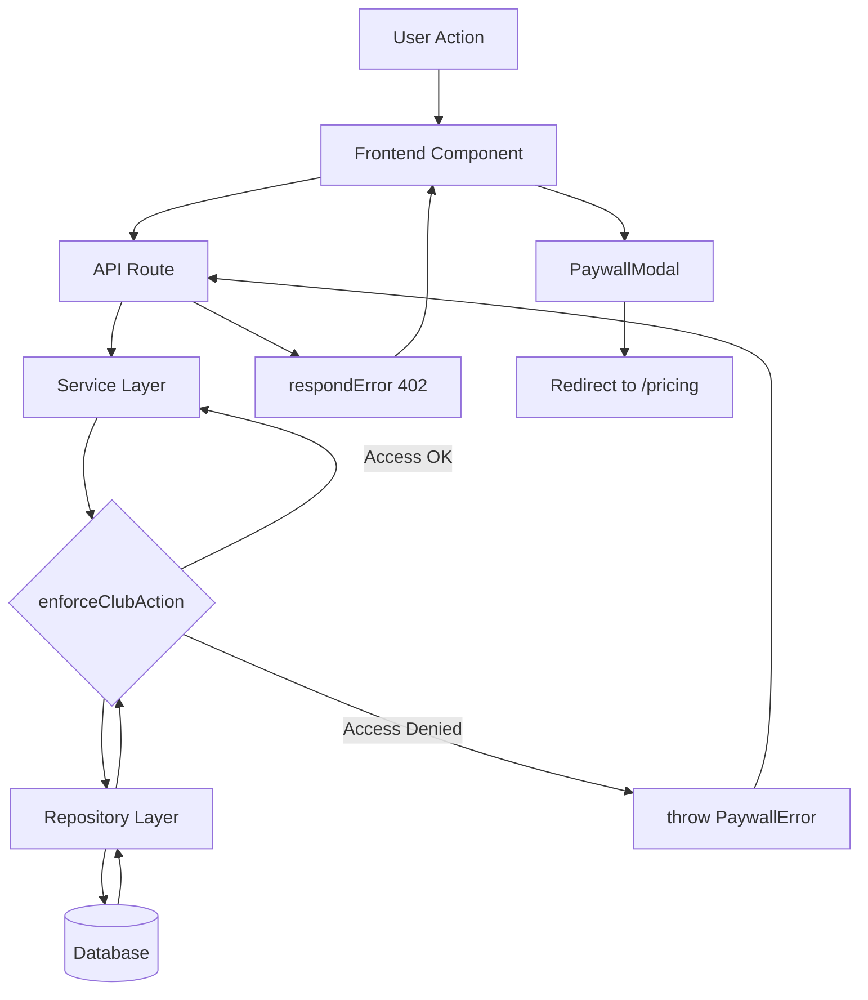
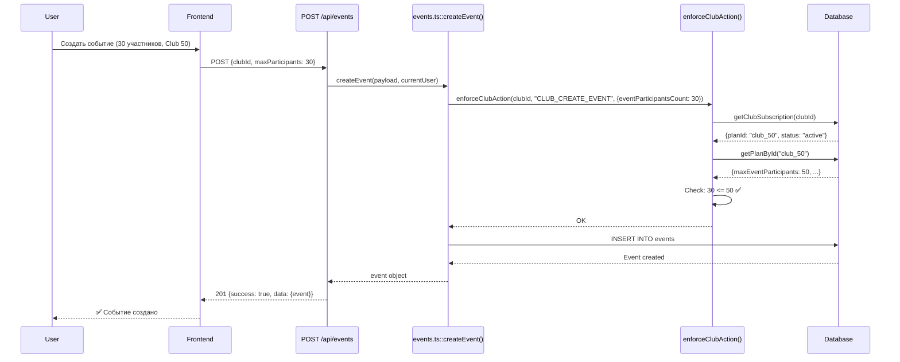
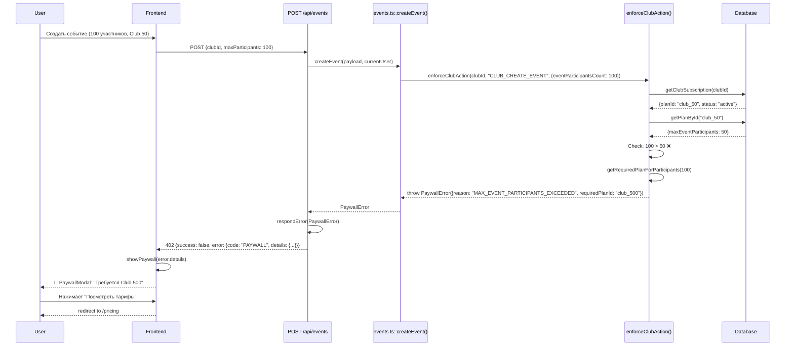
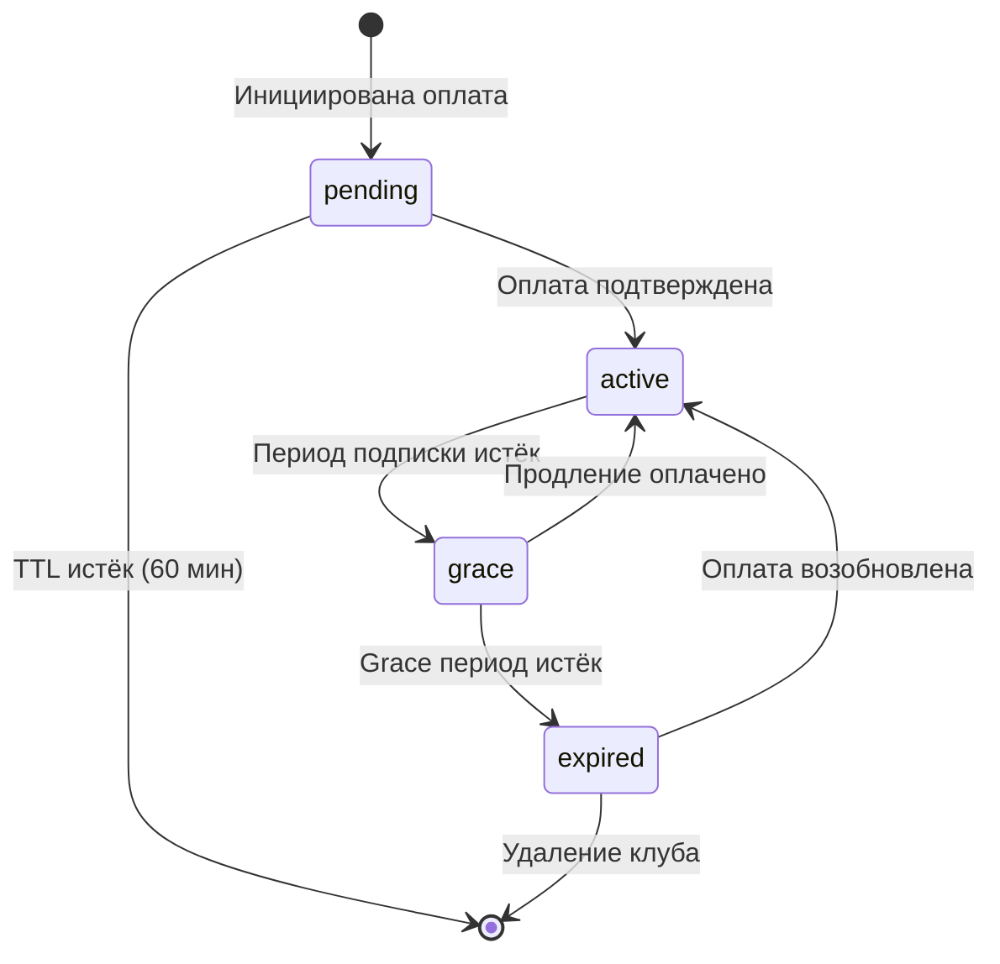

# 💳 Анализ системы биллинга Need4Trip

> **Living Document** — обновляется по мере развития системы  
> **Версия:** 1.0  
> **Дата:** 23 декабря 2024  
> **Статус:** Текущая реализация (v2.0)

---

## 📋 Содержание

1. [Обзор системы](#обзор-системы)
2. [Архитектура](#архитектура)
3. [База данных](#база-данных)
4. [Тарифные планы](#тарифные-планы)
5. [Система enforcement](#система-enforcement)
6. [Paywall Modal](#paywall-modal)
7. [Flow создания события](#flow-создания-события)
8. [Ключевые файлы](#ключевые-файлы)
9. [Примеры использования](#примеры-использования)
10. [Кэширование](#кэширование)
11. [Статус-машина подписки](#статус-машина-подписки)
12. [Обработка ошибок](#обработка-ошибок)
13. [Области для улучшения](#области-для-улучшения)
14. [План развития](#план-развития)

---

## 🎯 Обзор системы

### Основные принципы

Система биллинга Need4Trip построена на следующих принципах (согласно `docs/BILLING_AND_LIMITS.md`):

1. **Frontend не решает лимиты и доступ** — фронт только показывает UI и реагирует на ошибки backend
2. **Backend — единственный источник истины** — по доступу, лимитам, grace и paywall
3. **Цены и лимиты — в БД** — seed + API `/api/plans`
4. **Поведение при неоплате — в БД** — grace period, доступные действия в `pending`/`grace`/`expired`
5. **Транзакции не участвуют в проверках доступа** — `billing_transactions` — только аудит/история

### Ключевые концепции

| Термин | Описание |
|--------|----------|
| **User** | Пользователь (Telegram) |
| **Club** | Платная сущность (в Free клуб создать нельзя) |
| **Plan** | Тариф клуба (`Club 50` / `Club 500` / `Unlimited`) |
| **Subscription** | Состояние оплаты клуба: `active`/`grace`/`expired`/`pending` |
| **Limits** | Лимиты тарифа (max_members, max_event_participants, paid events, CSV export) |
| **Actions** | Операции, которые могут быть разрешены/запрещены в зависимости от подписки |
| **Billing policy** | Правила grace и разрешённые actions при pending/grace/expired |

---

## 🏗️ Архитектура

### Общая структура

```
┌─────────────────────────────────────────────────────────────────┐
│                        DATABASE (Supabase)                       │
├─────────────────────────────────────────────────────────────────┤
│ ┌─────────────────┐  ┌─────────────────┐  ┌─────────────────┐  │
│ │  club_plans     │  │ billing_policy  │  │ billing_policy  │  │
│ │                 │  │                 │  │    _actions     │  │
│ │ - id            │  │ - id            │  │                 │  │
│ │ - title         │  │ - grace_days    │  │ - status        │  │
│ │ - price_kzt     │  │ - pending_ttl   │  │ - action        │  │
│ │ - max_members   │  │                 │  │ - is_allowed    │  │
│ │ - max_event_... │  │                 │  │                 │  │
│ │ - allow_paid    │  │                 │  │                 │  │
│ │ - allow_csv     │  │                 │  │                 │  │
│ └─────────────────┘  └─────────────────┘  └─────────────────┘  │
│                                                                  │
│ ┌─────────────────┐  ┌─────────────────────────────────────┐   │
│ │ club_           │  │ billing_transactions (audit)        │   │
│ │  subscriptions  │  │                                     │   │
│ │                 │  │ - id, club_id, plan_id              │   │
│ │ - club_id       │  │ - provider, provider_payment_id     │   │
│ │ - plan_id       │  │ - amount_kzt, currency              │   │
│ │ - status        │  │ - status (pending/paid/failed)      │   │
│ │ - period_start  │  │ - period_start, period_end          │   │
│ │ - period_end    │  │ - created_at, updated_at            │   │
│ │ - grace_until   │  │                                     │   │
│ └─────────────────┘  └─────────────────────────────────────┘   │
└─────────────────────────────────────────────────────────────────┘
                              ↑ Query + Cache (5 min)
                              │
┌─────────────────────────────────────────────────────────────────┐
│                     BACKEND (Repository Layer)                   │
├─────────────────────────────────────────────────────────────────┤
│ planRepo.ts                 → getPlanById(), listPublicPlans()   │
│ clubSubscriptionRepo.ts     → getClubSubscription(), upsert...   │
│ billingPolicyRepo.ts        → isActionAllowed(), getPolicyMap()  │
│ billingTransactionsRepo.ts  → createPending(), markPaid()        │
└─────────────────────────────────────────────────────────────────┘
                              ↑
                              │
┌─────────────────────────────────────────────────────────────────┐
│                     BACKEND (Service Layer)                      │
├─────────────────────────────────────────────────────────────────┤
│ accessControl.ts            → enforceClubAction()                │
│   ├─ enforceFreeLimit()     → проверка FREE плана из БД          │
│   ├─ enforcePlanLimits()    → проверка лимитов плана             │
│   └─ getClubCurrentPlan()   → получение текущего плана           │
└─────────────────────────────────────────────────────────────────┘
                              ↑ throws PaywallError (402)
                              │
┌─────────────────────────────────────────────────────────────────┐
│                      API ROUTES (Next.js)                        │
├─────────────────────────────────────────────────────────────────┤
│ POST /api/events            → createEvent() → enforceClubAction │
│ PUT  /api/events/[id]       → updateEvent() → enforceClubAction │
│ GET  /api/clubs/[id]/export → enforceClubAction(CSV_EXPORT)     │
│ GET  /api/plans             → listPublicPlans()                  │
│ GET  /api/clubs/[id]/plan   → getClubCurrentPlan()               │
└─────────────────────────────────────────────────────────────────┘
                              ↑ HTTP 402 + PaywallError JSON
                              │
┌─────────────────────────────────────────────────────────────────┐
│                     FRONTEND (React/Next.js)                     │
├─────────────────────────────────────────────────────────────────┤
│ PaywallModal (2 версии)     → показывает ограничения            │
│ useClubPlan()               → загружает лимиты для UI           │
│ usePaywall()                → hook для управления paywall modal │
│ EventForm                   → валидация + usePaywall()           │
│ PricingPage                 → отображает тарифы из /api/plans   │
└─────────────────────────────────────────────────────────────────┘
```

### Поток данных



---

## 💾 База данных

### Схема таблиц

#### 1. `club_plans` — Тарифные планы

```sql
CREATE TABLE public.club_plans (
  id TEXT PRIMARY KEY,                          -- 'free' | 'club_50' | 'club_500' | 'club_unlimited'
  title TEXT NOT NULL,
  
  price_monthly_kzt NUMERIC(10,2) NOT NULL,     -- Цена в тенге
  currency TEXT NOT NULL DEFAULT 'KZT',
  
  max_members INT NULL,                         -- NULL = безлимит
  max_event_participants INT NULL,              -- NULL = безлимит
  
  allow_paid_events BOOLEAN NOT NULL,
  allow_csv_export BOOLEAN NOT NULL,
  
  is_public BOOLEAN NOT NULL DEFAULT true,
  
  created_at TIMESTAMPTZ NOT NULL DEFAULT NOW(),
  updated_at TIMESTAMPTZ NOT NULL DEFAULT NOW()
);

CREATE INDEX idx_club_plans_public ON club_plans(is_public, price_monthly_kzt);
```

**Миграции:**
- `20241215_create_club_plans_v2.sql` — создание таблицы
- `20241215_seed_club_plans.sql` — seed планов (Club 50, 500, Unlimited)
- `20241216_add_free_plan.sql` — добавление FREE плана в БД

#### 2. `club_subscriptions` — Подписки клубов

```sql
CREATE TABLE public.club_subscriptions (
  club_id UUID PRIMARY KEY REFERENCES clubs(id) ON DELETE CASCADE,
  
  plan_id TEXT NOT NULL REFERENCES club_plans(id),
  status TEXT NOT NULL CHECK (status IN ('pending', 'active', 'grace', 'expired')),
  
  current_period_start TIMESTAMPTZ NULL,
  current_period_end TIMESTAMPTZ NULL,
  
  grace_until TIMESTAMPTZ NULL,
  
  created_at TIMESTAMPTZ NOT NULL DEFAULT NOW(),
  updated_at TIMESTAMPTZ NOT NULL DEFAULT NOW()
);

CREATE INDEX idx_club_subscriptions_plan_id ON club_subscriptions(plan_id);
CREATE INDEX idx_club_subscriptions_status ON club_subscriptions(status);
CREATE INDEX idx_club_subscriptions_period_end ON club_subscriptions(current_period_end) 
  WHERE current_period_end IS NOT NULL;
```

**Важно:** Если запись отсутствует → FREE план (персональные события без клуба)

**Миграции:**
- `20241212_create_club_subscriptions.sql` — создание таблицы
- `20241215_alter_club_subscriptions_v2_SAFE.sql` — миграция на v2.0

#### 3. `billing_policy` — Глобальная политика биллинга

```sql
CREATE TABLE public.billing_policy (
  id TEXT PRIMARY KEY,                           -- 'default'
  grace_period_days INT NOT NULL DEFAULT 7,      -- Дней grace периода
  pending_ttl_minutes INT NOT NULL DEFAULT 60,   -- Время ожидания оплаты
  
  created_at TIMESTAMPTZ NOT NULL DEFAULT NOW(),
  updated_at TIMESTAMPTZ NOT NULL DEFAULT NOW()
);
```

**Seed:** `grace_period_days = 7`, `pending_ttl_minutes = 60`

**Миграции:**
- `20241215_create_billing_policy.sql`
- `20241215_seed_billing_policy.sql`

#### 4. `billing_policy_actions` — Разрешённые действия по статусам

```sql
CREATE TABLE public.billing_policy_actions (
  policy_id TEXT NOT NULL REFERENCES billing_policy(id) ON DELETE CASCADE,
  status TEXT NOT NULL CHECK (status IN ('pending','grace','expired')),
  action TEXT NOT NULL,
  is_allowed BOOLEAN NOT NULL DEFAULT false,
  
  PRIMARY KEY (policy_id, status, action)
);
```

**Seed данные:**

| status | action | is_allowed |
|--------|--------|-----------|
| **grace** | CLUB_CREATE_EVENT | ✅ true |
| **grace** | CLUB_UPDATE_EVENT | ✅ true |
| **grace** | CLUB_CREATE_PAID_EVENT | ✅ true |
| **grace** | CLUB_EXPORT_PARTICIPANTS_CSV | ✅ true |
| **grace** | CLUB_INVITE_MEMBER | ✅ true |
| **expired** | ALL_ACTIONS | ❌ false |
| **pending** | ALL_ACTIONS | ❌ false |

**Миграции:**
- `20241215_create_billing_policy_actions.sql`
- `20241215_seed_billing_policy_actions.sql`

#### 5. `billing_transactions` — История платежей (audit trail)

```sql
CREATE TABLE public.billing_transactions (
  id UUID PRIMARY KEY DEFAULT gen_random_uuid(),
  
  club_id UUID NOT NULL REFERENCES clubs(id) ON DELETE CASCADE,
  plan_id TEXT NOT NULL REFERENCES club_plans(id),
  
  provider TEXT NOT NULL,                       -- 'kaspi' | 'epay' | 'manual'
  provider_payment_id TEXT,
  
  amount_kzt NUMERIC(10,2) NOT NULL,
  currency TEXT NOT NULL DEFAULT 'KZT',
  
  status TEXT NOT NULL CHECK (status IN ('pending','paid','failed','refunded')),
  
  period_start TIMESTAMPTZ NULL,
  period_end TIMESTAMPTZ NULL,
  
  created_at TIMESTAMPTZ NOT NULL DEFAULT NOW(),
  updated_at TIMESTAMPTZ NOT NULL DEFAULT NOW()
);

CREATE INDEX idx_billing_transactions_club_id ON billing_transactions(club_id);
CREATE INDEX idx_billing_transactions_status ON billing_transactions(status);
```

**Назначение:** Только аудит. НЕ используется для проверок доступа.

**Миграция:** `20241215_create_billing_transactions.sql`

### RLS (Row Level Security)

**Включено для:**
- `club_subscriptions` — `20241222_enable_rls_club_subscriptions.sql`
- `billing_transactions` — `20241222_enable_rls_billing_transactions.sql`

---

## 💰 Тарифные планы

### Текущие планы

| ID | Название | Цена/мес | Участники/событие | Члены клуба | Платные события | CSV экспорт |
|----|----------|----------|-------------------|-------------|-----------------|-------------|
| `free` | **Free** | 0 ₸ | 15 | - | ❌ | ❌ |
| `club_50` | **Club 50** | 5,000 ₸ | 50 | 50 | ✅ | ✅ |
| `club_500` | **Club 500** | 15,000 ₸ | 500 | 500 | ✅ | ✅ |
| `club_unlimited` | **Unlimited** | 30,000 ₸ | ∞ | ∞ | ✅ | ✅ |

### Особенности FREE плана

**Free — это не клубный тариф:**
- ❌ Нельзя создать клуб
- ✅ Можно создавать личные события (не привязанные к клубу)
- ✅ Только бесплатные события
- ✅ Лимит участников: 15
- ❌ CSV экспорт недоступен

**В БД:** FREE план теперь хранится в `club_plans` (с версии 2.1) для унификации кэширования.

### Источник тарифов

**Endpoint:** `GET /api/plans`

```typescript
// src/app/api/plans/route.ts
export async function GET() {
  const plans = await listPublicPlans(); // Все планы с is_public = true
  return NextResponse.json({
    success: true,
    data: { plans },
  });
}
```

**Frontend:** Страница `/pricing` загружает планы из этого API.

---

## 🔐 Система enforcement

### Центральная функция

**Файл:** `src/lib/services/accessControl.ts`

```typescript
export async function enforceClubAction(params: {
  clubId: string;
  action: BillingActionCode;
  context?: {
    eventParticipantsCount?: number;
    clubMembersCount?: number;
    isPaidEvent?: boolean;
  };
}): Promise<void>
```

### Алгоритм проверки (из спецификации)

```
1. Load club_subscriptions by club_id
2. If NULL → FREE plan
   - Load FREE plan from DB (cached)
   - Check FREE limits
   - Throw PaywallError if violated
3. If subscription exists:
   a. Load plan from DB (cached)
   b. Check status:
      - active → check plan limits only
      - grace/pending/expired → check billing_policy_actions + limits
   c. If action not allowed → throw PaywallError
   d. Check plan limits (max_members, max_event_participants, etc.)
   e. If limits exceeded → throw PaywallError
```

### Коды действий (BillingActionCode)

```typescript
// src/lib/types/billing.ts
export const BILLING_ACTION_CODES = [
  "CLUB_CREATE_EVENT",
  "CLUB_UPDATE_EVENT",
  "CLUB_CREATE_PAID_EVENT",
  "CLUB_EXPORT_PARTICIPANTS_CSV",
  "CLUB_INVITE_MEMBER",
  "CLUB_REMOVE_MEMBER",
  "CLUB_UPDATE",
] as const;
```

### Примеры проверок

#### 1. Проверка лимита участников

```typescript
// src/lib/services/accessControl.ts (enforcePlanLimits)
if (plan.maxEventParticipants !== null && 
    context.eventParticipantsCount > plan.maxEventParticipants) {
  
  const requiredPlan = await getRequiredPlanForParticipants(
    context.eventParticipantsCount
  );
  
  throw new PaywallError({
    message: `Event with ${context.eventParticipantsCount} participants exceeds limit`,
    reason: "MAX_EVENT_PARTICIPANTS_EXCEEDED",
    currentPlanId: plan.id,
    requiredPlanId: requiredPlan,
    meta: {
      requested: context.eventParticipantsCount,
      limit: plan.maxEventParticipants,
    },
  });
}
```

#### 2. Проверка CSV экспорта

```typescript
if (action === "CLUB_EXPORT_PARTICIPANTS_CSV") {
  if (!plan.allowCsvExport) {
    throw new PaywallError({
      message: "CSV export not allowed on your plan",
      reason: "CSV_EXPORT_NOT_ALLOWED",
      currentPlanId: plan.id,
      requiredPlanId: "club_50",
    });
  }
}
```

#### 3. Проверка статуса подписки

```typescript
// Если status != 'active'
const isAllowed = await isActionAllowed(subscription.status, action);

if (!isAllowed) {
  throw new PaywallError({
    message: `Action "${action}" not allowed for status "${subscription.status}"`,
    reason: "SUBSCRIPTION_NOT_ACTIVE",
    currentPlanId: subscription.planId,
    meta: { status: subscription.status },
  });
}
```

### PaywallError структура

```typescript
// src/lib/errors.ts
export class PaywallError extends AppError {
  reason: string;
  currentPlanId?: string;
  requiredPlanId?: string;
  meta?: Record<string, unknown>;
  cta: {
    type: "OPEN_PRICING";
    href: "/pricing";
  };
  
  // statusCode: 402
  // code: "PAYWALL"
}
```

**Причины paywall (reason codes):**

```typescript
export const PAYWALL_REASONS = [
  "CLUB_CREATION_REQUIRES_PLAN",
  "SUBSCRIPTION_EXPIRED",
  "SUBSCRIPTION_NOT_ACTIVE",
  "PAID_EVENTS_NOT_ALLOWED",
  "CSV_EXPORT_NOT_ALLOWED",
  "MAX_EVENT_PARTICIPANTS_EXCEEDED",
  "MAX_CLUB_MEMBERS_EXCEEDED",
] as const;
```

---

## 🚧 Paywall Modal

### Две реализации (требуется консолидация)

#### 1. PaywallModal.tsx (новый, типизированный)

**Файл:** `src/components/billing/PaywallModal.tsx`

```typescript
interface PaywallModalProps {
  open: boolean;
  onClose: () => void;
  error: PaywallError; // Полный объект ошибки
}

export function PaywallModal({ open, onClose, error }: PaywallModalProps) {
  const message = REASON_MESSAGES[error.reason] || defaultMessage;
  
  return (
    <Dialog open={open} onOpenChange={onClose}>
      <DialogContent>
        <DialogHeader>
          <DialogTitle>{message.title}</DialogTitle>
          <DialogDescription>{message.description}</DialogDescription>
        </DialogHeader>
        
        <div>
          {error.currentPlanId && <p>Текущий план: {error.currentPlanId}</p>}
          {error.requiredPlanId && <p>Требуется: {error.requiredPlanId}</p>}
          {error.meta && <p>Лимит: {error.meta.limit} / Запрошено: {error.meta.requested}</p>}
        </div>
        
        <DialogFooter>
          <Button onClick={() => router.push(error.cta.href)}>
            Посмотреть тарифы
          </Button>
        </DialogFooter>
      </DialogContent>
    </Dialog>
  );
}

// Hook для использования
export function usePaywall() {
  const [paywallError, setPaywallError] = useState<PaywallError | null>(null);
  
  const showPaywall = (error: PaywallError) => setPaywallError(error);
  const hidePaywall = () => setPaywallError(null);
  
  const PaywallModalComponent = paywallError ? (
    <PaywallModal open={!!paywallError} onClose={hidePaywall} error={paywallError} />
  ) : null;
  
  return { showPaywall, hidePaywall, PaywallModalComponent };
}
```

**Использование:**

```typescript
const { showPaywall, PaywallModalComponent } = usePaywall();

try {
  await createEvent(...);
} catch (err) {
  if (err.response?.status === 402) {
    showPaywall(err.response.data.error.details);
  }
}

return <>{PaywallModalComponent}</>;
```

#### 2. paywall-modal.tsx (старый, упрощённый)

**Файл:** `src/components/billing/paywall-modal.tsx`

```typescript
interface PaywallModalProps {
  isOpen: boolean;
  onClose: () => void;
  title?: string;
  message: string;
  requiredPlanId?: string;
}

export function PaywallModal({
  isOpen,
  onClose,
  title = "Обновите тариф",
  message,
  requiredPlanId,
}: PaywallModalProps) {
  // Упрощённая версия без типизации PaywallError
}
```

**Где используется:**
- `src/components/events/create-event-page-content.tsx` (старая версия)

### Сообщения для пользователя

```typescript
const REASON_MESSAGES: Record<string, { title: string; description: string }> = {
  PAID_EVENTS_NOT_ALLOWED: {
    title: "Платные события недоступны",
    description: "Для создания платных событий требуется план Club 50 или выше.",
  },
  CSV_EXPORT_NOT_ALLOWED: {
    title: "CSV экспорт недоступен",
    description: "Экспорт участников в CSV требует план Club 50 или выше.",
  },
  MAX_EVENT_PARTICIPANTS_EXCEEDED: {
    title: "Превышен лимит участников",
    description: "Ваш текущий план не поддерживает такое количество участников.",
  },
  MAX_CLUB_MEMBERS_EXCEEDED: {
    title: "Превышен лимит организаторов",
    description: "Достигнут максимум организаторов для вашего плана.",
  },
  SUBSCRIPTION_EXPIRED: {
    title: "Подписка истекла",
    description: "Ваша подписка истекла. Пожалуйста, продлите её для продолжения.",
  },
  CLUB_CREATION_REQUIRES_PLAN: {
    title: "Требуется тарифный план",
    description: "Для создания клуба требуется выбрать тарифный план.",
  },
};
```

---

## 🔄 Flow создания события

### Успешный сценарий



### Сценарий с Paywall



### Код в createEvent()

```typescript
// src/lib/services/events.ts
export async function createEvent(input: unknown, currentUser: CurrentUser | null) {
  const validated = EventCreateSchema.parse(input);
  
  // Проверка биллинга v2.0
  if (validated.clubId) {
    await enforceClubAction({
      clubId: validated.clubId,
      action: validated.isPaid ? "CLUB_CREATE_PAID_EVENT" : "CLUB_CREATE_EVENT",
      context: {
        eventParticipantsCount: validated.maxParticipants ?? undefined,
        isPaidEvent: validated.isPaid,
      },
    });
  } else {
    // Personal events (FREE plan)
    const freePlan = await getPlanById("free");
    
    if (validated.isPaid && !freePlan.allowPaidEvents) {
      throw new PaywallError({
        message: "Платные события доступны только на платных тарифах",
        reason: "PAID_EVENTS_NOT_ALLOWED",
        currentPlanId: "free",
        requiredPlanId: "club_50",
      });
    }
    
    if (validated.maxParticipants && freePlan.maxEventParticipants !== null && 
        validated.maxParticipants > freePlan.maxEventParticipants) {
      throw new PaywallError({
        message: `Превышен лимит участников (${validated.maxParticipants} > ${freePlan.maxEventParticipants})`,
        reason: "MAX_EVENT_PARTICIPANTS_EXCEEDED",
        currentPlanId: "free",
        requiredPlanId: "club_50",
        meta: {
          requested: validated.maxParticipants,
          limit: freePlan.maxEventParticipants,
        },
      });
    }
  }
  
  // Создание события в БД
  const event = await createEventRecord({...validated, createdByUserId: currentUser.id});
  return event;
}
```

---

## 📁 Ключевые файлы

### Backend

#### Repository Layer (Database)

```
src/lib/db/
├── planRepo.ts                     — Тарифы (с кэшем)
│   ├── listPublicPlans()
│   ├── getPlanById()
│   ├── getRequiredPlanForParticipants()
│   └── getRequiredPlanForMembers()
│
├── clubSubscriptionRepo.ts         — Подписки клубов
│   ├── getClubSubscription()
│   ├── upsertClubSubscription()
│   ├── setClubSubscriptionStatus()
│   └── activateSubscription()
│
├── billingPolicyRepo.ts            — Политики биллинга
│   ├── getDefaultBillingPolicy()
│   ├── getPolicyActionsMap()
│   └── isActionAllowed()
│
└── billingTransactionsRepo.ts      — История платежей
    ├── createPendingTransaction()
    ├── markTransactionPaid()
    ├── markTransactionFailed()
    └── getClubTransactions()
```

#### Service Layer (Business Logic)

```
src/lib/services/
├── accessControl.ts                — Enforcement системы
│   ├── enforceClubAction()         ← Главная функция проверки
│   ├── enforceFreeLimit()
│   ├── enforcePlanLimits()
│   └── getClubCurrentPlan()
│
├── events.ts                       — Логика событий
│   ├── createEvent()               → вызывает enforceClubAction()
│   └── updateEvent()               → вызывает enforceClubAction()
│
└── clubs.ts                        — Логика клубов
```

#### API Routes

```
src/app/api/
├── plans/
│   └── route.ts                    — GET /api/plans
│
├── clubs/[id]/
│   ├── route.ts                    — GET, PATCH /api/clubs/:id
│   ├── current-plan/
│   │   └── route.ts                — GET /api/clubs/:id/current-plan
│   └── export/
│       └── route.ts                — GET /api/clubs/:id/export (CSV)
│
└── events/
    ├── route.ts                    — GET, POST /api/events
    └── [id]/
        └── route.ts                — GET, PUT /api/events/:id
```

#### Errors & Response Handling

```
src/lib/
├── errors.ts                       — PaywallError, AppError
└── api/
    └── response.ts                 — respondError(), respondSuccess()
```

#### Types

```
src/lib/types/
└── billing.ts                      — Все типы биллинга
    ├── PlanId, ClubPlan
    ├── SubscriptionStatus, ClubSubscription
    ├── BillingActionCode
    ├── PaywallError, PaywallReason
    └── BillingTransaction
```

### Frontend

#### Components

```
src/components/
├── billing/
│   ├── PaywallModal.tsx            — Новый paywall modal (типизированный)
│   └── paywall-modal.tsx           — Старый paywall modal (упрощённый)
│
├── events/
│   ├── event-form.tsx              — Использует useClubPlan(), usePaywall()
│   └── create-event-page-content.tsx
│
└── pricing/
    └── pricing-card-button.tsx
```

#### Hooks

```
src/hooks/
└── use-club-plan.ts                — Загрузка плана клуба для UI
    └── useClubPlan(clubId)
        ├── Загружает /api/clubs/:id/current-plan
        ├── Для FREE: загружает планviz из БД (getPlanById("free"))
        └── Возвращает {plan, limits, loading, error}
```

#### Pages

```
src/app/(app)/
├── pricing/
│   └── page.tsx                    — Страница тарифов
│
└── events/
    ├── create/
    │   └── page.tsx
    └── [id]/
        └── edit/
            └── page.tsx
```

### Database

```
supabase/migrations/
├── 20241215_create_club_plans_v2.sql
├── 20241215_seed_club_plans.sql
├── 20241216_add_free_plan.sql
├── 20241212_create_club_subscriptions.sql
├── 20241215_alter_club_subscriptions_v2_SAFE.sql
├── 20241215_create_billing_policy.sql
├── 20241215_seed_billing_policy.sql
├── 20241215_create_billing_policy_actions.sql
├── 20241215_seed_billing_policy_actions.sql
├── 20241215_create_billing_transactions.sql
├── 20241222_enable_rls_club_subscriptions.sql
└── 20241222_enable_rls_billing_transactions.sql
```

### Documentation

```
docs/
├── BILLING_AND_LIMITS.md           — Продуктовая спецификация (source of truth)
└── BILLING_SYSTEM_ANALYSIS.md      — Этот документ (технический анализ)
```

---

## 💡 Примеры использования

### 1. Проверка доступа при создании события

```typescript
// src/lib/services/events.ts
export async function createEvent(input: unknown, currentUser: CurrentUser | null) {
  const validated = EventCreateSchema.parse(input);
  
  if (validated.clubId) {
    // Проверка для клубных событий
    await enforceClubAction({
      clubId: validated.clubId,
      action: validated.isPaid ? "CLUB_CREATE_PAID_EVENT" : "CLUB_CREATE_EVENT",
      context: {
        eventParticipantsCount: validated.maxParticipants ?? undefined,
        isPaidEvent: validated.isPaid,
      },
    });
  } else {
    // Проверка для личных событий (FREE)
    const freePlan = await getPlanById("free");
    
    if (validated.isPaid && !freePlan.allowPaidEvents) {
      throw new PaywallError({...});
    }
  }
  
  // Создание события
  const event = await createEventRecord({...});
  return event;
}
```

### 2. CSV экспорт с проверкой биллинга

```typescript
// src/app/api/clubs/[id]/export/route.ts
export async function GET(req: NextRequest, { params }: Params) {
  const { id: clubId } = await params;
  const user = await getCurrentUserFromMiddleware(req);
  
  // Проверка прав доступа
  const userRole = await getUserClubRole(user.id, clubId);
  if (userRole !== "owner" && userRole !== "organizer") {
    throw new ForbiddenError("Нет доступа");
  }
  
  // Проверка биллинга
  await enforceClubAction({
    clubId,
    action: "CLUB_EXPORT_PARTICIPANTS_CSV",
  });
  
  // Экспорт
  const members = await listMembers(clubId);
  const csv = generateCSV(members);
  
  return new NextResponse(csv, {
    headers: {
      "Content-Type": "text/csv",
      "Content-Disposition": `attachment; filename="members.csv"`,
    },
  });
}
```

### 3. Использование useClubPlan в форме

```typescript
// src/components/events/event-form.tsx
export function EventForm({ club, ...props }) {
  const { plan, limits, loading } = useClubPlan(club?.id);
  const { showPaywall, PaywallModalComponent } = usePaywall();
  
  // Динамический лимит из плана (или 15 для FREE)
  const maxAllowedParticipants = limits?.maxEventParticipants ?? 15;
  
  const handleSubmit = async (data) => {
    try {
      await createEvent(data);
    } catch (err) {
      if (err.response?.status === 402) {
        showPaywall(err.response.data.error.details);
        return;
      }
      throw err;
    }
  };
  
  return (
    <>
      <form onSubmit={handleSubmit}>
        <Input
          label="Макс. участников"
          max={maxAllowedParticipants}
          hint={`Ваш план поддерживает до ${maxAllowedParticipants} участников`}
        />
        <Button type="submit">Создать</Button>
      </form>
      
      {PaywallModalComponent}
    </>
  );
}
```

### 4. Получение текущего плана клуба

```typescript
// src/app/api/clubs/[id]/current-plan/route.ts
export async function GET(req: NextRequest, { params }: Params) {
  const { id: clubId } = await params;
  const user = await getCurrentUserFromMiddleware(req);
  
  // Получение плана через service
  const { planId, plan, subscription } = await getClubCurrentPlan(clubId);
  
  return respondSuccess({
    planId: plan.id,
    planTitle: plan.title,
    subscription: subscription ? {
      status: subscription.status,
      currentPeriodStart: subscription.currentPeriodStart,
      currentPeriodEnd: subscription.currentPeriodEnd,
      graceUntil: subscription.graceUntil,
    } : null,
    limits: {
      maxMembers: plan.maxMembers,
      maxEventParticipants: plan.maxEventParticipants,
      allowPaidEvents: plan.allowPaidEvents,
      allowCsvExport: plan.allowCsvExport,
    },
  });
}
```

### 5. Обработка PaywallError в API

```typescript
// src/lib/api/response.ts
export function respondError(error: AppError | Error | unknown) {
  // Специальная обработка для PaywallError
  if (isPaywallError(error)) {
    return NextResponse.json(
      {
        success: false,
        error: {
          code: error.code,              // "PAYWALL"
          message: error.message,
          details: error.toJSON(),       // Полный payload
        },
      },
      { status: 402 }
    );
  }
  
  // Остальные ошибки
  if (isAppError(error)) {
    return NextResponse.json(
      {
        success: false,
        error: {
          code: error.code,
          message: error.message,
          details: error.details,
        },
      },
      { status: error.statusCode }
    );
  }
  
  return NextResponse.json({ error: "Internal Error" }, { status: 500 });
}
```

---

## ⚡ Кэширование

### StaticCache для планов

**Файл:** `src/lib/cache/staticCache.ts`  
**Использование:** `src/lib/db/planRepo.ts`

```typescript
const plansCache = new StaticCache<ClubPlan>(
  {
    ttl: 5 * 60 * 1000, // 5 минут
    name: 'club_plans',
  },
  async () => {
    // Loader: загружает ВСЕ планы из БД
    const { data } = await supabase
      .from('club_plans')
      .select('*')
      .order('price_monthly_kzt', { ascending: true });
    
    return data.map(mapDbPlanToDomain);
  },
  (plan) => plan.id // Key extractor
);

// Все запросы используют кэш
export async function getPlanById(planId: PlanId): Promise<ClubPlan> {
  const plan = await plansCache.getByKey(planId); // O(1)
  if (!plan) throw new NotFoundError(`Plan '${planId}' not found`);
  return plan;
}

export async function listPublicPlans(): Promise<ClubPlan[]> {
  const allPlans = await plansCache.getAll();
  return allPlans.filter(plan => plan.isPublic);
}
```

### Преимущества

- ✅ **O(1) доступ** по ключу (planId)
- ✅ **Автоматическая инвалидация** через TTL
- ✅ **Единое место загрузки** — один запрос к БД на 5 минут
- ✅ **FREE план теперь в кэше** — унификация с платными планами

### Инвалидация кэша

```typescript
export async function invalidatePlansCache(): Promise<void> {
  plansCache.clear();
  log.info("Club plans cache invalidated");
}
```

Вызывается после обновления планов через admin API (когда будет реализован).

---

## 🔄 Статус-машина подписки

### Диаграмма состояний



### Описание статусов

| Статус | Когда устанавливается | Разрешённые действия | Переход |
|--------|----------------------|---------------------|---------|
| **pending** | Payment intent создан, ждём подтверждения | ❌ Ничего (кроме просмотра) | → `active` (payment confirmed) <br> → deleted (TTL expired) |
| **active** | Оплата подтверждена, подписка активна | ✅ Всё (в рамках лимитов плана) | → `grace` (period_end reached) |
| **grace** | Период подписки истёк, но действует grace | ✅ Почти всё (настраивается) | → `active` (renewal paid) <br> → `expired` (grace_until reached) |
| **expired** | Grace период истёк, подписка неактивна | ❌ Read-only | → `active` (payment) <br> → deleted (manual) |

### Параметры из billing_policy

```sql
SELECT * FROM billing_policy WHERE id = 'default';

-- id: 'default'
-- grace_period_days: 7
-- pending_ttl_minutes: 60
```

**Grace period:** 7 дней после истечения `current_period_end`

**Pending TTL:** 60 минут на ожидание подтверждения оплаты

### Автоматизация переходов (TODO)

**Сейчас:** Переходы статусов выполняются вручную через API.

**Планируется:** Cron job для автоматических переходов:
- `active` → `grace` (когда `current_period_end < now()`)
- `grace` → `expired` (когда `grace_until < now()`)
- `pending` → cleanup (когда `created_at + pending_ttl < now()`)

---

## 🚨 Обработка ошибок

### Backend: respondError()

```typescript
// src/lib/api/response.ts
export function respondError(error: AppError | Error | unknown) {
  // 1. PaywallError → 402
  if (isPaywallError(error)) {
    return NextResponse.json(
      {
        success: false,
        error: {
          code: "PAYWALL",
          message: error.message,
          details: {
            reason: error.reason,
            currentPlanId: error.currentPlanId,
            requiredPlanId: error.requiredPlanId,
            meta: error.meta,
            cta: { type: "OPEN_PRICING", href: "/pricing" },
          },
        },
      },
      { status: 402 }
    );
  }
  
  // 2. Другие AppError
  if (isAppError(error)) {
    return NextResponse.json(
      { success: false, error: {...} },
      { status: error.statusCode }
    );
  }
  
  // 3. Неизвестные ошибки
  return NextResponse.json(
    { success: false, error: { code: "InternalError", message: "..." } },
    { status: 500 }
  );
}
```

### Frontend: обработка 402

```typescript
// В компоненте
const { showPaywall, PaywallModalComponent } = usePaywall();

const handleSubmit = async (data) => {
  try {
    const response = await fetch('/api/events', {
      method: 'POST',
      body: JSON.stringify(data),
    });
    
    if (!response.ok) {
      if (response.status === 402) {
        const json = await response.json();
        showPaywall(json.error.details);
        return;
      }
      throw new Error('Server error');
    }
    
    const result = await response.json();
    // Success handling
  } catch (err) {
    // Error handling
  }
};

return (
  <>
    <form onSubmit={handleSubmit}>...</form>
    {PaywallModalComponent}
  </>
);
```

### PaywallError JSON format

**Response body при 402:**

```json
{
  "success": false,
  "error": {
    "code": "PAYWALL",
    "message": "Event with 100 participants exceeds your plan limit of 50",
    "details": {
      "reason": "MAX_EVENT_PARTICIPANTS_EXCEEDED",
      "currentPlanId": "club_50",
      "requiredPlanId": "club_500",
      "meta": {
        "requested": 100,
        "limit": 50
      },
      "cta": {
        "type": "OPEN_PRICING",
        "href": "/pricing"
      }
    }
  }
}
```

---

## 🔍 Области для улучшения

### 1. Консолидация PaywallModal

**Проблема:** Две версии модального окна с разными интерфейсами.

**Файлы:**
- `src/components/billing/PaywallModal.tsx` — новая версия (типизированная)
- `src/components/billing/paywall-modal.tsx` — старая версия (упрощённая)

**Решение:**
- [ ] Мигрировать все использования на `PaywallModal.tsx`
- [ ] Удалить `paywall-modal.tsx`
- [ ] Обновить `create-event-page-content.tsx`

**Затронутые файлы:**
```
src/components/events/create-event-page-content.tsx
```

---

### 2. Автоматизация переходов статусов подписки

**Проблема:** Переходы `active → grace → expired` не автоматизированы.

**Сейчас:** Требуется ручное управление через API.

**Решение:**
- [ ] Создать cron endpoint `/api/cron/billing-status-update`
- [ ] Настроить Vercel Cron (или внешний scheduler)
- [ ] Реализовать логику:
  ```typescript
  // Псевдокод
  async function updateExpiredSubscriptions() {
    const policy = await getDefaultBillingPolicy();
    
    // active → grace
    const activeExpired = await findSubscriptions({
      status: 'active',
      where: 'current_period_end < now()',
    });
    
    for (const sub of activeExpired) {
      const graceUntil = addDays(sub.currentPeriodEnd, policy.gracePeriodDays);
      await setClubSubscriptionStatus(sub.clubId, 'grace', graceUntil);
    }
    
    // grace → expired
    const graceExpired = await findSubscriptions({
      status: 'grace',
      where: 'grace_until < now()',
    });
    
    for (const sub of graceExpired) {
      await setClubSubscriptionStatus(sub.clubId, 'expired', null);
    }
  }
  ```

**Частота:** Каждый час или каждый день (в зависимости от требований).

---

### 3. Платёжная интеграция (Kaspi, ePay, Stripe)

**Проблема:** Структура готова, но платежи не подключены.

**Текущее состояние:**
- ✅ Таблица `billing_transactions` создана
- ✅ Repository методы реализованы
- ❌ Провайдеры не интегрированы

**План интеграции:**

#### Этап 1: Kaspi QR (приоритет)
- [ ] Получить API credentials (Kaspi Business)
- [ ] Создать `/api/billing/kaspi/init` — генерация QR-кода
- [ ] Создать `/api/billing/kaspi/webhook` — обработка callback
- [ ] Логика:
  ```typescript
  // Инициализация платежа
  POST /api/billing/kaspi/init
  {
    clubId: "...",
    planId: "club_50"
  }
  
  Response:
  {
    transactionId: "...",
    qrCodeUrl: "...",
    amount: 5000,
    expiresAt: "2024-12-24T10:00:00Z"
  }
  
  // Webhook от Kaspi
  POST /api/billing/kaspi/webhook
  {
    transactionId: "...",
    status: "SUCCESS",
    paymentId: "kaspi_xxx"
  }
  
  // Обработка:
  1. markTransactionPaid(transactionId, paymentId)
  2. activateSubscription(clubId, planId, periodStart, periodEnd)
  3. Отправить уведомление пользователю
  ```

#### Этап 2: ePay (Казахстан)
- [ ] Интеграция аналогична Kaspi
- [ ] Endpoint: `/api/billing/epay/*`

#### Этап 3: Stripe (международные платежи)
- [ ] Использовать Stripe Checkout
- [ ] Webhooks для обработки событий
- [ ] Endpoint: `/api/billing/stripe/*`

**Документация:**
- [ ] Создать `docs/PAYMENT_INTEGRATION.md`

---

### 4. Cleanup истёкших pending платежей

**Проблема:** Pending transactions не очищаются после `pending_ttl_minutes`.

**Решение:**
- [ ] Добавить в cron задачу очистки:
  ```typescript
  async function cleanupPendingTransactions() {
    const policy = await getDefaultBillingPolicy();
    const ttlMinutes = policy.pendingTtlMinutes;
    
    const expired = await supabaseAdmin
      .from('billing_transactions')
      .select('*')
      .eq('status', 'pending')
      .lt('created_at', new Date(Date.now() - ttlMinutes * 60 * 1000).toISOString());
    
    for (const tx of expired.data) {
      await markTransactionFailed(tx.id);
      // Опционально: удалить draft клуба, если был создан
    }
  }
  ```

---

### 5. Grace period уведомления

**Проблема:** Пользователи не получают уведомления о приближении окончания подписки.

**Решение:**
- [ ] Отправлять email/Telegram за 3 дня до `current_period_end`
- [ ] Отправлять при переходе в `grace`
- [ ] Отправлять за 2 дня до `grace_until`

**Интеграция:**
- Использовать существующую систему уведомлений (если есть)
- Или интегрировать SendGrid/Mailgun/Resend

---

### 6. Создание клубов без оплаты (club_drafts)

**Проблема:** Клубы создаются до оплаты → "полумёртвые" клубы в БД.

**Из спецификации:**
> Чтобы не плодить "полумёртвые" клубы, делайте один из вариантов:
> - **Вариант A (лучший):** `club_drafts` (временная сущность до оплаты)
> - **Вариант B:** хранить draft в client/local storage (менее надёжно)

**Решение (Вариант A):**

```sql
CREATE TABLE public.club_drafts (
  id UUID PRIMARY KEY DEFAULT gen_random_uuid(),
  user_id UUID NOT NULL REFERENCES users(id) ON DELETE CASCADE,
  plan_id TEXT NOT NULL REFERENCES club_plans(id),
  
  -- Draft данные клуба
  name TEXT NOT NULL,
  description TEXT,
  city_ids UUID[],
  
  -- Payment intent
  transaction_id UUID REFERENCES billing_transactions(id),
  
  expires_at TIMESTAMPTZ NOT NULL, -- created_at + pending_ttl_minutes
  created_at TIMESTAMPTZ NOT NULL DEFAULT NOW()
);

CREATE INDEX idx_club_drafts_user_id ON club_drafts(user_id);
CREATE INDEX idx_club_drafts_expires_at ON club_drafts(expires_at);
```

**Flow:**
1. User нажимает "Создать клуб"
2. POST `/api/clubs/draft` → создаёт draft + transaction (pending)
3. Возвращает `draftId` + `paymentInfo` (QR, ссылка)
4. После оплаты: webhook → создать клуб из draft → удалить draft
5. Cron очищает expired drafts

---

### 7. Мониторинг и метрики

**Проблема:** Нет метрик по биллингу.

**Что отслеживать:**
- [ ] MRR (Monthly Recurring Revenue)
- [ ] Churn rate (отток пользователей)
- [ ] Conversion rate (Free → Club 50)
- [ ] Paywall показы и клики
- [ ] Failed payments

**Инструменты:**
- Vercel Analytics
- Mixpanel / Amplitude
- Custom dashboard в Supabase

---

### 8. Тесты для enforcement системы

**Проблема:** Отсутствуют автотесты для критичной логики.

**Из спецификации (раздел 11):**
> Минимальный набор:
> - ✅ Free не может создать клуб: 402 + reason `CLUB_CREATION_REQUIRES_PLAN`
> - ✅ Free personal event >15 участников: 402 + `requiredPlanId: club_50`
> - ✅ Club 50 event 51 участник: 402 + `requiredPlanId: club_500`
> - ✅ Club subscription expired: любые действия → 402
> - ✅ Grace period: действия разрешены/запрещены по policy
> - ✅ CSV export: Free → 402, Club 50+ → ok
> - ✅ Paid event: Free → 402, Club 50+ → ok

**Решение:**
- [ ] Создать `/tests/services/accessControl.test.ts`
- [ ] Использовать Vitest / Jest
- [ ] Моки для Supabase

```typescript
describe('enforceClubAction', () => {
  it('should throw PaywallError when FREE user creates event with 20 participants', async () => {
    // Mock: no subscription (FREE)
    mockGetClubSubscription.mockResolvedValue(null);
    mockGetPlanById.mockResolvedValue({
      id: 'free',
      maxEventParticipants: 15,
    });
    
    await expect(
      enforceClubAction({
        clubId: 'test-club',
        action: 'CLUB_CREATE_EVENT',
        context: { eventParticipantsCount: 20 },
      })
    ).rejects.toThrow(PaywallError);
  });
  
  // Остальные тесты...
});
```

---

### 9. Admin панель для управления подписками

**Проблема:** Нет UI для ручного управления подписками.

**Функции:**
- [ ] Просмотр всех подписок
- [ ] Ручное изменение статуса (`active`, `grace`, `expired`)
- [ ] Продление подписки
- [ ] Просмотр истории транзакций
- [ ] Invalidate plans cache

**Endpoint:**
```typescript
PATCH /api/admin/subscriptions/:clubId
{
  status: "active",
  periodEnd: "2025-01-31T00:00:00Z"
}
```

**UI:** Next.js admin route (protected)

---

### 10. Рефакторинг FREE плана

**Проблема:** FREE план теперь в `club_plans`, но логически это не клубный план.

**Варианты:**

**A. Оставить как есть (текущее решение)**
- ✅ Простота кэширования
- ✅ Унификация с платными планами
- ❌ Концептуально FREE ≠ club plan

**B. Создать `personal_plan` таблицу**
- ✅ Чистая концепция (FREE отдельно от clubs)
- ❌ Дублирование структуры
- ❌ Усложнение кода

**Рекомендация:** Оставить текущее решение (A). FREE в `club_plans` с `id='free'` — практичный компромисс.

---

### 11. Улучшение UX Paywall Modal

**Идеи:**
- [ ] Показывать сравнительную таблицу планов прямо в модалке
- [ ] "Quick upgrade" кнопка (сразу на payment flow)
- [ ] A/B тестирование текстов
- [ ] Анимация + эмодзи для вовлечения

**Mockup:**
```
┌─────────────────────────────────────────┐
│  🚀 Превышен лимит участников           │
│                                         │
│  Ваш план: Club 50 (до 50 участников)   │
│  Вы запросили: 100 участников           │
│                                         │
│  ┌─────────────────────────────────┐    │
│  │ Club 500 - 15,000₸/мес          │    │
│  │ ✓ До 500 участников             │    │
│  │ ✓ Платные события               │    │
│  │ ✓ CSV экспорт                   │    │
│  │                                 │    │
│  │ [Перейти на Club 500]           │    │
│  └─────────────────────────────────┘    │
│                                         │
│  [Посмотреть все тарифы]  [Отмена]      │
└─────────────────────────────────────────┘
```

---

### 12. Оптимизация кэша

**Текущее:** TTL = 5 минут

**Улучшения:**
- [ ] Event-based invalidation при изменении планов через admin
- [ ] Warm-up кэша при старте сервера (если cold start)
- [ ] Metrics: cache hit rate

---

## 📈 План развития

### Фаза 1: Стабилизация (Q1 2025)

**Приоритет: HIGH**

- [ ] Консолидация PaywallModal (1-2 дня)
- [ ] Тесты для accessControl.ts (2-3 дня)
- [ ] Автоматизация статусов подписки (cron) (2-3 дня)
- [ ] Cleanup pending transactions (1 день)

**Цель:** Система работает стабильно без ручного вмешательства.

---

### Фаза 2: Платёжная интеграция (Q1 2025)

**Приоритет: HIGH**

- [ ] Kaspi QR интеграция (1 неделя)
- [ ] club_drafts для flow создания клубов (3-5 дней)
- [ ] Webhook обработка (2-3 дня)
- [ ] Тестирование оплаты end-to-end (3 дня)

**Цель:** Пользователи могут оплачивать подписки через Kaspi.

---

### Фаза 3: Мониторинг и метрики (Q1-Q2 2025)

**Приоритет: MEDIUM**

- [ ] Dashboard для MRR, churn, conversions (1 неделя)
- [ ] Email/Telegram уведомления (3-5 дней)
- [ ] A/B тесты Paywall Modal (ongoing)

**Цель:** Понимание метрик, оптимизация конверсии.

---

### Фаза 4: Масштабирование (Q2 2025)

**Приоритет: LOW**

- [ ] ePay интеграция (1 неделя)
- [ ] Stripe для международных платежей (1 неделя)
- [ ] Admin панель для управления подписками (1-2 недели)

**Цель:** Поддержка нескольких платёжных методов, удобное управление.

---

## 📚 Дополнительные ресурсы

### Документация

- **Продуктовая спецификация:** `docs/BILLING_AND_LIMITS.md`
- **Этот анализ:** `docs/BILLING_SYSTEM_ANALYSIS.md`
- **Миграции:** `supabase/migrations/20241215_*.sql`

### Внешние ссылки

- [Kaspi Business API](https://kaspi.kz/business) — документация по интеграции
- [Stripe Billing](https://stripe.com/docs/billing) — best practices
- [SaaS Metrics](https://www.saastr.com/saas-metrics-guide/) — MRR, Churn, CAC

### Связанные фичи

- **Уведомления:** `docs/NOTIFICATION_SYSTEM_HARDENED.md`
- **RLS аудит:** `docs/RLS_COVERAGE_AUDIT.md`
- **Архитектура:** `docs/ARCHITECTURE_REVIEW_REDIRECTS.md`

---

## 🔄 История изменений

| Дата | Версия | Изменения |
|------|--------|-----------|
| 2024-12-23 | 1.0 | Первая версия документа (анализ текущей системы v2.0) |

---

## 📝 Примечания

### Терминология

- **План (Plan)** — тарифный план (`free`, `club_50`, etc.)
- **Подписка (Subscription)** — запись в `club_subscriptions` с текущим статусом
- **Транзакция (Transaction)** — запись в `billing_transactions` (история платежей)
- **Enforcement** — проверка доступа через `enforceClubAction()`
- **Paywall** — модальное окно с предложением upgrade

### Соглашения о коде

- **Все проверки биллинга** — только через `enforceClubAction()`
- **Все repo функции** — возвращают domain types (camelCase), а не DB types (snake_case)
- **PaywallError** — всегда 402, всегда с `cta: {href: "/pricing"}`
- **FREE план** — `null` в `club_subscriptions`, но существует в `club_plans`

---

**Версия:** 1.0  
**Последнее обновление:** 23 декабря 2024  
**Автор:** AI Assistant (анализ кодовой базы Need4Trip)  
**Статус:** ✅ Актуален (отражает текущую реализацию v2.0)

