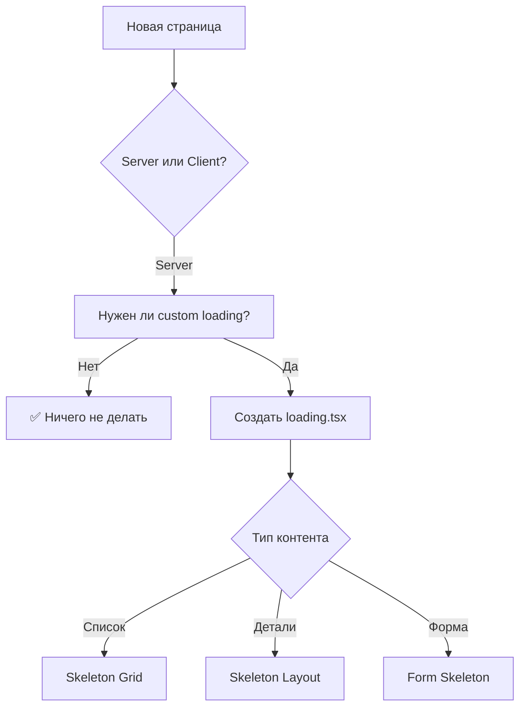
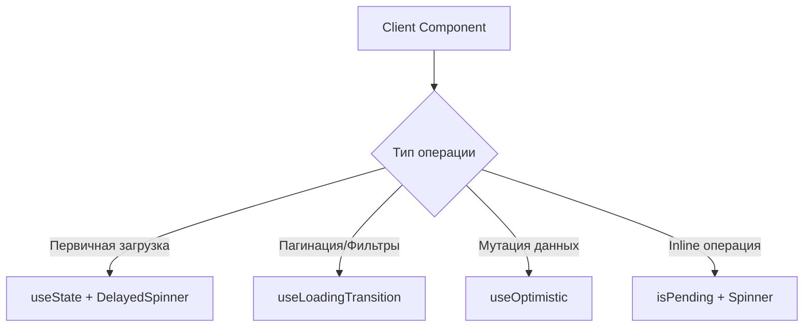

# 📖 Гайд по использованию Loading System для новых страниц

## Обзор

Как правильно добавлять состояния загрузки при создании новых страниц и компонентов.

---

## 🎯 Принцип работы системы

### Автоматическое применение

**Большинство случаев работает "из коробки" благодаря:**

1. **Next.js Conventions:**
   - `loading.tsx` файлы срабатывают автоматически
   - Suspense boundaries наследуются
   - Streaming SSR включен по умолчанию

2. **Layout Inheritance:**
   ```
   app/
   ├── loading.tsx          ← Применяется ко ВСЕМ страницам
   ├── clubs/
   │   ├── loading.tsx      ← Переопределяет для /clubs/*
   │   └── [id]/
   │       └── page.tsx     ← Наследует clubs/loading.tsx
   ```

3. **Компоненты по умолчанию:**
   - `<Spinner />` - уже стилизован
   - Skeleton компоненты - готовы к импорту
   - Hooks - глобально доступны

---

## 📋 Decision Tree: Что использовать?

### Для Server Components (99% страниц)



**Правило:** Server Components используют **`loading.tsx`**

---

### Для Client Components (редко)



**Правило:** Client Components используют **hooks**

---

## 🚀 Быстрый старт: Примеры для копирования

### Пример 1: Простая Server Page (список)

**Ситуация:** Новая страница `/memberships/page.tsx` - список подписок

**Шаг 1:** Создать страницу (Server Component)
```tsx
// app/memberships/page.tsx
export default async function MembershipsPage() {
  const memberships = await getMemberships();
  
  return (
    <div className="page-container space-y-6 pb-10 pt-12">
      <h1>Мои подписки</h1>
      <div className="grid grid-cols-1 md:grid-cols-2 lg:grid-cols-3 gap-5">
        {memberships.map(m => <MembershipCard key={m.id} membership={m} />)}
      </div>
    </div>
  );
}
```

**Шаг 2:** Создать loading.tsx (копировать из clubs)
```tsx
// app/memberships/loading.tsx
import { ClubCardSkeleton } from "@/components/ui/skeletons";

export default function Loading() {
  return (
    <div className="page-container space-y-6 pb-10 pt-12">
      {/* Header */}
      <div className="h-10 w-48 animate-pulse rounded-lg bg-[#F7F7F8]" />
      
      {/* Grid */}
      <div className="grid grid-cols-1 md:grid-cols-2 lg:grid-cols-3 gap-5">
        {Array.from({ length: 6 }).map((_, i) => (
          <ClubCardSkeleton key={i} />
        ))}
      </div>
    </div>
  );
}
```

**✅ Готово!** Next.js автоматически покажет loading.tsx при навигации.

---

### Пример 2: Детальная страница с частями (Streaming)

**Ситуация:** `/memberships/[id]/page.tsx` - детали подписки

**Паттерн:** Критичное сразу + остальное через Suspense

```tsx
// app/memberships/[id]/page.tsx
import { Suspense } from "react";
import { MembershipHeader } from "./_components/header";
import { TransactionsSkeleton } from "@/components/ui/skeletons";

export default async function MembershipDetailsPage({ params }) {
  const { id } = await params;
  
  // Критичное - загружаем сразу
  const membership = await getMembershipById(id);
  
  return (
    <div className="page-container space-y-6 pb-10 pt-12">
      {/* Показываем сразу */}
      <MembershipHeader membership={membership} />
      
      {/* Загружаем параллельно */}
      <Suspense fallback={<TransactionsSkeleton />}>
        <TransactionsListAsync membershipId={id} />
      </Suspense>
      
      <Suspense fallback={<InvoicesSkeleton />}>
        <InvoicesListAsync membershipId={id} />
      </Suspense>
    </div>
  );
}

// Отдельный async компонент
async function TransactionsListAsync({ membershipId }: { membershipId: string }) {
  const transactions = await getTransactions(membershipId);
  return <TransactionsList transactions={transactions} />;
}

async function InvoicesListAsync({ membershipId }: { membershipId: string }) {
  const invoices = await getInvoices(membershipId);
  return <InvoicesList invoices={invoices} />;
}
```

**✅ Готово!** Части загружаются параллельно, пользователь видит контент быстрее.

---

### Пример 3: Client Component с фильтрами

**Ситуация:** Компонент `/components/memberships/membership-filters.tsx`

**Паттерн:** useLoadingTransition для плавных переходов

```tsx
// components/memberships/membership-filters.tsx
"use client";

import { useState } from "react";
import { useLoadingTransition } from "@/hooks/use-loading-transition";
import { DelayedSpinner } from "@/components/ui/delayed-spinner";

export function MembershipFilters({ onFilterChange }) {
  const [activeFilter, setActiveFilter] = useState("all");
  const { isPending, showLoading, startTransition } = useLoadingTransition();
  
  const handleFilter = (filter: string) => {
    startTransition(() => {
      setActiveFilter(filter);
      onFilterChange(filter);
    });
  };
  
  return (
    <div className="flex items-center gap-4">
      {/* Фильтры */}
      <button 
        onClick={() => handleFilter("active")}
        disabled={isPending}
      >
        Активные
      </button>
      
      {/* Индикатор загрузки */}
      {showLoading && <DelayedSpinner size="sm" />}
    </div>
  );
}
```

**✅ Готово!** Плавные переходы с delayed spinner.

---

### Пример 4: Форма с оптимистичным UI

**Ситуация:** Форма создания `/components/memberships/create-form.tsx`

**Паттерн:** useTransition + оптимистичная навигация

```tsx
// components/memberships/create-form.tsx
"use client";

import { useTransition } from "react";
import { useRouter } from "next/navigation";
import { Spinner } from "@/components/ui/spinner";

export function CreateMembershipForm() {
  const [isPending, startTransition] = useTransition();
  const router = useRouter();
  
  const handleSubmit = (formData: FormData) => {
    startTransition(async () => {
      // Оптимистично переходим
      router.push("/memberships");
      
      try {
        const result = await createMembership(formData);
        router.push(`/memberships/${result.id}`);
        toast.success("Подписка создана!");
      } catch (error) {
        router.back();
        toast.error("Ошибка создания");
      }
    });
  };
  
  return (
    <form onSubmit={handleSubmit}>
      {/* Поля формы */}
      <button type="submit" disabled={isPending}>
        {isPending && <Spinner size="sm" className="mr-2" />}
        Создать
      </button>
    </form>
  );
}
```

**✅ Готово!** Мгновенный переход + обработка ошибок.

---

## 🔧 Готовые компоненты для переиспользования

### Skeleton Components

```tsx
// Импортируй готовые skeleton:
import {
  ClubCardSkeleton,
  EventCardSkeleton,
  ProfileSkeleton,
  FormSkeleton,
  TableRowSkeleton,
} from "@/components/ui/skeletons";

// Используй в loading.tsx:
<div className="grid grid-cols-3 gap-5">
  {Array.from({ length: 6 }).map((_, i) => (
    <ClubCardSkeleton key={i} />
  ))}
</div>
```

### Hooks

```tsx
// Импортируй готовые hooks:
import { useDelayedLoading } from "@/hooks/use-delayed-loading";
import { useLoadingTransition } from "@/hooks/use-loading-transition";
import { useOptimisticState } from "@/hooks/use-optimistic-state";

// Используй в компонентах:
const { isPending, showLoading, startTransition } = useLoadingTransition();
```

### Wrappers

```tsx
// Импортируй готовые wrappers:
import { SuspenseWrapper } from "@/components/ui/suspense-wrapper";
import { DelayedSpinner } from "@/components/ui/delayed-spinner";

// Используй для lazy компонентов:
<SuspenseWrapper fallback={<Skeleton />} delay={300}>
  <HeavyComponent />
</SuspenseWrapper>
```

---

## 📐 Шаблоны для копирования

### Template 1: List Page (Server Component)

```tsx
// app/[feature]/page.tsx
export default async function FeaturePage() {
  const items = await getItems();
  
  return (
    <div className="page-container space-y-6 pb-10 pt-12">
      <h1 className="text-[28px] font-bold text-[#1F2937] md:text-[32px]">
        Заголовок
      </h1>
      
      <div className="grid grid-cols-1 md:grid-cols-2 lg:grid-cols-3 gap-5">
        {items.map(item => <ItemCard key={item.id} item={item} />)}
      </div>
    </div>
  );
}
```

```tsx
// app/[feature]/loading.tsx
import { ClubCardSkeleton } from "@/components/ui/skeletons";

export default function Loading() {
  return (
    <div className="page-container space-y-6 pb-10 pt-12">
      <div className="h-10 w-48 animate-pulse rounded-lg bg-[#F7F7F8]" />
      <div className="grid grid-cols-1 md:grid-cols-2 lg:grid-cols-3 gap-5">
        {Array.from({ length: 6 }).map((_, i) => (
          <ClubCardSkeleton key={i} />
        ))}
      </div>
    </div>
  );
}
```

---

### Template 2: Detail Page with Streaming

```tsx
// app/[feature]/[id]/page.tsx
import { Suspense } from "react";

export default async function DetailPage({ params }) {
  const { id } = await params;
  const item = await getItemById(id);
  
  return (
    <div className="page-container space-y-6 pb-10 pt-12">
      <ItemHeader item={item} />
      
      <div className="grid grid-cols-1 lg:grid-cols-3 gap-6">
        <div className="lg:col-span-2 space-y-6">
          <ItemDescription item={item} />
          
          <Suspense fallback={<DetailsSkeleton />}>
            <ItemDetailsAsync itemId={id} />
          </Suspense>
        </div>
        
        <Suspense fallback={<SidebarSkeleton />}>
          <SidebarAsync itemId={id} />
        </Suspense>
      </div>
    </div>
  );
}

async function ItemDetailsAsync({ itemId }: { itemId: string }) {
  const details = await getDetails(itemId);
  return <ItemDetails details={details} />;
}

async function SidebarAsync({ itemId }: { itemId: string }) {
  const data = await getSidebarData(itemId);
  return <Sidebar data={data} />;
}
```

---

### Template 3: Client Component with Filters

```tsx
// components/[feature]/feature-list.tsx
"use client";

import { useState } from "react";
import { useLoadingTransition } from "@/hooks/use-loading-transition";
import { cn } from "@/lib/utils";

export function FeatureList({ initialItems }) {
  const [items, setItems] = useState(initialItems);
  const { isPending, showLoading, startTransition } = useLoadingTransition();
  
  const handleFilter = (filter: string) => {
    startTransition(async () => {
      const filtered = await fetchFiltered(filter);
      setItems(filtered);
    });
  };
  
  return (
    <div className="space-y-6">
      <Filters onFilterChange={handleFilter} disabled={isPending} />
      
      <div className={cn(
        "transition-opacity duration-200",
        isPending && "opacity-50"
      )}>
        <div className="grid grid-cols-3 gap-5">
          {items.map(item => <ItemCard key={item.id} item={item} />)}
        </div>
      </div>
      
      {showLoading && (
        <div className="absolute inset-0 bg-white/80">
          <SkeletonGrid />
        </div>
      )}
    </div>
  );
}
```

---

## 🎓 Обучение команды

### Quick Start Checklist для разработчиков

**При создании новой страницы:**

- [ ] 1. Определи: Server или Client Component?
- [ ] 2. Server → создай `loading.tsx` рядом со страницей
- [ ] 3. Client → используй `useLoadingTransition` hook
- [ ] 4. Есть медленные части? → оберни в `<Suspense>`
- [ ] 5. Мутация данных? → используй `useOptimistic`
- [ ] 6. Тестируй на медленном 3G (DevTools)

---

### Частые ошибки и решения

#### ❌ Ошибка 1: Забыли loading.tsx
```tsx
// Плохо - нет loading state
export default async function Page() {
  const data = await slowFetch();
  return <div>{data}</div>;
}
```

```tsx
// ✅ Хорошо - есть loading.tsx
// app/page.tsx - без изменений
// app/loading.tsx - добавили
export default function Loading() {
  return <Skeleton />;
}
```

---

#### ❌ Ошибка 2: Используют fetch в Client Component
```tsx
// Плохо
"use client";
const [data, setData] = useState([]);
useEffect(() => {
  fetch('/api/data').then(setData);
}, []);
```

```tsx
// ✅ Хорошо - Server Component
export default async function Page() {
  const data = await getData(); // Прямой вызов DB
  return <ClientComponent initialData={data} />;
}
```

---

#### ❌ Ошибка 3: Не используют delayed loading
```tsx
// Плохо - skeleton мигает при быстрой загрузке
{loading && <Skeleton />}
```

```tsx
// ✅ Хорошо - delayed skeleton
const showLoading = useDelayedLoading(loading, 300);
{showLoading && <Skeleton />}
```

---

## 📚 Документация для команды

### 1. README.md в `/docs`

```markdown
# Loading States Guide

## Быстрый старт
- Server Page → создай loading.tsx
- Client Component → используй useLoadingTransition
- Async части → оберни в Suspense

## Готовые компоненты
- См. /components/ui/skeletons
- См. /hooks/use-*
- См. примеры ниже

[ссылки на шаблоны]
```

---

### 2. Storybook/Component Library

```tsx
// .storybook/stories/LoadingStates.stories.tsx
export const ClubCardSkeleton = () => <ClubCardSkeleton />;
export const EventCardSkeleton = () => <EventCardSkeleton />;
export const WithDelayedSpinner = () => {
  const [loading, setLoading] = useState(false);
  return (
    <>
      <button onClick={() => setLoading(true)}>Start</button>
      <DelayedSpinner loading={loading} />
    </>
  );
};
```

---

### 3. Code Snippets для IDE

**VSCode snippets:**
```json
{
  "Next.js Loading File": {
    "prefix": "nxload",
    "body": [
      "import { ${1:ClubCardSkeleton} } from '@/components/ui/skeletons';",
      "",
      "export default function Loading() {",
      "  return (",
      "    <div className=\"page-container space-y-6 pb-10 pt-12\">",
      "      <div className=\"h-10 w-48 animate-pulse rounded-lg bg-[#F7F7F8]\" />",
      "      <div className=\"grid grid-cols-1 md:grid-cols-2 lg:grid-cols-3 gap-5\">",
      "        {Array.from({ length: 6 }).map((_, i) => (",
      "          <${1:ClubCardSkeleton} key={i} />",
      "        ))}",
      "      </div>",
      "    </div>",
      "  );",
      "}"
    ]
  },
  "Use Loading Transition": {
    "prefix": "useloading",
    "body": [
      "const { isPending, showLoading, startTransition } = useLoadingTransition();",
      "",
      "const handle${1:Action} = () => {",
      "  startTransition(async () => {",
      "    ${2:// Your async code}",
      "  });",
      "};"
    ]
  }
}
```

---

## 🔄 Автоматизация

### ESLint правила (опционально)

```js
// .eslintrc.js
module.exports = {
  rules: {
    // Требовать loading.tsx для async Server Components
    'custom/require-loading-file': 'warn',
    
    // Предупреждать о fetch в Client Components
    'custom/no-fetch-in-client': 'warn',
    
    // Требовать useTransition для мутаций
    'custom/require-transition': 'warn',
  }
};
```

---

### Pre-commit hook

```bash
# .husky/pre-commit
#!/bin/sh

# Проверить, что новые page.tsx имеют loading.tsx
git diff --cached --name-only | grep 'page\.tsx$' | while read file; do
  dir=$(dirname "$file")
  if [ ! -f "$dir/loading.tsx" ]; then
    echo "⚠️  Warning: $dir/page.tsx doesn't have loading.tsx"
  fi
done
```

---

## 🎯 Итого: 3 простых правила

### Правило 1: Server Components (большинство)
```
Новая страница → создай loading.tsx рядом → готово
```

### Правило 2: Медленные части
```
Долгая загрузка → оберни в Suspense → готово
```

### Правило 3: Client взаимодействия
```
Фильтры/пагинация → useLoadingTransition → готово
```

---

## ✅ Проверка перед деплоем

**Чеклист:**
- [ ] Все Server Pages имеют loading.tsx или Suspense
- [ ] Client Components используют hooks из системы
- [ ] Нет inline spinners (используются компоненты)
- [ ] Skeleton соответствует реальному контенту
- [ ] Протестировано на медленном соединении

---

## 📞 Помощь

**Если не знаешь что использовать:**
1. Проверь Decision Tree выше
2. Посмотри похожие страницы в проекте
3. Копируй Template из этого гайда
4. Спроси в команде

**Документация:**
- `docs/LOADING_SYSTEM_ADVANCED_PLAN.md` - полная архитектура
- `docs/LOADING_STATES_GUIDE.md` - примеры использования
- `components/ui/skeletons/README.md` - список компонентов

---

## 🚀 Примеры из проекта

**Хорошие примеры для изучения:**

1. **Streaming SSR:** `/app/clubs/[id]/page.tsx`
2. **Client Transitions:** `/app/clubs/page.tsx`
3. **Optimistic UI:** `/components/events/registration-card.tsx`
4. **Suspense Boundaries:** `/app/page.tsx` (homepage)

**Копируй из них!** ✅
