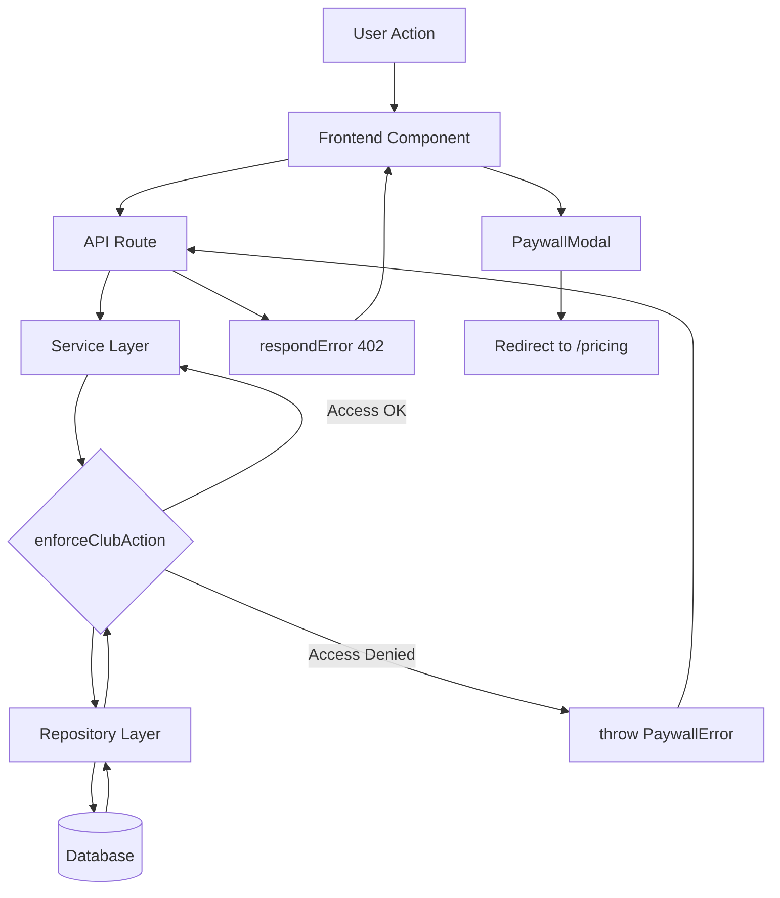
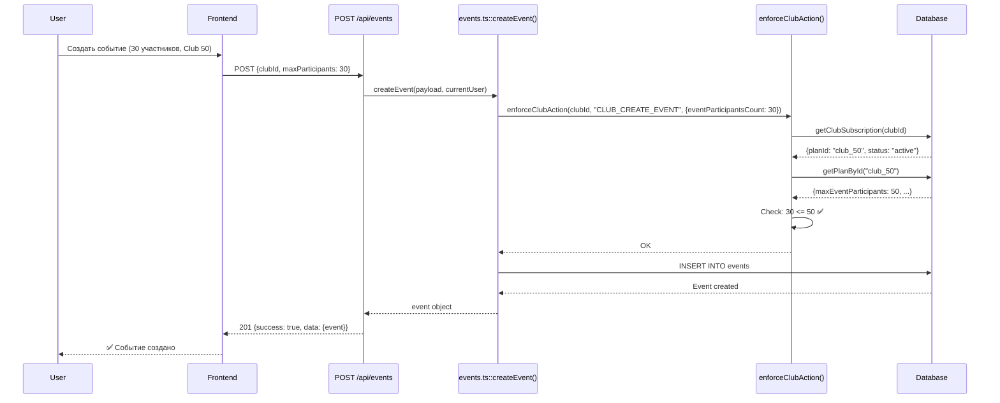
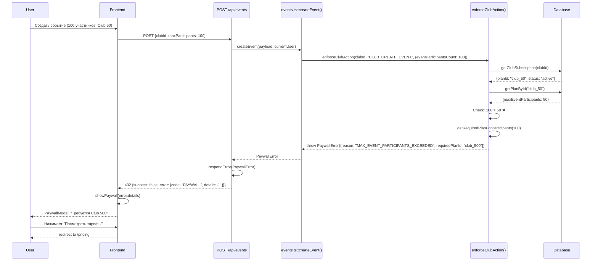
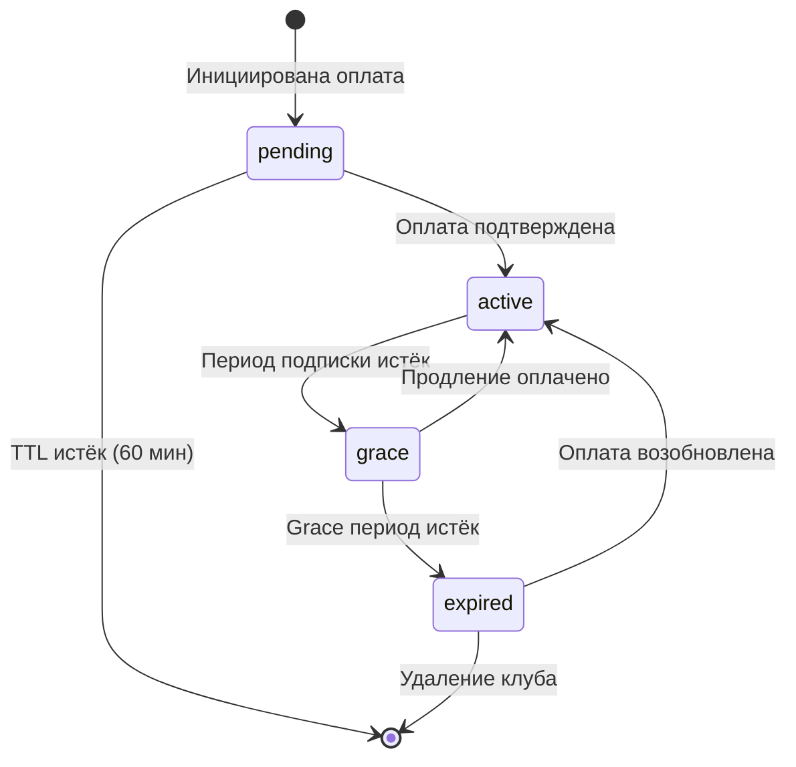

# 💳 Анализ системы биллинга Need4Trip

> **Living Document** — обновляется по мере развития системы  
> **Версия:** 5.5 ⚡  
> **Дата:** 1 января 2026  
> **Статус:** Production (v5.5 - Aborted Actions Finalization)

---

## 🆕 Что нового в v5.5

**1 January 2026:**
- ✅ **Finalized "Aborted Purchase Attempts" section** - Updated to v5.4, aligned with SSOT_ARCHITECTURE.md § 26.4
- ✅ **Added explicit/implicit cancellation rules** - Clear separation of user-initiated vs non-explicit interruptions
- ✅ **Added "Completed payment ≠ auto-applied" rule** - Payment does NOT auto-bind to events
- ✅ **Added "No pending-based UX assumptions" rule** - UI must not display awaiting/processing states
- ✅ **Updated cross-references** - Added § 26.4 (UI Behavior Rules), Neutral Informational Hint

## 🆕 Что нового в v5.4

**1 January 2026:**
- ✅ **Added "Aborted Purchase Attempts" section** - Billing-specific rules for non-completed transactions
- ✅ **Cross-reference to SSOT_ARCHITECTURE.md § 26** - Canonical source for aborted/incomplete actions
- ✅ **Transaction State → Entitlement Mapping** - Explicit table showing when credits are issued
- ✅ **No TTL timers in UI rule** - Frontend must not display countdown for pending transactions

## 🆕 Что нового в v5.3

**1 January 2026:**
- ✅ **Marked v4.x sections as NON-NORMATIVE** - Clear separation of historical vs current architecture
- ✅ **Updated API Endpoints section** - Removed `/api/events/:id/publish`, added POST/PUT enforcement
- ✅ **Updated 409 response contract** - Removed publish endpoint reference from CTA
- ✅ **Updated Migration section** - Now covers v3 → v4 → v5 path
- ✅ **Updated TOC** - Reflects v5+ normative structure

## 🆕 Что нового в v5.2

**26 December 2024:**
- ✅ **Credit badge in header** - Zap icon ⚡ with count (desktop + mobile)
- ✅ **AuthContext integration** - credits count loaded with user (0 extra API calls)
- ✅ **Profile credits section** - available + consumed history
- ✅ **Event create banner** - contextual credit info
- ✅ **Dropdown details** - click badge → info + CTA
- ✅ **Improved invalidation** - router.refresh() instead of window.reload()

## 🆕 Что нового в v5.1

**26 December 2024:**
- ✅ **Compensating transactions** - credit + event save wrapped in transaction
- ✅ **Rollback on failure** - credit returned if event save fails
- ✅ **Retry-safe** - users can retry without losing credits
- ✅ **Observable** - CRITICAL logs for manual intervention

## 🆕 Что нового в v5.0

**26 December 2024:**
- ✅ **Unified enforcement** - `enforceEventPublish()` в create/update
- ✅ **No separate publish step** - события публикуются сразу при сохранении
- ✅ **Removed publish endpoint** - `/api/events/:id/publish` удалён
- ✅ **Removed published_at** - события сразу live (no drafts)
- ✅ **Credit flow integrated** - 409/402 обрабатываются в POST/PUT

## 📜 Implementation History: v4.x (NON-NORMATIVE)

> **⚠️ HISTORICAL — NOT CURRENT ARCHITECTURE**  
> The following v4.x sections describe the **previous** implementation that included a separate publish endpoint.  
> **v5+ is the current production model** — see "Event Save Enforcement (v5)" section for normative behavior.  
> v5+ has NO separate publish step; enforcement happens at save-time (POST/PUT).

### Что было в v4.1 (DEPRECATED)

**26 December 2024:**
- ~~Publish endpoint integrated~~ — **REMOVED in v5.0**
- ✅ **409 handling** - CreditConfirmationModal fully integrated (still valid, different trigger point)
- ✅ **Frontend complete** - all v4 features now working end-to-end

### Что было в v4.0 (DEPRECATED)

**Major Changes (still valid in v5+):**
- ✅ **billing_products** table - SSOT для pricing (NO HARDCODE!)
- ✅ **Unified purchase API** - `/api/billing/purchase-intent` (one-off + clubs)
- ✅ **One-off credits** - EVENT_UPGRADE_500 (perpetual, 1000 KZT)
- ~~**Publish enforcement** - reads constraints from DB dynamically~~ — **Moved to save-time in v5+**
- ✅ **Kaspi stub mode** - ready for real integration
- ✅ **Status polling** - `/api/billing/transactions/status`

**Breaking Changes (v3→v4, still relevant):**
- ❌ Deleted `/api/billing/credits/purchase` → use `/api/billing/purchase-intent`
- ❌ Deleted `/api/billing/credits/confirm` → use `/api/dev/billing/settle` (DEV)

---

## 📋 Содержание

1. [Обзор системы](#обзор-системы)
2. [Database Schema](#database-schema) ⚡
3. [Тарифные планы](#тарифные-планы)
4. [One-off Credits](#one-off-credits) ⚡⚡
5. [Unified Purchase Flow](#unified-purchase-flow) ⚡⚡
6. [Event Save Enforcement (v5) — NORMATIVE](#event-save-enforcement-v5) ⚡⚡ **CURRENT**
7. [Paywall Modal](#paywall-modal)
8. [API Endpoints (v5+ Current)](#api-endpoints-v5-current) ⚡
9. [Ключевые файлы](#ключевые-файлы)
10. [Implementation History: v4.x (NON-NORMATIVE)](#implementation-history-v4x-non-normative) 📜
11. [Migration History: v3 → v4 → v5 (NON-NORMATIVE)](#migration-history-v3--v4--v5-non-normative) 📜

---

## 🎯 Обзор системы

### Основные принципы

Система биллинга Need4Trip построена на следующих принципах (согласно `docs/BILLING_AND_LIMITS.md`):

1. **Frontend не решает лимиты и доступ** — фронт только показывает UI и реагирует на ошибки backend
2. **Backend — единственный источник истины** — по доступу, лимитам, grace и paywall
3. **Цены и лимиты — в БД** — seed + API `/api/plans`
4. **Поведение при неоплате — в БД** — grace period, доступные действия в `pending`/`grace`/`expired`
5. **Транзакции не участвуют в проверках доступа** — `billing_transactions` — только аудит/история

### Ключевые концепции

| Термин | Описание |
|--------|----------|
| **User** | Пользователь (Telegram) |
| **Club** | Платная сущность (в Free клуб создать нельзя) |
| **Plan** | Тариф клуба (`Club 50` / `Club 500` / `Unlimited`) |
| **Subscription** | Состояние оплаты клуба: `active`/`grace`/`expired`/`pending` |
| **Limits** | Лимиты тарифа (max_members, max_event_participants, paid events, CSV export) |
| **Actions** | Операции, которые могут быть разрешены/запрещены в зависимости от подписки |
| **Billing policy** | Правила grace и разрешённые actions при pending/grace/expired |

---

## 🏗️ Архитектура

### Общая структура

```
┌─────────────────────────────────────────────────────────────────┐
│                        DATABASE (Supabase)                       │
├─────────────────────────────────────────────────────────────────┤
│ ┌─────────────────┐  ┌─────────────────┐  ┌─────────────────┐  │
│ │  club_plans     │  │ billing_policy  │  │ billing_policy  │  │
│ │                 │  │                 │  │    _actions     │  │
│ │ - id            │  │ - id            │  │                 │  │
│ │ - name          │  │ - grace_days    │  │ - status        │  │
│ │ - price_monthly │  │ - pending_ttl   │  │ - action        │  │
│ │ - currency_code │  │                 │  │ - is_allowed    │  │
│ │ - max_members   │  │                 │  │                 │  │
│ │ - allow_paid    │  │                 │  │                 │  │
│ │ - allow_csv     │  │                 │  │                 │  │
│ └─────────────────┘  └─────────────────┘  └─────────────────┘  │
│                                                                  │
│ ┌─────────────────┐  ┌─────────────────────────────────────┐   │
│ │ club_           │  │ billing_transactions (audit)        │   │
│ │  subscriptions  │  │                                     │   │
│ │                 │  │ - id, club_id, user_id, plan_id     │   │
│ │ - club_id       │  │ - product_code, provider            │   │
│ │ - plan_id       │  │ - amount, currency_code             │   │
│ │ - status        │  │ - status (pending/completed/failed) │   │
│ │ - period_start  │  │ - period_start, period_end          │   │
│ │ - period_end    │  │ - created_at, updated_at            │   │
│ │ - grace_until   │  │                                     │   │
│ └─────────────────┘  └─────────────────────────────────────┘   │
└─────────────────────────────────────────────────────────────────┘
                              ↑ Query + Cache (5 min)
                              │
┌─────────────────────────────────────────────────────────────────┐
│                     BACKEND (Repository Layer)                   │
├─────────────────────────────────────────────────────────────────┤
│ planRepo.ts                 → getPlanById(), listPublicPlans()   │
│ clubSubscriptionRepo.ts     → getClubSubscription(), upsert...   │
│ billingPolicyRepo.ts        → isActionAllowed(), getPolicyMap()  │
│ billingTransactionsRepo.ts  → createPending(), markPaid()        │
└─────────────────────────────────────────────────────────────────┘
                              ↑
                              │
┌─────────────────────────────────────────────────────────────────┐
│                     BACKEND (Service Layer)                      │
├─────────────────────────────────────────────────────────────────┤
│ accessControl.ts            → enforceClubAction()                │
│   ├─ enforceFreeLimit()     → проверка FREE плана из БД          │
│   ├─ enforcePlanLimits()    → проверка лимитов плана             │
│   └─ getClubCurrentPlan()   → получение текущего плана           │
└─────────────────────────────────────────────────────────────────┘
                              ↑ throws PaywallError (402)
                              │
┌─────────────────────────────────────────────────────────────────┐
│                      API ROUTES (Next.js)                        │
├─────────────────────────────────────────────────────────────────┤
│ POST /api/events            → createEvent() → enforceClubAction │
│ PUT  /api/events/[id]       → updateEvent() → enforceClubAction │
│ GET  /api/clubs/[id]/export → enforceClubAction(CSV_EXPORT)     │
│ GET  /api/plans             → listPublicPlans()                  │
│ GET  /api/clubs/[id]/plan   → getClubCurrentPlan()               │
└─────────────────────────────────────────────────────────────────┘
                              ↑ HTTP 402 + PaywallError JSON
                              │
┌─────────────────────────────────────────────────────────────────┐
│                     FRONTEND (React/Next.js)                     │
├─────────────────────────────────────────────────────────────────┤
│ PaywallModal (2 версии)     → показывает ограничения            │
│ useClubPlan()               → загружает лимиты для UI           │
│ usePaywall()                → hook для управления paywall modal │
│ EventForm                   → валидация + usePaywall()           │
│ PricingPage                 → отображает тарифы из /api/plans   │
└─────────────────────────────────────────────────────────────────┘
```

### Поток данных



---

## 💾 База данных

### Схема таблиц

#### 1. `club_plans` — Тарифные планы

```sql
CREATE TABLE public.club_plans (
  id TEXT PRIMARY KEY,                          -- 'free' | 'club_50' | 'club_500' | 'club_unlimited'
  name TEXT NOT NULL,
  description TEXT,
  
  price_monthly NUMERIC(10,2) NOT NULL,         -- Normalized (generic amount)
  currency_code TEXT NOT NULL DEFAULT 'KZT' REFERENCES currencies(code),  -- FK
  
  max_club_members INT NULL,                    -- NULL = безлимит
  max_event_participants INT NULL,              -- NULL = безлимит
  
  allow_paid_events BOOLEAN NOT NULL DEFAULT FALSE,
  allow_csv_export BOOLEAN NOT NULL DEFAULT FALSE,
  
  is_active BOOLEAN NOT NULL DEFAULT TRUE,
  
  created_at TIMESTAMPTZ NOT NULL DEFAULT NOW(),
  updated_at TIMESTAMPTZ NOT NULL DEFAULT NOW()
);

CREATE INDEX idx_club_plans_price_monthly ON club_plans(price_monthly);
CREATE INDEX idx_club_plans_currency_code ON club_plans(currency_code);
```

> **Schema alignment (2024-12-26):** `price_monthly_kzt` → `price_monthly` + `currency_code` FK.
> See SSOT_DATABASE.md §6 for authoritative schema.

**Миграции:**
- `20241215_create_club_plans_v2.sql` — создание таблицы
- `20241215_seed_club_plans.sql` — seed планов (Club 50, 500, Unlimited)
- `20241216_add_free_plan.sql` — добавление FREE плана в БД

#### 2. `club_subscriptions` — Подписки клубов

```sql
CREATE TABLE public.club_subscriptions (
  club_id UUID PRIMARY KEY REFERENCES clubs(id) ON DELETE CASCADE,
  
  plan_id TEXT NOT NULL REFERENCES club_plans(id),
  status TEXT NOT NULL CHECK (status IN ('pending', 'active', 'grace', 'expired')),
  
  current_period_start TIMESTAMPTZ NULL,
  current_period_end TIMESTAMPTZ NULL,
  
  grace_until TIMESTAMPTZ NULL,
  
  created_at TIMESTAMPTZ NOT NULL DEFAULT NOW(),
  updated_at TIMESTAMPTZ NOT NULL DEFAULT NOW()
);

CREATE INDEX idx_club_subscriptions_plan_id ON club_subscriptions(plan_id);
CREATE INDEX idx_club_subscriptions_status ON club_subscriptions(status);
CREATE INDEX idx_club_subscriptions_period_end ON club_subscriptions(current_period_end) 
  WHERE current_period_end IS NOT NULL;
```

**Важно:** Если запись отсутствует → FREE план (персональные события без клуба)

**Миграции:**
- `20241212_create_club_subscriptions.sql` — создание таблицы
- `20241215_alter_club_subscriptions_v2_SAFE.sql` — миграция на v2.0

#### 3. `billing_policy` — Глобальная политика биллинга

```sql
CREATE TABLE public.billing_policy (
  id TEXT PRIMARY KEY,                           -- 'default'
  grace_period_days INT NOT NULL DEFAULT 7,      -- Дней grace периода
  pending_ttl_minutes INT NOT NULL DEFAULT 60,   -- Время ожидания оплаты
  
  created_at TIMESTAMPTZ NOT NULL DEFAULT NOW(),
  updated_at TIMESTAMPTZ NOT NULL DEFAULT NOW()
);
```

**Seed:** `grace_period_days = 7`, `pending_ttl_minutes = 60`

**Миграции:**
- `20241215_create_billing_policy.sql`
- `20241215_seed_billing_policy.sql`

#### 4. `billing_policy_actions` — Разрешённые действия по статусам

```sql
CREATE TABLE public.billing_policy_actions (
  policy_id TEXT NOT NULL REFERENCES billing_policy(id) ON DELETE CASCADE,
  status TEXT NOT NULL CHECK (status IN ('pending','grace','expired')),
  action TEXT NOT NULL,
  is_allowed BOOLEAN NOT NULL DEFAULT false,
  
  PRIMARY KEY (policy_id, status, action)
);
```

**Seed данные:**

| status | action | is_allowed |
|--------|--------|-----------|
| **grace** | CLUB_CREATE_EVENT | ✅ true |
| **grace** | CLUB_UPDATE_EVENT | ✅ true |
| **grace** | CLUB_CREATE_PAID_EVENT | ✅ true |
| **grace** | CLUB_EXPORT_PARTICIPANTS_CSV | ✅ true |
| **grace** | CLUB_INVITE_MEMBER | ✅ true |
| **expired** | ALL_ACTIONS | ❌ false |
| **pending** | ALL_ACTIONS | ❌ false |

**Миграции:**
- `20241215_create_billing_policy_actions.sql`
- `20241215_seed_billing_policy_actions.sql`

#### 5. `billing_transactions` — История платежей (audit trail)

```sql
CREATE TABLE public.billing_transactions (
  id UUID PRIMARY KEY DEFAULT gen_random_uuid(),
  
  club_id UUID REFERENCES clubs(id) ON DELETE CASCADE,       -- NULL для one-off credits
  user_id UUID REFERENCES users(id) ON DELETE SET NULL,      -- Для one-off credits
  product_code TEXT NOT NULL,                                -- EVENT_UPGRADE_500, CLUB_*
  plan_id TEXT REFERENCES club_plans(id) ON DELETE RESTRICT, -- NULL для one-off
  
  provider TEXT NOT NULL,                                    -- 'kaspi' | 'yookassa' | 'stripe'
  provider_payment_id TEXT,
  
  amount NUMERIC(10,2) NOT NULL,                             -- Normalized (was amount_kzt)
  currency_code TEXT NOT NULL DEFAULT 'KZT' REFERENCES currencies(code), -- FK
  
  status TEXT NOT NULL CHECK (status IN ('pending','completed','failed','refunded')),
  
  period_start TIMESTAMPTZ NULL,
  period_end TIMESTAMPTZ NULL,
  
  created_at TIMESTAMPTZ NOT NULL DEFAULT NOW(),
  updated_at TIMESTAMPTZ NOT NULL DEFAULT NOW()
);

CREATE INDEX idx_billing_transactions_club_id ON billing_transactions(club_id);
CREATE INDEX idx_billing_transactions_user_id ON billing_transactions(user_id);
CREATE INDEX idx_billing_transactions_product_code ON billing_transactions(product_code);
CREATE INDEX idx_billing_transactions_status ON billing_transactions(status);
```

**Назначение:** Только аудит. НЕ используется для проверок доступа.

> **Schema alignment (2024-12-26):** `amount_kzt` → `amount`, `currency` → `currency_code` (FK), `status: 'paid'` → `status: 'completed'`.
> See SSOT_DATABASE.md §5 for authoritative schema.

### RLS (Row Level Security)

**Включено для:**
- `club_subscriptions` — `20241222_enable_rls_club_subscriptions.sql`
- `billing_transactions` — `20241222_enable_rls_billing_transactions.sql`

---

## 💰 Тарифные планы

### Текущие планы

| ID | Название | Цена/мес | Участники/событие | Члены клуба | Платные события | CSV экспорт |
|----|----------|----------|-------------------|-------------|-----------------|-------------|
| `free` | **Free** | 0 ₸ | 15 | - | ❌ | ❌ |
| `club_50` | **Club 50** | 5,000 ₸ | 50 | 50 | ✅ | ✅ |
| `club_500` | **Club 500** | 15,000 ₸ | 500 | 500 | ✅ | ✅ |
| `club_unlimited` | **Unlimited** | 30,000 ₸ | ∞ | ∞ | ✅ | ✅ |

### Особенности FREE плана

**Free — это не клубный тариф:**
- ❌ Нельзя создать клуб
- ✅ Можно создавать личные события (не привязанные к клубу)
- ✅ Только бесплатные события
- ✅ Лимит участников: 15
- ❌ CSV экспорт недоступен

**В БД:** FREE план теперь хранится в `club_plans` (с версии 2.1) для унификации кэширования.

### Источник тарифов

**Endpoint:** `GET /api/plans`

```typescript
// src/app/api/plans/route.ts
export async function GET() {
  const plans = await listPublicPlans(); // Все планы с is_public = true
  return NextResponse.json({
    success: true,
    data: { plans },
  });
}
```

**Frontend:** Страница `/pricing` загружает планы из этого API.

---

## 🔐 Система enforcement

### Центральная функция

**Файл:** `src/lib/services/accessControl.ts`

```typescript
export async function enforceClubAction(params: {
  clubId: string;
  action: BillingActionCode;
  context?: {
    eventParticipantsCount?: number;
    clubMembersCount?: number;
    isPaidEvent?: boolean;
  };
}): Promise<void>
```

### Алгоритм проверки (из спецификации)

```
1. Load club_subscriptions by club_id
2. If NULL → FREE plan
   - Load FREE plan from DB (cached)
   - Check FREE limits
   - Throw PaywallError if violated
3. If subscription exists:
   a. Load plan from DB (cached)
   b. Check status:
      - active → check plan limits only
      - grace/pending/expired → check billing_policy_actions + limits
   c. If action not allowed → throw PaywallError
   d. Check plan limits (max_members, max_event_participants, etc.)
   e. If limits exceeded → throw PaywallError
```

### Коды действий (BillingActionCode)

```typescript
// src/lib/types/billing.ts
export const BILLING_ACTION_CODES = [
  "CLUB_CREATE_EVENT",
  "CLUB_UPDATE_EVENT",
  "CLUB_CREATE_PAID_EVENT",
  "CLUB_EXPORT_PARTICIPANTS_CSV",
  "CLUB_INVITE_MEMBER",
  "CLUB_REMOVE_MEMBER",
  "CLUB_UPDATE",
] as const;
```

### Примеры проверок

#### 1. Проверка лимита участников

```typescript
// src/lib/services/accessControl.ts (enforcePlanLimits)
if (plan.maxEventParticipants !== null && 
    context.eventParticipantsCount > plan.maxEventParticipants) {
  
  const requiredPlan = await getRequiredPlanForParticipants(
    context.eventParticipantsCount
  );
  
  throw new PaywallError({
    message: `Event with ${context.eventParticipantsCount} participants exceeds limit`,
    reason: "MAX_EVENT_PARTICIPANTS_EXCEEDED",
    currentPlanId: plan.id,
    requiredPlanId: requiredPlan,
    meta: {
      requested: context.eventParticipantsCount,
      limit: plan.maxEventParticipants,
    },
  });
}
```

#### 2. Проверка CSV экспорта

```typescript
if (action === "CLUB_EXPORT_PARTICIPANTS_CSV") {
  if (!plan.allowCsvExport) {
    throw new PaywallError({
      message: "CSV export not allowed on your plan",
      reason: "CSV_EXPORT_NOT_ALLOWED",
      currentPlanId: plan.id,
      requiredPlanId: "club_50",
    });
  }
}
```

#### 3. Проверка статуса подписки

```typescript
// Если status != 'active'
const isAllowed = await isActionAllowed(subscription.status, action);

if (!isAllowed) {
  throw new PaywallError({
    message: `Action "${action}" not allowed for status "${subscription.status}"`,
    reason: "SUBSCRIPTION_NOT_ACTIVE",
    currentPlanId: subscription.planId,
    meta: { status: subscription.status },
  });
}
```

### PaywallError структура

```typescript
// src/lib/errors.ts
export class PaywallError extends AppError {
  reason: string;
  currentPlanId?: string;
  requiredPlanId?: string;
  meta?: Record<string, unknown>;
  cta: {
    type: "OPEN_PRICING";
    href: "/pricing";
  };
  
  // statusCode: 402
  // code: "PAYWALL"
}
```

**Причины paywall (reason codes):**

```typescript
export const PAYWALL_REASONS = [
  "CLUB_CREATION_REQUIRES_PLAN",
  "SUBSCRIPTION_EXPIRED",
  "SUBSCRIPTION_NOT_ACTIVE",
  "PAID_EVENTS_NOT_ALLOWED",
  "CSV_EXPORT_NOT_ALLOWED",
  "MAX_EVENT_PARTICIPANTS_EXCEEDED",
  "MAX_CLUB_MEMBERS_EXCEEDED",
] as const;
```

---

## 🚧 Paywall Modal (v4)

### PaywallModal.tsx (v4 - Purchase Intent + Polling)

**Статус:** ✅ Updated for v4 (26 Dec 2024)

**Файл:** `src/components/billing/PaywallModal.tsx`

**Features:**
- ✅ Multiple payment options (ONE_OFF + CLUB)
- ✅ Unified `/api/billing/purchase-intent` API
- ✅ Transaction status polling
- ✅ Visual feedback (loading states)
- ✅ Error handling

**Full Implementation:**

```typescript
import { useState, useEffect } from "react";
import { Dialog, DialogContent, DialogHeader, DialogTitle } from "@/components/ui/dialog";
import { Button } from "@/components/ui/button";
import type { PaywallError } from "@/lib/types/billing";

interface PaywallModalProps {
  open: boolean;
  onClose: () => void;
  error: PaywallError; // 402 response payload
}

export function PaywallModal({ open, onClose, error }: PaywallModalProps) {
  const [loading, setLoading] = useState(false);
  const [transactionId, setTransactionId] = useState<string | null>(null);
  const [paymentUrl, setPaymentUrl] = useState<string | null>(null);
  
  // Handle purchase intent
  const handlePurchase = async (productCode: string) => {
    setLoading(true);
    try {
      const res = await fetch('/api/billing/purchase-intent', {
        method: 'POST',
        headers: { 'Content-Type': 'application/json' },
        body: JSON.stringify({ product_code: productCode })
      });
      
      if (!res.ok) throw new Error('Purchase failed');
      
      const data = await res.json();
      setTransactionId(data.data.transaction_id);
      setPaymentUrl(data.data.payment_details.invoice_url);
      
      // Start polling for status
      startPolling(data.data.transaction_id);
    } catch (err) {
      console.error(err);
      setLoading(false);
    }
  };
  
  // Poll transaction status
  const startPolling = (txId: string) => {
    const interval = setInterval(async () => {
      try {
        const res = await fetch(`/api/billing/transactions/status?transaction_id=${txId}`);
        const data = await res.json();
        
        if (data.data.status === 'completed') {
          clearInterval(interval);
          setLoading(false);
          onClose();
          window.location.reload(); // Refresh to show new credit
        }
        
        if (data.data.status === 'failed') {
          clearInterval(interval);
          setLoading(false);
          alert('Payment failed');
        }
      } catch (err) {
        console.error(err);
      }
    }, 3000); // Poll every 3 seconds
    
    // Cleanup after 5 minutes
    setTimeout(() => clearInterval(interval), 5 * 60 * 1000);
  };
  
  return (
    <Dialog open={open} onOpenChange={onClose}>
      <DialogContent className="sm:max-w-lg">
        <DialogHeader>
          <DialogTitle>
            {error.reason === 'PUBLISH_REQUIRES_PAYMENT' 
              ? 'Превышен лимит бесплатного плана'
              : 'Требуется обновление плана'}
          </DialogTitle>
        </DialogHeader>
        
        <div className="space-y-4">
          {/* Current situation */}
          <div className="bg-amber-50 p-4 rounded-lg">
            <p className="text-sm text-amber-900">
              {error.message}
            </p>
            {error.meta && (
              <p className="text-xs text-amber-700 mt-2">
                Запрошено: {error.meta.requestedParticipants} участников
                {error.meta.freeLimit && ` / Лимит: ${error.meta.freeLimit}`}
              </p>
            )}
          </div>
          
          {/* Payment options */}
          {error.options && error.options.length > 0 && (
            <div className="space-y-2">
              <h3 className="font-medium">Варианты оплаты:</h3>
              
              {error.options.map((option, idx) => (
                <div key={idx} className="border p-4 rounded-lg">
                  {option.type === 'ONE_OFF_CREDIT' && (
                    <>
                      <h4 className="font-semibold">Разовый кредит</h4>
                      <p className="text-sm text-gray-600 mb-2">
                        Одноразовое событие до 500 участников
                      </p>
                      <p className="font-bold text-lg mb-3">
                        {option.price} {option.currency_code === 'KZT' ? '₸' : option.currency_code}
                      </p>
                      <Button
                        onClick={() => handlePurchase(option.product_code)}
                        disabled={loading}
                        className="w-full"
                      >
                        {loading ? 'Обработка...' : 'Купить'}
                      </Button>
                    </>
                  )}
                  
                  {option.type === 'CLUB_ACCESS' && (
                    <>
                      <h4 className="font-semibold">Клубный доступ</h4>
                      <p className="text-sm text-gray-600 mb-2">
                        Неограниченные события + members
                      </p>
                      <Button
                        variant="outline"
                        onClick={() => window.location.href = '/pricing'}
                        className="w-full"
                      >
                        Посмотреть тарифы
                      </Button>
                    </>
                  )}
                </div>
              ))}
            </div>
          )}
          
          {/* Payment in progress */}
          {paymentUrl && (
            <div className="bg-blue-50 p-4 rounded-lg">
              <p className="text-sm text-blue-900 mb-2">
                Платёж создан. Оплатите по ссылке:
              </p>
              <a 
                href={paymentUrl} 
                target="_blank" 
                rel="noopener noreferrer"
                className="text-blue-600 underline"
              >
                Открыть Kaspi
              </a>
              <p className="text-xs text-blue-700 mt-2">
                После оплаты страница обновится автоматически
              </p>
            </div>
          )}
        </div>
      </DialogContent>
    </Dialog>
  );
}

// Hook for easy usage
export function usePaywall() {
  const [paywallError, setPaywallError] = useState<PaywallError | null>(null);
  
  const showPaywall = (error: PaywallError) => setPaywallError(error);
  const hidePaywall = () => setPaywallError(null);
  
  const PaywallModalComponent = paywallError ? (
    <PaywallModal open={!!paywallError} onClose={hidePaywall} error={paywallError} />
  ) : null;
  
  return { showPaywall, hidePaywall, PaywallModalComponent };
}
```

**Usage (v5+ — save-time enforcement):**

```typescript
import { usePaywall } from "@/components/billing/PaywallModal";

const { showPaywall, PaywallModalComponent } = usePaywall();

try {
  // v5+: enforcement happens at save-time (POST/PUT), no separate publish step
  await fetch('/api/events', { method: 'POST', body: JSON.stringify(payload) });
} catch (err) {
  if (err.response?.status === 402) {
    showPaywall(err.response.data.error.details);
  }
}

return <>{PaywallModalComponent}</>;
```

### CreditConfirmationModal.tsx (v4)

**Файл:** `src/components/billing/CreditConfirmationModal.tsx`

**Purpose:** Показывается при 409 CREDIT_CONFIRMATION_REQUIRED

**Full Implementation:**

```typescript
import { Dialog, DialogContent, DialogHeader, DialogTitle, DialogFooter } from "@/components/ui/dialog";
import { Button } from "@/components/ui/button";
import { AlertCircle, CreditCard } from "lucide-react";
import type { CreditCode } from "@/lib/types/billing";

interface CreditConfirmationModalProps {
  open: boolean;
  onOpenChange: (open: boolean) => void;
  creditCode: CreditCode;
  eventId: string;
  requestedParticipants: number;
  onConfirm: () => void;
  onCancel: () => void;
  isLoading?: boolean;
}

export function CreditConfirmationModal({
  open,
  onOpenChange,
  creditCode,
  requestedParticipants,
  onConfirm,
  onCancel,
  isLoading = false,
}: CreditConfirmationModalProps) {
  return (
    <Dialog open={open} onOpenChange={onOpenChange}>
      <DialogContent className="sm:max-w-md">
        <DialogHeader>
          <div className="flex items-center gap-3">
            <div className="p-2 bg-orange-100 rounded-full">
              <CreditCard className="w-5 h-5 text-orange-600" />
            </div>
            <DialogTitle>Подтвердите использование кредита</DialogTitle>
          </div>
        </DialogHeader>

        <div className="space-y-4 py-4">
          {/* Warning */}
          <div className="flex gap-3 p-4 bg-amber-50 border border-amber-200 rounded-lg">
            <AlertCircle className="w-5 h-5 text-amber-600 flex-shrink-0" />
            <div className="text-sm">
              <p className="font-medium text-amber-900">
                Это действие нельзя отменить
              </p>
              <p className="text-amber-700 mt-1">
                После подтверждения кредит будет привязан к этому событию
                и станет недоступен для других событий.
              </p>
            </div>
          </div>

          {/* Details */}
          <div className="space-y-2 text-sm">
            <div className="flex justify-between">
              <span className="text-gray-600">Кредит:</span>
              <span className="font-medium">{creditCode}</span>
            </div>
            <div className="flex justify-between">
              <span className="text-gray-600">Участников:</span>
              <span className="font-medium">{requestedParticipants}</span>
            </div>
          </div>
        </div>

        <DialogFooter className="flex-row gap-2">
          <Button
            variant="outline"
            onClick={onCancel}
            disabled={isLoading}
            className="flex-1"
          >
            Отмена
          </Button>
          <Button
            onClick={onConfirm}
            disabled={isLoading}
            className="flex-1 bg-orange-600 hover:bg-orange-700"
          >
            {isLoading ? 'Сохранение...' : 'Подтвердить и сохранить'}
          </Button>
        </DialogFooter>
      </DialogContent>
    </Dialog>
  );
}

// Hook for easy usage
export function useCreditConfirmation() {
  const [modalState, setModalState] = useState<{
    open: boolean;
    creditCode?: CreditCode;
    eventId?: string;
    requestedParticipants?: number;
  }>({ open: false });

  const showConfirmation = (data: {
    creditCode: CreditCode;
    eventId: string;
    requestedParticipants: number;
  }) => {
    setModalState({ open: true, ...data });
  };

  const hideConfirmation = () => {
    setModalState({ open: false });
  };

  return { modalState, showConfirmation, hideConfirmation };
}
```

**Usage:**

```typescript
import { useCreditConfirmation, CreditConfirmationModal } from "@/components/billing/CreditConfirmationModal";

const { showConfirmation, hideConfirmation, modalState } = useCreditConfirmation();
const [pendingEventId, setPendingEventId] = useState<string | null>(null);

// When 409 received
if (publishRes.status === 409) {
  const error409 = await publishRes.json();
  setPendingEventId(eventId);
  showConfirmation({
    creditCode: error409.error.meta.creditCode,
    eventId: error409.error.meta.eventId,
    requestedParticipants: error409.error.meta.requestedParticipants
  });
}

// Render modal
return (
  <>
    {modalState.open && modalState.creditCode && (
      <CreditConfirmationModal
        open={modalState.open}
        onOpenChange={hideConfirmation}
        creditCode={modalState.creditCode}
        eventId={modalState.eventId!}
        requestedParticipants={modalState.requestedParticipants!}
        onConfirm={async () => {
          hideConfirmation();
          // v5+: Retry save with confirm_credit=1
          await handleSave(pendingPayload, true); // ?confirm_credit=1
        }}
        onCancel={hideConfirmation}
      />
    )}
  </>
);
```

---

## 🔄 Flow создания события

### Успешный сценарий



### Сценарий с Paywall



### Код в createEvent()

```typescript
// src/lib/services/events.ts
export async function createEvent(input: unknown, currentUser: CurrentUser | null) {
  const validated = EventCreateSchema.parse(input);
  
  // Проверка биллинга v2.0
  if (validated.clubId) {
    await enforceClubAction({
      clubId: validated.clubId,
      action: validated.isPaid ? "CLUB_CREATE_PAID_EVENT" : "CLUB_CREATE_EVENT",
      context: {
        eventParticipantsCount: validated.maxParticipants ?? undefined,
        isPaidEvent: validated.isPaid,
      },
    });
  } else {
    // Personal events (FREE plan)
    const freePlan = await getPlanById("free");
    
    if (validated.isPaid && !freePlan.allowPaidEvents) {
      throw new PaywallError({
        message: "Платные события доступны только на платных тарифах",
        reason: "PAID_EVENTS_NOT_ALLOWED",
        currentPlanId: "free",
        requiredPlanId: "club_50",
      });
    }
    
    if (validated.maxParticipants && freePlan.maxEventParticipants !== null && 
        validated.maxParticipants > freePlan.maxEventParticipants) {
      throw new PaywallError({
        message: `Превышен лимит участников (${validated.maxParticipants} > ${freePlan.maxEventParticipants})`,
        reason: "MAX_EVENT_PARTICIPANTS_EXCEEDED",
        currentPlanId: "free",
        requiredPlanId: "club_50",
        meta: {
          requested: validated.maxParticipants,
          limit: freePlan.maxEventParticipants,
        },
      });
    }
  }
  
  // Создание события в БД
  const event = await createEventRecord({...validated, createdByUserId: currentUser.id});
  return event;
}
```

---

## 📁 Ключевые файлы

### Backend

#### Repository Layer (Database)

```
src/lib/db/
├── planRepo.ts                     — Тарифы (с кэшем)
│   ├── listPublicPlans()
│   ├── getPlanById()
│   ├── getRequiredPlanForParticipants()
│   └── getRequiredPlanForMembers()
│
├── billingProductsRepo.ts          — Products (v4 NEW) ⚡
│   ├── getBillingProductByCode()
│   ├── listActiveBillingProducts()
│   └── SSOT для one-off pricing
│
├── billingCreditsRepo.ts           — Credits (v4 NEW) ⚡
│   ├── findAvailableCredit()
│   ├── createBillingCredit()
│   ├── consumeCredit()
│   └── getUserCredits()
│
├── clubSubscriptionRepo.ts         — Подписки клубов
│   ├── getClubSubscription()
│   ├── upsertClubSubscription()
│   ├── setClubSubscriptionStatus()
│   └── activateSubscription()
│
├── billingPolicyRepo.ts            — Политики биллинга
│   ├── getDefaultBillingPolicy()
│   ├── getPolicyActionsMap()
│   └── isActionAllowed()
│
└── billingTransactionsRepo.ts      — История платежей
    ├── createPendingTransaction()
    ├── markTransactionPaid()
    ├── markTransactionFailed()
    └── getClubTransactions()
```

#### Service Layer (Business Logic)

```
src/lib/services/
├── accessControl.ts                — Enforcement системы
│   ├── enforceClubAction()         ← Club billing
│   ├── enforcePublish()            ← Personal events (v4 NEW) ⚡
│   ├── enforceFreeLimit()
│   ├── enforcePlanLimits()
│   └── getClubCurrentPlan()
│
├── events.ts                       — Логика событий
│   ├── createEvent()               → вызывает enforceClubAction()
│   └── updateEvent()               → вызывает enforceClubAction()
│
└── clubs.ts                        — Логика клубов
```

#### API Routes

```
src/app/api/
├── billing/ (v4 NEW) ⚡
│   ├── products/
│   │   └── route.ts                — GET /api/billing/products
│   ├── purchase-intent/
│   │   └── route.ts                — POST /api/billing/purchase-intent
│   ├── transactions/
│   │   └── status/
│   │       └── route.ts            — GET /api/billing/transactions/status
│   └── dev/
│       └── billing/
│           └── settle/
│               └── route.ts        — POST /api/dev/billing/settle (DEV)
│
├── plans/
│   └── route.ts                    — GET /api/plans
│
├── clubs/[id]/
│   ├── route.ts                    — GET, PATCH /api/clubs/:id
│   ├── current-plan/
│   │   └── route.ts                — GET /api/clubs/:id/current-plan
│   └── export/
│       └── route.ts                — GET /api/clubs/:id/export (CSV)
│
└── events/
    ├── route.ts                    — GET, POST /api/events (v5+: enforcement at save-time)
    └── [id]/
        └── route.ts                — GET, PUT /api/events/:id (v5+: enforcement at save-time)
        # NOTE: publish/ directory was REMOVED in v5+ (enforcement moved to POST/PUT)
```

#### Errors & Response Handling

```
src/lib/
├── errors.ts                       — PaywallError, AppError
└── api/
    └── response.ts                 — respondError(), respondSuccess()
```

#### Types

```
src/lib/types/
└── billing.ts                      — Все типы биллинга
    ├── PlanId, ClubPlan
    ├── SubscriptionStatus, ClubSubscription
    ├── BillingActionCode
    ├── PaywallError, PaywallReason
    └── BillingTransaction
```

### Frontend

#### Components

```
src/components/
├── billing/
│   ├── PaywallModal.tsx            — v4 Modal (purchase-intent + polling) ⚡
│   └── CreditConfirmationModal.tsx — 409 handling (v4 NEW) ⚡
│
├── events/
│   ├── event-form.tsx              — Использует useClubPlan(), usePaywall()
│   └── create-event-page-content.tsx
│
└── pricing/
    └── pricing-card-button.tsx
```

#### Hooks

```
src/hooks/
└── use-club-plan.ts                — Загрузка плана клуба для UI
    └── useClubPlan(clubId)
        ├── Загружает /api/clubs/:id/current-plan
        ├── Для FREE: загружает планviz из БД (getPlanById("free"))
        └── Возвращает {plan, limits, loading, error}
```

#### Pages

```
src/app/(app)/
├── pricing/
│   └── page.tsx                    — Страница тарифов
│
└── events/
    ├── create/
    │   └── create-event-client.tsx — ✅ Calls publish endpoint (v4) ⚡
    └── [id]/
        └── edit/
            └── edit-event-client.tsx — ✅ Calls publish endpoint (v4) ⚡
```

### Database

```
supabase/migrations/
├── 20241215_create_club_plans_v2.sql
├── 20241215_seed_club_plans.sql
├── 20241216_add_free_plan.sql
├── 20241212_create_club_subscriptions.sql
├── 20241215_alter_club_subscriptions_v2_SAFE.sql
├── 20241215_create_billing_policy.sql
├── 20241215_seed_billing_policy.sql
├── 20241215_create_billing_policy_actions.sql
├── 20241215_seed_billing_policy_actions.sql
├── 20241215_create_billing_transactions.sql
├── 20241222_enable_rls_club_subscriptions.sql
└── 20241222_enable_rls_billing_transactions.sql
```

### Documentation

```
docs/
├── BILLING_AND_LIMITS.md           — Продуктовая спецификация (source of truth)
└── BILLING_SYSTEM_ANALYSIS.md      — Этот документ (технический анализ)
```

---

## 💡 Примеры использования

### 1. Проверка доступа при создании события

```typescript
// src/lib/services/events.ts
export async function createEvent(input: unknown, currentUser: CurrentUser | null) {
  const validated = EventCreateSchema.parse(input);
  
  if (validated.clubId) {
    // Проверка для клубных событий
    await enforceClubAction({
      clubId: validated.clubId,
      action: validated.isPaid ? "CLUB_CREATE_PAID_EVENT" : "CLUB_CREATE_EVENT",
      context: {
        eventParticipantsCount: validated.maxParticipants ?? undefined,
        isPaidEvent: validated.isPaid,
      },
    });
  } else {
    // Проверка для личных событий (FREE)
    const freePlan = await getPlanById("free");
    
    if (validated.isPaid && !freePlan.allowPaidEvents) {
      throw new PaywallError({...});
    }
  }
  
  // Создание события
  const event = await createEventRecord({...});
  return event;
}
```

### 2. CSV экспорт с проверкой биллинга

```typescript
// src/app/api/clubs/[id]/export/route.ts
export async function GET(req: NextRequest, { params }: Params) {
  const { id: clubId } = await params;
  const user = await getCurrentUserFromMiddleware(req);
  
  // Проверка прав доступа
  // Canonical roles: owner, admin, member, pending (see SSOT_CLUBS_EVENTS_ACCESS.md §2)
  const userRole = await getUserClubRole(user.id, clubId);
  if (userRole !== "owner" && userRole !== "admin") {
    throw new ForbiddenError("Нет доступа");
  }
  
  // Проверка биллинга
  await enforceClubAction({
    clubId,
    action: "CLUB_EXPORT_PARTICIPANTS_CSV",
  });
  
  // Экспорт
  const members = await listMembers(clubId);
  const csv = generateCSV(members);
  
  return new NextResponse(csv, {
    headers: {
      "Content-Type": "text/csv",
      "Content-Disposition": `attachment; filename="members.csv"`,
    },
  });
}
```

### 3. Использование useClubPlan в форме

```typescript
// src/components/events/event-form.tsx
export function EventForm({ club, ...props }) {
  const { plan, limits, loading } = useClubPlan(club?.id);
  const { showPaywall, PaywallModalComponent } = usePaywall();
  
  // Динамический лимит из плана (или 15 для FREE)
  const maxAllowedParticipants = limits?.maxEventParticipants ?? 15;
  
  const handleSubmit = async (data) => {
    try {
      await createEvent(data);
    } catch (err) {
      if (err.response?.status === 402) {
        showPaywall(err.response.data.error.details);
        return;
      }
      throw err;
    }
  };
  
  return (
    <>
      <form onSubmit={handleSubmit}>
        <Input
          label="Макс. участников"
          max={maxAllowedParticipants}
          hint={`Ваш план поддерживает до ${maxAllowedParticipants} участников`}
        />
        <Button type="submit">Создать</Button>
      </form>
      
      {PaywallModalComponent}
    </>
  );
}
```

### 4. Получение текущего плана клуба

```typescript
// src/app/api/clubs/[id]/current-plan/route.ts
export async function GET(req: NextRequest, { params }: Params) {
  const { id: clubId } = await params;
  const user = await getCurrentUserFromMiddleware(req);
  
  // Получение плана через service
  const { planId, plan, subscription } = await getClubCurrentPlan(clubId);
  
  return respondSuccess({
    planId: plan.id,
    planTitle: plan.title,
    subscription: subscription ? {
      status: subscription.status,
      currentPeriodStart: subscription.currentPeriodStart,
      currentPeriodEnd: subscription.currentPeriodEnd,
      graceUntil: subscription.graceUntil,
    } : null,
    limits: {
      maxMembers: plan.maxMembers,
      maxEventParticipants: plan.maxEventParticipants,
      allowPaidEvents: plan.allowPaidEvents,
      allowCsvExport: plan.allowCsvExport,
    },
  });
}
```

### 5. Обработка PaywallError в API

```typescript
// src/lib/api/response.ts
export function respondError(error: AppError | Error | unknown) {
  // Специальная обработка для PaywallError
  if (isPaywallError(error)) {
    return NextResponse.json(
      {
        success: false,
        error: {
          code: error.code,              // "PAYWALL"
          message: error.message,
          details: error.toJSON(),       // Полный payload
        },
      },
      { status: 402 }
    );
  }
  
  // Остальные ошибки
  if (isAppError(error)) {
    return NextResponse.json(
      {
        success: false,
        error: {
          code: error.code,
          message: error.message,
          details: error.details,
        },
      },
      { status: error.statusCode }
    );
  }
  
  return NextResponse.json({ error: "Internal Error" }, { status: 500 });
}
```

---

## ⚡ Кэширование

### StaticCache для планов

**Файл:** `src/lib/cache/staticCache.ts`  
**Использование:** `src/lib/db/planRepo.ts`

```typescript
const plansCache = new StaticCache<ClubPlan>(
  {
    ttl: 5 * 60 * 1000, // 5 минут
    name: 'club_plans',
  },
  async () => {
    // Loader: загружает ВСЕ планы из БД
    const { data } = await supabase
      .from('club_plans')
      .select('*')
      .order('price_monthly', { ascending: true });
    
    return data.map(mapDbPlanToDomain);
  },
  (plan) => plan.id // Key extractor
);

// Все запросы используют кэш
export async function getPlanById(planId: PlanId): Promise<ClubPlan> {
  const plan = await plansCache.getByKey(planId); // O(1)
  if (!plan) throw new NotFoundError(`Plan '${planId}' not found`);
  return plan;
}

export async function listPublicPlans(): Promise<ClubPlan[]> {
  const allPlans = await plansCache.getAll();
  return allPlans.filter(plan => plan.isPublic);
}
```

### Преимущества

- ✅ **O(1) доступ** по ключу (planId)
- ✅ **Автоматическая инвалидация** через TTL
- ✅ **Единое место загрузки** — один запрос к БД на 5 минут
- ✅ **FREE план теперь в кэше** — унификация с платными планами

### Инвалидация кэша

```typescript
export async function invalidatePlansCache(): Promise<void> {
  plansCache.clear();
  log.info("Club plans cache invalidated");
}
```

Вызывается после обновления планов через admin API (когда будет реализован).

---

## 🔄 Статус-машина подписки

### Диаграмма состояний



### Описание статусов

| Статус | Когда устанавливается | Разрешённые действия | Переход |
|--------|----------------------|---------------------|---------|
| **pending** | Payment intent создан, ждём подтверждения | ❌ Ничего (кроме просмотра) | → `active` (payment confirmed) <br> → deleted (TTL expired) |
| **active** | Оплата подтверждена, подписка активна | ✅ Всё (в рамках лимитов плана) | → `grace` (period_end reached) |
| **grace** | Период подписки истёк, но действует grace | ✅ Почти всё (настраивается) | → `active` (renewal paid) <br> → `expired` (grace_until reached) |
| **expired** | Grace период истёк, подписка неактивна | ❌ Read-only | → `active` (payment) <br> → deleted (manual) |

### Параметры из billing_policy

```sql
SELECT * FROM billing_policy WHERE id = 'default';

-- id: 'default'
-- grace_period_days: 7
-- pending_ttl_minutes: 60
```

**Grace period:** 7 дней после истечения `current_period_end`

**Pending TTL:** 60 минут на ожидание подтверждения оплаты

### Автоматизация переходов (TODO)

**Сейчас:** Переходы статусов выполняются вручную через API.

**Планируется:** Cron job для автоматических переходов:
- `active` → `grace` (когда `current_period_end < now()`)
- `grace` → `expired` (когда `grace_until < now()`)
- `pending` → cleanup (когда `created_at + pending_ttl < now()`)

---

## 🚨 Обработка ошибок

### Backend: respondError()

```typescript
// src/lib/api/response.ts
export function respondError(error: AppError | Error | unknown) {
  // 1. PaywallError → 402
  if (isPaywallError(error)) {
    return NextResponse.json(
      {
        success: false,
        error: {
          code: "PAYWALL",
          message: error.message,
          details: {
            reason: error.reason,
            currentPlanId: error.currentPlanId,
            requiredPlanId: error.requiredPlanId,
            meta: error.meta,
            cta: { type: "OPEN_PRICING", href: "/pricing" },
          },
        },
      },
      { status: 402 }
    );
  }
  
  // 2. Другие AppError
  if (isAppError(error)) {
    return NextResponse.json(
      { success: false, error: {...} },
      { status: error.statusCode }
    );
  }
  
  // 3. Неизвестные ошибки
  return NextResponse.json(
    { success: false, error: { code: "InternalError", message: "..." } },
    { status: 500 }
  );
}
```

### Frontend: обработка 402

```typescript
// В компоненте
const { showPaywall, PaywallModalComponent } = usePaywall();

const handleSubmit = async (data) => {
  try {
    const response = await fetch('/api/events', {
      method: 'POST',
      body: JSON.stringify(data),
    });
    
    if (!response.ok) {
      if (response.status === 402) {
        const json = await response.json();
        showPaywall(json.error.details);
        return;
      }
      throw new Error('Server error');
    }
    
    const result = await response.json();
    // Success handling
  } catch (err) {
    // Error handling
  }
};

return (
  <>
    <form onSubmit={handleSubmit}>...</form>
    {PaywallModalComponent}
  </>
);
```

### PaywallError JSON format

**Response body при 402:**

```json
{
  "success": false,
  "error": {
    "code": "PAYWALL",
    "message": "Event with 100 participants exceeds your plan limit of 50",
    "details": {
      "reason": "MAX_EVENT_PARTICIPANTS_EXCEEDED",
      "currentPlanId": "club_50",
      "requiredPlanId": "club_500",
      "meta": {
        "requested": 100,
        "limit": 50
      },
      "cta": {
        "type": "OPEN_PRICING",
        "href": "/pricing"
      }
    }
  }
}
```

---

## 🔍 Области для улучшения

### 1. ~~Консолидация PaywallModal~~ ✅ ВЫПОЛНЕНО

**Статус:** ✅ Завершено (23 декабря 2024)

**Что сделано:**
- ✅ Мигрированы все использования на `PaywallModal.tsx`
- ✅ Удалён `paywall-modal.tsx`
- ✅ Обновлён `src/app/(app)/events/[id]/edit/page.tsx`
- ✅ Обновлён `src/components/events/create-event-page-content.tsx`

**Результат:**
- Единый типизированный API для paywall
- Упрощённое использование через hook `usePaywall()`
- Лучшая обработка ошибок 402
- Более информативные сообщения для пользователей

---

### 2. Автоматизация переходов статусов подписки

**Проблема:** Переходы `active → grace → expired` не автоматизированы.

**Сейчас:** Требуется ручное управление через API.

**Решение:**
- [ ] Создать cron endpoint `/api/cron/billing-status-update`
- [ ] Настроить Vercel Cron (или внешний scheduler)
- [ ] Реализовать логику:
  ```typescript
  // Псевдокод
  async function updateExpiredSubscriptions() {
    const policy = await getDefaultBillingPolicy();
    
    // active → grace
    const activeExpired = await findSubscriptions({
      status: 'active',
      where: 'current_period_end < now()',
    });
    
    for (const sub of activeExpired) {
      const graceUntil = addDays(sub.currentPeriodEnd, policy.gracePeriodDays);
      await setClubSubscriptionStatus(sub.clubId, 'grace', graceUntil);
    }
    
    // grace → expired
    const graceExpired = await findSubscriptions({
      status: 'grace',
      where: 'grace_until < now()',
    });
    
    for (const sub of graceExpired) {
      await setClubSubscriptionStatus(sub.clubId, 'expired', null);
    }
  }
  ```

**Частота:** Каждый час или каждый день (в зависимости от требований).

---

### 3. Платёжная интеграция (Kaspi, ePay, Stripe)

**Проблема:** Структура готова, но платежи не подключены.

**Текущее состояние:**
- ✅ Таблица `billing_transactions` создана
- ✅ Repository методы реализованы
- ❌ Провайдеры не интегрированы

**План интеграции:**

#### Этап 1: Kaspi QR (приоритет)
- [ ] Получить API credentials (Kaspi Business)
- [ ] Создать `/api/billing/kaspi/init` — генерация QR-кода
- [ ] Создать `/api/billing/kaspi/webhook` — обработка callback
- [ ] Логика:
  ```typescript
  // Инициализация платежа
  POST /api/billing/kaspi/init
  {
    clubId: "...",
    planId: "club_50"
  }
  
  Response:
  {
    transactionId: "...",
    qrCodeUrl: "...",
    amount: 5000,
    expiresAt: "2024-12-24T10:00:00Z"
  }
  
  // Webhook от Kaspi
  POST /api/billing/kaspi/webhook
  {
    transactionId: "...",
    status: "SUCCESS",
    paymentId: "kaspi_xxx"
  }
  
  // Обработка:
  1. markTransactionPaid(transactionId, paymentId)
  2. activateSubscription(clubId, planId, periodStart, periodEnd)
  3. Отправить уведомление пользователю
  ```

#### Этап 2: ePay (Казахстан)
- [ ] Интеграция аналогична Kaspi
- [ ] Endpoint: `/api/billing/epay/*`

#### Этап 3: Stripe (международные платежи)
- [ ] Использовать Stripe Checkout
- [ ] Webhooks для обработки событий
- [ ] Endpoint: `/api/billing/stripe/*`

**Документация:**
- [ ] Создать `docs/PAYMENT_INTEGRATION.md`

---

### 4. Cleanup истёкших pending платежей

**Проблема:** Pending transactions не очищаются после `pending_ttl_minutes`.

**Решение:**
- [ ] Добавить в cron задачу очистки:
  ```typescript
  async function cleanupPendingTransactions() {
    const policy = await getDefaultBillingPolicy();
    const ttlMinutes = policy.pendingTtlMinutes;
    
    const expired = await supabaseAdmin
      .from('billing_transactions')
      .select('*')
      .eq('status', 'pending')
      .lt('created_at', new Date(Date.now() - ttlMinutes * 60 * 1000).toISOString());
    
    for (const tx of expired.data) {
      await markTransactionFailed(tx.id);
      // Опционально: удалить draft клуба, если был создан
    }
  }
  ```

---

### 5. Grace period уведомления

**Проблема:** Пользователи не получают уведомления о приближении окончания подписки.

**Решение:**
- [ ] Отправлять email/Telegram за 3 дня до `current_period_end`
- [ ] Отправлять при переходе в `grace`
- [ ] Отправлять за 2 дня до `grace_until`

**Интеграция:**
- Использовать существующую систему уведомлений (если есть)
- Или интегрировать SendGrid/Mailgun/Resend

---

### 6. Создание клубов без оплаты (club_drafts)

**Проблема:** Клубы создаются до оплаты → "полумёртвые" клубы в БД.

**Из спецификации:**
> Чтобы не плодить "полумёртвые" клубы, делайте один из вариантов:
> - **Вариант A (лучший):** `club_drafts` (временная сущность до оплаты)
> - **Вариант B:** хранить draft в client/local storage (менее надёжно)

**Решение (Вариант A):**

```sql
CREATE TABLE public.club_drafts (
  id UUID PRIMARY KEY DEFAULT gen_random_uuid(),
  user_id UUID NOT NULL REFERENCES users(id) ON DELETE CASCADE,
  plan_id TEXT NOT NULL REFERENCES club_plans(id),
  
  -- Draft данные клуба
  name TEXT NOT NULL,
  description TEXT,
  city_ids UUID[],
  
  -- Payment intent
  transaction_id UUID REFERENCES billing_transactions(id),
  
  expires_at TIMESTAMPTZ NOT NULL, -- created_at + pending_ttl_minutes
  created_at TIMESTAMPTZ NOT NULL DEFAULT NOW()
);

CREATE INDEX idx_club_drafts_user_id ON club_drafts(user_id);
CREATE INDEX idx_club_drafts_expires_at ON club_drafts(expires_at);
```

**Flow:**
1. User нажимает "Создать клуб"
2. POST `/api/clubs/draft` → создаёт draft + transaction (pending)
3. Возвращает `draftId` + `paymentInfo` (QR, ссылка)
4. После оплаты: webhook → создать клуб из draft → удалить draft
5. Cron очищает expired drafts

---

### 7. Мониторинг и метрики

**Проблема:** Нет метрик по биллингу.

**Что отслеживать:**
- [ ] MRR (Monthly Recurring Revenue)
- [ ] Churn rate (отток пользователей)
- [ ] Conversion rate (Free → Club 50)
- [ ] Paywall показы и клики
- [ ] Failed payments

**Инструменты:**
- Vercel Analytics
- Mixpanel / Amplitude
- Custom dashboard в Supabase

---

### 8. Тесты для enforcement системы

**Проблема:** Отсутствуют автотесты для критичной логики.

**Из спецификации (раздел 11):**
> Минимальный набор:
> - ✅ Free не может создать клуб: 402 + reason `CLUB_CREATION_REQUIRES_PLAN`
> - ✅ Free personal event >15 участников: 402 + `requiredPlanId: club_50`
> - ✅ Club 50 event 51 участник: 402 + `requiredPlanId: club_500`
> - ✅ Club subscription expired: любые действия → 402
> - ✅ Grace period: действия разрешены/запрещены по policy
> - ✅ CSV export: Free → 402, Club 50+ → ok
> - ✅ Paid event: Free → 402, Club 50+ → ok

**Решение:**
- [ ] Создать `/tests/services/accessControl.test.ts`
- [ ] Использовать Vitest / Jest
- [ ] Моки для Supabase

```typescript
describe('enforceClubAction', () => {
  it('should throw PaywallError when FREE user creates event with 20 participants', async () => {
    // Mock: no subscription (FREE)
    mockGetClubSubscription.mockResolvedValue(null);
    mockGetPlanById.mockResolvedValue({
      id: 'free',
      maxEventParticipants: 15,
    });
    
    await expect(
      enforceClubAction({
        clubId: 'test-club',
        action: 'CLUB_CREATE_EVENT',
        context: { eventParticipantsCount: 20 },
      })
    ).rejects.toThrow(PaywallError);
  });
  
  // Остальные тесты...
});
```

---

### 9. Admin панель для управления подписками

**Проблема:** Нет UI для ручного управления подписками.

**Функции:**
- [ ] Просмотр всех подписок
- [ ] Ручное изменение статуса (`active`, `grace`, `expired`)
- [ ] Продление подписки
- [ ] Просмотр истории транзакций
- [ ] Invalidate plans cache

**Endpoint:**
```typescript
PATCH /api/admin/subscriptions/:clubId
{
  status: "active",
  periodEnd: "2025-01-31T00:00:00Z"
}
```

**UI:** Next.js admin route (protected)

---

### 10. Рефакторинг FREE плана

**Проблема:** FREE план теперь в `club_plans`, но логически это не клубный план.

**Варианты:**

**A. Оставить как есть (текущее решение)**
- ✅ Простота кэширования
- ✅ Унификация с платными планами
- ❌ Концептуально FREE ≠ club plan

**B. Создать `personal_plan` таблицу**
- ✅ Чистая концепция (FREE отдельно от clubs)
- ❌ Дублирование структуры
- ❌ Усложнение кода

**Рекомендация:** Оставить текущее решение (A). FREE в `club_plans` с `id='free'` — практичный компромисс.

---

### 11. Улучшение UX Paywall Modal

**Идеи:**
- [ ] Показывать сравнительную таблицу планов прямо в модалке
- [ ] "Quick upgrade" кнопка (сразу на payment flow)
- [ ] A/B тестирование текстов
- [ ] Анимация + эмодзи для вовлечения

**Mockup:**
```
┌─────────────────────────────────────────┐
│  🚀 Превышен лимит участников           │
│                                         │
│  Ваш план: Club 50 (до 50 участников)   │
│  Вы запросили: 100 участников           │
│                                         │
│  ┌─────────────────────────────────┐    │
│  │ Club 500 - 15,000₸/мес          │    │
│  │ ✓ До 500 участников             │    │
│  │ ✓ Платные события               │    │
│  │ ✓ CSV экспорт                   │    │
│  │                                 │    │
│  │ [Перейти на Club 500]           │    │
│  └─────────────────────────────────┘    │
│                                         │
│  [Посмотреть все тарифы]  [Отмена]      │
└─────────────────────────────────────────┘
```

---

### 12. Оптимизация кэша

**Текущее:** TTL = 5 минут

**Улучшения:**
- [ ] Event-based invalidation при изменении планов через admin
- [ ] Warm-up кэша при старте сервера (если cold start)
- [ ] Metrics: cache hit rate

---

## 📈 План развития

### Фаза 1: Стабилизация (Q1 2025)

**Приоритет: HIGH**

- [ ] Консолидация PaywallModal (1-2 дня)
- [ ] Тесты для accessControl.ts (2-3 дня)
- [ ] Автоматизация статусов подписки (cron) (2-3 дня)
- [ ] Cleanup pending transactions (1 день)

**Цель:** Система работает стабильно без ручного вмешательства.

---

### Фаза 2: Платёжная интеграция (Q1 2025)

**Приоритет: HIGH**

- [ ] Kaspi QR интеграция (1 неделя)
- [ ] club_drafts для flow создания клубов (3-5 дней)
- [ ] Webhook обработка (2-3 дня)
- [ ] Тестирование оплаты end-to-end (3 дня)

**Цель:** Пользователи могут оплачивать подписки через Kaspi.

---

### Фаза 3: Мониторинг и метрики (Q1-Q2 2025)

**Приоритет: MEDIUM**

- [ ] Dashboard для MRR, churn, conversions (1 неделя)
- [ ] Email/Telegram уведомления (3-5 дней)
- [ ] A/B тесты Paywall Modal (ongoing)

**Цель:** Понимание метрик, оптимизация конверсии.

---

### Фаза 4: Масштабирование (Q2 2025)

**Приоритет: LOW**

- [ ] ePay интеграция (1 неделя)
- [ ] Stripe для международных платежей (1 неделя)
- [ ] Admin панель для управления подписками (1-2 недели)

**Цель:** Поддержка нескольких платёжных методов, удобное управление.

---

## 📚 Дополнительные ресурсы

### Документация

- **Продуктовая спецификация:** `docs/BILLING_AND_LIMITS.md`
- **Этот анализ:** `docs/BILLING_SYSTEM_ANALYSIS.md`
- **Миграции:** `supabase/migrations/20241215_*.sql`

### Внешние ссылки

- [Kaspi Business API](https://kaspi.kz/business) — документация по интеграции
- [Stripe Billing](https://stripe.com/docs/billing) — best practices
- [SaaS Metrics](https://www.saastr.com/saas-metrics-guide/) — MRR, Churn, CAC

### Связанные фичи

- **Уведомления:** `docs/NOTIFICATION_SYSTEM_HARDENED.md`
- **RLS аудит:** `docs/RLS_COVERAGE_AUDIT.md`
- **Архитектура:** `docs/ARCHITECTURE_REVIEW_REDIRECTS.md`

---

## 🔄 История изменений

| Дата | Версия | Изменения |
|------|--------|-----------|
| 2024-12-23 | 1.1 | Консолидация PaywallModal - удалена старая версия, все компоненты мигрированы на единый API |
| 2024-12-23 | 1.0 | Первая версия документа (анализ текущей системы v2.0) |

---

## 📝 Примечания

### Терминология

- **План (Plan)** — тарифный план (`free`, `club_50`, etc.)
- **Подписка (Subscription)** — запись в `club_subscriptions` с текущим статусом
- **Транзакция (Transaction)** — запись в `billing_transactions` (история платежей)
- **Enforcement** — проверка доступа через `enforceClubAction()`
- **Paywall** — модальное окно с предложением upgrade

### Соглашения о коде

- **Все проверки биллинга** — только через `enforceClubAction()`
- **Все repo функции** — возвращают domain types (camelCase), а не DB types (snake_case)
- **PaywallError** — всегда 402, всегда с `cta: {href: "/pricing"}`
- **FREE план** — `null` в `club_subscriptions`, но существует в `club_plans`

---

**Версия:** 1.1  
**Последнее обновление:** 23 декабря 2024  
**Автор:** AI Assistant (анализ кодовой базы Need4Trip)  
**Статус:** ✅ Актуален (отражает текущую реализацию v2.0 + консолидация PaywallModal)

## ⚡⚡ One-off Credits (NEW in v4)

### Концепция

**One-off credit** = разовая покупка для апгрейда личного события (без клуба).

**Характеристики:**
- **Бессрочный** - не привязан к событию при покупке
- **Расходуется ровно один раз** - при подтверждении publish
- **Только для личных событий** - club events используют club billing
- **Не заменяет клуб** - при превышении лимитов credit user must buy club

### Продукт: EVENT_UPGRADE_500

**Из billing_products:**
```json
{
  "code": "EVENT_UPGRADE_500",
  "title": "Event Upgrade (до 500 участников)",
  "price": 1000,
  "currency_code": "KZT",
  "constraints": {
    "scope": "personal",
    "max_participants": 500
  }
}
```

> **Schema alignment:** `price_kzt` → `price` + `currency_code`. See SSOT_DATABASE.md.

**Лимиты:**
- Free plan: ~15 participants
- One-off credit: до 500 participants
- Больше 500: требуется club

### Credit Lifecycle (v5+)

```
1. Purchase → billing_transactions(pending)
2. Payment  → billing_transactions(completed)
3. Issue    → billing_credits(status='available')
4. Save (POST/PUT with confirm_credit=1) → billing_credits(status='consumed', consumed_event_id set)
```

> **v5+ Note:** Credit consumption happens at save-time (POST/PUT), not at a separate publish step.
> See SSOT_CLUBS_EVENTS_ACCESS.md §10 for canonical timing rules.

### Database Schema

```sql
-- SSOT для продуктов
CREATE TABLE billing_products (
  id UUID PRIMARY KEY DEFAULT gen_random_uuid(),
  code TEXT NOT NULL UNIQUE,
  title TEXT NOT NULL,
  type TEXT NOT NULL CHECK (type IN ('credit')),
  price NUMERIC(10,2) NOT NULL,                    -- Normalized (generic amount)
  currency_code TEXT NOT NULL DEFAULT 'KZT' REFERENCES currencies(code), -- FK
  is_active BOOLEAN NOT NULL DEFAULT TRUE,
  constraints JSONB NOT NULL DEFAULT '{}',
  created_at TIMESTAMPTZ NOT NULL DEFAULT NOW(),
  updated_at TIMESTAMPTZ NOT NULL DEFAULT NOW()
);

-- Entitlements (credits owned by user)
CREATE TABLE billing_credits (
  id UUID PRIMARY KEY DEFAULT gen_random_uuid(),
  user_id UUID NOT NULL REFERENCES users(id) ON DELETE CASCADE,
  credit_code TEXT NOT NULL CHECK (credit_code IN ('EVENT_UPGRADE_500')),
  status TEXT NOT NULL CHECK (status IN ('available', 'consumed')),
  consumed_event_id UUID REFERENCES events(id) ON DELETE SET NULL,
  consumed_at TIMESTAMPTZ,
  source_transaction_id UUID NOT NULL UNIQUE REFERENCES billing_transactions(id) ON DELETE CASCADE,
  created_at TIMESTAMPTZ NOT NULL DEFAULT NOW(),
  updated_at TIMESTAMPTZ NOT NULL DEFAULT NOW()
);
```

> **Schema alignment (2024-12-26):** `price_kzt` → `price` + `currency_code` (FK).
> See SSOT_DATABASE.md §6-7 for authoritative schema.

**Key Points:**
- `source_transaction_id UNIQUE` = idempotency
- `credit_code FK` = referential integrity
- `status` = lifecycle state

---

## ⚡⚡ Unified Purchase Flow (NEW in v4)

### Endpoint: POST /api/billing/purchase-intent

**Purpose:** Unified API для покупки one-off credits + club subscriptions.

**Input:**
```typescript
{
  product_code: "EVENT_UPGRADE_500" | "CLUB_50" | "CLUB_500" | "CLUB_UNLIMITED",
  quantity?: number,  // default 1
  context?: {
    eventId?: string,
    clubId?: string
  }
}
```

**Output:**
```typescript
{
  transaction_id: string,
  transaction_reference: string,
  payment: {
    provider: "kaspi",
    invoice_url?: string,    // stub for now
    qr_payload?: string,     // stub for now
    instructions: string
  }
}
```

### Flow Diagram

```
User clicks "Buy" → POST /api/billing/purchase-intent
                    ↓
                    Create billing_transactions(pending)
                    ↓
                    Return payment details (Kaspi stub)
                    ↓
User pays Kaspi  → Webhook / DEV: POST /api/dev/billing/settle
                    ↓
                    Mark transaction(completed)
                    ↓
                    Issue billing_credit (if one-off)
                    OR
                    Activate club_subscription (if club)
```

### Kaspi Integration (Stub Mode)

**Current (v4):**
- Returns mock `invoice_url`, `qr_payload`
- DEV settlement via `/api/dev/billing/settle`

**Future (production):**
- Real Kaspi API integration
- Webhook endpoint for payment confirmation
- No code changes in API contracts (stub → real swap)

---

## ⚡ Event Save Enforcement (v5)

### Architecture

**Unified enforcement** - `enforceEventPublish()` в `src/lib/services/accessControl.ts`

**Integration points:**
- `createEvent()` в `src/lib/services/events.ts` + `confirmCredit` param
- `updateEvent()` в `src/lib/services/events.ts` + `confirmCredit` param
- `POST /api/events` - extracts `?confirm_credit=1`, handles 409
- `PUT /api/events/:id` - extracts `?confirm_credit=1`, handles 409

**Key difference from v4:**
- ❌ NO separate publish step
- ✅ Enforcement happens **BEFORE** save (atomic)
- ✅ Events are live immediately upon creation
- ✅ No `published_at` field (use `created_at`)

### Decision Tree

**Club Events (clubId != null):**
```
1. Check subscription status + policy
   ├─> expired/blocked → 402 PAYWALL (CLUB_ACCESS only)
   └─> active → check plan limits

2. Check plan limits (maxParticipants, isPaid)
   ├─> exceeded → 402 PAYWALL (CLUB_ACCESS + recommended plan)
   └─> ok → ALLOW (save event)
```

**Personal Events (clubId == null):**
```
1. Check maxParticipants
   ├─> ≤ free (15) → ALLOW (no credit)
   ├─> > oneoff (500) → 402 PAYWALL (CLUB_ACCESS only)
   └─> 16-500 → check credit

2. Has available credit?
   ├─> NO → 402 PAYWALL (ONE_OFF + CLUB_ACCESS)
   └─> YES → check confirmation

3. confirm_credit=1?
   ├─> NO → 409 CREDIT_CONFIRMATION (show modal)
   └─> YES → consume credit + ALLOW (save event)
```

### Frontend Flow (v5)

**CREATE:**
```typescript
// src/app/(app)/events/create/create-event-client.tsx
const handleSubmit = async (payload, retryWithCredit = false) => {
  const url = retryWithCredit ? "/api/events?confirm_credit=1" : "/api/events";
  const res = await fetch(url, { method: "POST", body: JSON.stringify(payload) });
  
  if (res.status === 409) {
    // Save payload for retry
    setPendingPayload(payload);
    showConfirmation({ ... });
    return;
  }
  
  if (res.status === 402) {
    showPaywall({ ... });
    return;
  }
  
  // Success - redirect
  router.push('/events');
};

// On credit confirmation
onConfirm={() => handleSubmit(pendingPayload, true)}
```

**UPDATE:**
```typescript
// src/app/(app)/events/[id]/edit/edit-event-client.tsx
const handleSubmit = async (payload, retryWithCredit = false) => {
  const url = retryWithCredit 
    ? `/api/events/${event.id}?confirm_credit=1`
    : `/api/events/${event.id}`;
  const res = await fetch(url, { method: "PUT", body: JSON.stringify(payload) });
  
  // Same 409/402 handling as create
  // ...
  
  // Success - redirect to event detail
  router.push(`/events/${event.id}`);
};
```

### API Implementation (v5)

**POST /api/events:**
```typescript
export async function POST(request: Request) {
  const currentUser = await getCurrentUserFromMiddleware(request);
  const url = new URL(request.url);
  const confirmCredit = url.searchParams.get("confirm_credit") === "1";
  
  const payload = await request.json();
  const event = await createEvent(payload, currentUser, confirmCredit);
  
  return respondJSON({ event }, undefined, 201);
}
// createEvent() calls enforceEventPublish() which throws 402/409
```

**PUT /api/events/:id:**
```typescript
export async function PUT(request: Request, { params }: Params) {
  const currentUser = await getCurrentUserFromMiddleware(request);
  const url = new URL(request.url);
  const confirmCredit = url.searchParams.get("confirm_credit") === "1";
  
  const payload = await request.json();
  const { id } = await params;
  const updated = await updateEvent(id, payload, currentUser, confirmCredit);
  
  return respondJSON({ event: updated });
}
// updateEvent() calls enforceEventPublish() which throws 402/409
```

---

### UI Integration (v5.2)

**Visual display of available credits across the app.**

#### **1. CreditBadge Component** ⚡

**Location:** Header (desktop + mobile)

**Component:** `src/components/billing/credit-badge.tsx`

**Features:**
- Zap icon (⚡) with count
- Reads from AuthContext → 0 API calls
- Auto-hide when count = 0
- Dropdown on click with:
  - Credit type info
  - CTA buttons (Create Event, View Profile)

**Layout:**
```
Desktop: [Nav] [⚡ 2] [Avatar]
Mobile:  [Nav] → [⚡ 2] → [User Menu]
```

**Performance:**
- Count loaded with user (getCurrentUser)
- No N+1 queries (single JOIN)
- Instant display (from context)

---

#### **2. Profile Credits Section**

**Component:** `src/components/profile/profile-credits-section.tsx`

**API:** `GET /api/profile/credits`

**Response:**
```json
{
  "available": [
    {
      "id": "uuid",
      "creditCode": "EVENT_UPGRADE_500",
      "createdAt": "2024-12-26",
      "sourceTransaction": { ... }
    }
  ],
  "consumed": [
    {
      "id": "uuid",
      "consumedAt": "2024-12-20",
      "consumedEvent": {
        "id": "uuid",
        "title": "Зимний поход",
        "startDate": "2025-01-15",
        "maxParticipants": 250
      }
    }
  ],
  "count": {
    "available": 2,
    "consumed": 5,
    "total": 7
  }
}
```

**UI:**
- Stats cards (available, consumed, total)
- Green cards for available credits
- Gray cards for consumed (with event links)
- Empty state with CTA to /pricing

---

#### **3. Event Create Banner**

**Location:** `/events/create` page

**Logic:**
```typescript
const showBanner = user?.availableCreditsCount > 0;

{showBanner && (
  <InfoBanner>
    У вас есть {count} апгрейд(а).
    Используйте при создании события до 500 участников.
  </InfoBanner>
)}
```

**Design:**
- Primary color border + bg
- Zap icon
- Positioned above EventForm
- Auto-hide when no credits

---

#### **4. Invalidation Hooks**

**After purchase:**
```typescript
// PaywallModal.tsx
setPaymentStatus('success');
router.refresh(); // ⚡ Re-fetch CurrentUser + credits count
```

**After event create/update:**
```typescript
// Already exists in v5.0
router.push('/events');
router.refresh();
```

**Flow:**
1. User buys credit → polling → status=completed
2. router.refresh() → getCurrentUser() re-runs
3. availableCreditsCount updated
4. CreditBadge updates instantly

---

### Credit Consumption (v5.1 - SSOT-compliant)

**Updated:** 2026-01-01 — Fixed constraint violation (`chk_billing_credits_consumed_state`)

**Compensating Transaction Pattern** - ensures atomicity between event creation and credit consumption.

**File:** `src/lib/services/creditTransaction.ts`

**CRITICAL SSOT Constraint:**
```sql
-- chk_billing_credits_consumed_state
(status = 'available' AND consumed_event_id IS NULL AND consumed_at IS NULL) OR
(status = 'consumed' AND consumed_event_id IS NOT NULL AND consumed_at IS NOT NULL)
```

**Key Insight:** Credit consumption REQUIRES a valid `consumed_event_id`. Consuming credit for "future" or "hypothetical" event is FORBIDDEN (SSOT_CLUBS_EVENTS_ACCESS.md §10.1.2).

**Pattern (SSOT-correct order):**
```typescript
// Wrap operation with credit consumption + rollback on failure
export async function executeWithCreditTransaction<T extends { id: string }>(
  userId: string,
  creditCode: "EVENT_UPGRADE_500",
  eventId: string | undefined,
  operation: () => Promise<T>
): Promise<T> {
  let createdEventId: string | undefined;
  
  try {
    // Step 1: Execute operation FIRST (create event, get eventId)
    // SSOT §10.1.2: "The event is persisted as part of the save operation"
    const result = await operation();
    createdEventId = result.id;
    
    // Step 2: Consume credit with ACTUAL eventId (MUST NOT be NULL)
    // Satisfies constraint: consumed_event_id IS NOT NULL
    const actualEventId = eventId ?? createdEventId;
    await consumeCredit(userId, creditCode, actualEventId);
    
    return result;
    
  } catch (error) {
    // Step 3: If anything failed after event creation → rollback (delete event)
    if (createdEventId && !eventId) {
      await deleteEventForRollback(createdEventId);
    }
    
    throw error; // Re-throw (PaywallError → 402, other → 500)
  }
}
```

**Order Change from v5.0:**
| v5.0 (BROKEN) | v5.1 (FIXED) |
|---------------|--------------|
| 1. Consume credit (eventId=NULL) ❌ | 1. Create event (get eventId) |
| 2. Create event | 2. Consume credit (eventId=actual) ✅ |
| 3. Update credit with eventId | 3. (On failure) Delete event |

**Why v5.0 was broken:** Step 1 with `eventId=NULL` violated `chk_billing_credits_consumed_state` which requires `consumed_event_id IS NOT NULL` when `status='consumed'`.

**Error Semantics:**
| Scenario | Error Type | HTTP Status |
|----------|-----------|-------------|
| No credit available | PaywallError | 402 |
| Needs confirmation | CreditConfirmationRequiredError | 409 |
| Unexpected failure | Error | 500 |

**Benefits:**
- ✅ **Constraint-compliant** - never violates `chk_billing_credits_consumed_state`
- ✅ **SSOT-compliant** - event persisted BEFORE credit bound
- ✅ **Atomicity** - credit and event saved together or both fail
- ✅ **User-friendly** - clear error messages (402, 409)

**Integration:**
```typescript
// In createEvent() / updateEvent()
if (shouldUseCredit) {
  event = await executeWithCreditTransaction(
    userId,
    "EVENT_UPGRADE_500",
    eventId, // undefined for new, actual ID for update
    async () => {
      // Create event first
      const db = await createEventRecord(validated);
      await saveLocations(db.id, validated.locations);
      await replaceAllowedBrands(db.id, validated.allowedBrandIds);
      return mapDbEventToDomain(db); // Returns { id: string, ... }
    }
  );
} else {
  // Direct save without credit
  event = await createEventRecord(validated);
}
```

**Edge Cases:**

1. **Credit consumption fails after event created:**
   - Event is rolled back (deleted)
   - User sees PaywallError (402)
   - Can retry after purchasing credit

2. **Rollback (event deletion) fails (rare):**
   - Event exists but credit was NOT consumed
   - User is NOT charged
   - CRITICAL log generated:
     ```json
     {
       "severity": "CRITICAL",
       "requiresManualIntervention": true,
       "eventId": "...",
       "userId": "...",
       "error": "..."
     }
     ```
   - Admin must manually review orphaned event

3. **Concurrent Requests:**
   - `consumeCredit()` uses optimistic locking (SELECT...LIMIT 1)
   - First request wins, second gets PaywallError (402)

4. **Network Timeout:**
   - User disconnects after event created but before credit consumed
   - Transaction will fail, event will be deleted
   - User can retry safely

---

### Aborted Purchase Attempts (Non-Completion)

**Status:** CANONICAL (v5.4)

**SSOT Authority:** SSOT_ARCHITECTURE.md § 26 is the primary source of truth for aborted/incomplete action behavior. This section provides billing-specific clarifications without duplicating rules.

**Reference:** See SSOT_ARCHITECTURE.md § 26 "Aborted / Incomplete Actions (Canonical System Behavior)" for:
- Full definitions (incomplete action, aborted flow, pending/cancelled/failed transaction, **explicit cancellation, implicit interruption**)
- 8 canonical invariants (INV-1 through INV-8)
- Scenario table with deterministic outcomes
- **§ 26.4 UI Behavior Rules** — explicit vs implicit abort handling
- UI/Backend responsibilities split

#### Billing-Specific Rules (Non-Duplicative)

| Rule | Description |
|------|-------------|
| **pending/cancelled/aborted = no credit consumed** | A `billing_credits` record is created with `status='available'` ONLY after transaction `status='completed'`. Pending/cancelled/failed transactions do NOT issue credits. |
| **pending transaction ≠ entitlement** | `billing_transactions.status='pending'` does NOT grant access. Entitlement exists ONLY when credit `status='available'` (or club subscription `status='active'`). |
| **Transaction logs ≠ entitlement** | `billing_transactions` is an audit trail. Access checks read from `billing_credits` and `club_subscriptions`, NOT from transactions. |
| **No TTL timers in UI** | Frontend MUST NOT display "payment expires in X minutes". TTL enforcement is backend-only (see `billing_policy.pending_ttl_minutes`). |
| **Payment completed but action failed** | If payment completed (transaction `status='completed'`) but event save failed, credit remains `status='available'` and user can retry. Credit is NOT lost. |
| **Explicit/implicit cancellation = no credit consumed** | User closing paywall (explicit) or network drop (implicit) do NOT consume credits. Credit consumption requires completed transaction AND successful domain action binding. |
| **Completed payment ≠ auto-applied entitlement** | Payment completion creates credit with `status='available'`. Credit is NOT automatically bound to any event. User must explicitly save event with `confirm_credit=1` for binding. |
| **No pending-based UX assumptions** | UI MUST NOT display "payment pending", "awaiting confirmation", or any state that implies user should wait. Each interaction is independent. |

#### Transaction State → Entitlement Mapping

| Transaction Status | Credit Issued | Domain Access Granted |
|-------------------|---------------|----------------------|
| `pending` | ❌ NO | ❌ NO |
| `completed` | ✅ YES (`status='available'`) | ✅ YES (after credit bound to action) |
| `failed` | ❌ NO | ❌ NO |
| `refunded` | ❌ Credit revoked if issued | ❌ NO (access may be revoked) |

#### Implementation Cross-References

| Topic | Location |
|-------|----------|
| Invariants & scenario table | SSOT_ARCHITECTURE.md § 26 |
| Explicit vs implicit abort UI rules | SSOT_ARCHITECTURE.md § 26.4 |
| Neutral informational hint (implicit abort) | SSOT_DESIGN_SYSTEM.md § Neutral Informational Hint |
| Compensating transactions | This document § Credit Consumption (v5.1) |
| UI behavior on user cancel | SSOT_DESIGN_SYSTEM.md § Aborted User-Initiated Flows |
| Credit consumption timing | SSOT_CLUBS_EVENTS_ACCESS.md § 10 |

---

## 📜 Frontend Integration History: v4.x (NON-NORMATIVE)

> **⚠️ HISTORICAL — NOT CURRENT IMPLEMENTATION**  
> The following v4.x frontend examples describe the **previous** implementation that used a separate publish endpoint.  
> **v5+ is the current production model** — see "Event Save Enforcement (v5)" section for normative behavior.  
> v5+ has NO separate publish step; enforcement happens at save-time (POST/PUT).  
> These examples are preserved for historical reference only.

### v4.x Frontend Flow (DEPRECATED)

The v4.x model used a two-step process: create event → publish event. This has been replaced with save-time enforcement in v5+.

### v4.x Algorithm (DEPRECATED — NO LONGER USED)

> **⚠️ HISTORICAL:** This algorithm describes the v4.x `enforcePublish()` function that was called from `/api/events/:id/publish`.  
> In v5+, enforcement is performed by `enforceEventPublish()` called directly in `createEvent()` and `updateEvent()` services.  
> The `published_at` field was removed in v5+.

**v4.x Backend Implementation** (`src/lib/services/accessControl.ts` — REMOVED in v5+):

```typescript
export async function enforcePublish(params: {
  eventId: string;
  userId: string;
  confirmCredit?: boolean;
}): Promise<{
  allowed: boolean;
  willConsumeCredit?: boolean;
  requiresCreditConfirmation?: boolean;
  creditCode?: CreditCode;
}> {
  const db = getAdminDb();
  
  // Step 0: Load event
  const event = await db.from('events').select('*').eq('id', eventId).single();
  if (!event.data) throw new NotFoundError('Event not found');
  
  // Step 0.1: Idempotency check
  if (event.data.published_at) {
    return { allowed: true }; // Already published
  }
  
  // Step 1: Club events (existing enforcement)
  if (event.data.club_id) {
    await enforceClubAction({
      clubId: event.data.club_id,
      action: 'CREATE_EVENT_WITH_PARTICIPANTS',
      context: { eventParticipantsCount: event.data.max_participants }
    });
    return { allowed: true };
  }
  
  // Step 2: Personal events
  const freePlan = await clubPlanRepo.getPlanById('free');
  const oneOffProduct = await billingProductsRepo.getBillingProductByCode('EVENT_UPGRADE_500');
  
  if (!freePlan || !oneOffProduct) {
    throw new InternalError('Billing configuration missing');
  }
  
  // Step 2.1: Within free limits
  if (event.data.max_participants <= freePlan.max_event_participants) {
    return { allowed: true }; // Free-eligible, no credit needed
  }
  
  // Step 2.2: Exceeds one-off limit → Club required
  const maxOneOff = oneOffProduct.constraints.max_participants;
  if (event.data.max_participants > maxOneOff) {
    throw new PaywallError({
      message: 'Event requires club access',
      reason: 'CLUB_REQUIRED_FOR_LARGE_EVENT',
      meta: { 
        requestedParticipants: event.data.max_participants,
        oneOffLimit: maxOneOff
      },
      options: [{
        type: 'CLUB_ACCESS',
        recommended_plan_id: 'club_50'
      }]
    });
  }
  
  // Step 2.3: Within one-off range → Check credit
  const credit = await billingCreditsRepo.findAvailableCredit(
    params.userId,
    'EVENT_UPGRADE_500'
  );
  
  // Step 2.3.1: No credit available → Paywall
  if (!credit) {
    throw new PaywallError({
      message: 'Publish requires payment',
      reason: 'PUBLISH_REQUIRES_PAYMENT',
      meta: {
        requestedParticipants: event.data.max_participants,
        freeLimit: freePlan.max_event_participants
      },
      options: [
        {
          type: 'ONE_OFF_CREDIT',
          product_code: 'EVENT_UPGRADE_500',
          price: oneOffProduct.price,
          currency_code: oneOffProduct.currency_code,
          provider: 'kaspi'
        },
        {
          type: 'CLUB_ACCESS',
          recommended_plan_id: 'club_50'
        }
      ]
    });
  }
  
  // Step 2.3.2: Credit available, but not confirmed → 409
  if (!params.confirmCredit) {
    throw new ConflictError('Credit confirmation required', {
      code: 'CREDIT_CONFIRMATION_REQUIRED',
      reason: 'EVENT_UPGRADE_WILL_BE_CONSUMED',
      meta: {
        eventId: params.eventId,
        creditCode: credit.credit_code,
        requestedParticipants: event.data.max_participants
      },
      cta: {
        type: 'CONFIRM_CONSUME_CREDIT',
        href: `/api/events/${params.eventId}/publish?confirm_credit=1`
      }
    });
  }
  
  // Step 2.3.3: Confirmed → Consume credit atomically
  await billingCreditsRepo.consumeCredit(credit.id, params.eventId);
  
  return { 
    allowed: true,
    willConsumeCredit: true,
    creditCode: credit.credit_code
  };
}
```

**v4.x API Route** (`src/app/api/events/[id]/publish/route.ts` — **REMOVED in v5+**):

```typescript
export async function POST(
  request: Request,
  { params }: { params: { id: string } }
) {
  const currentUser = await getCurrentUser();
  if (!currentUser) {
    return respondError(new UnauthorizedError());
  }
  
  const { searchParams } = new URL(request.url);
  const confirmCredit = searchParams.get('confirm_credit') === '1';
  
  try {
    const decision = await enforcePublish({
      eventId: params.id,
      userId: currentUser.id,
      confirmCredit
    });
    
    // Publish event
    const db = getAdminDb();
    await db
      .from('events')
      .update({ published_at: new Date().toISOString() })
      .eq('id', params.id);
    
    return respondSuccess({ published: true });
    
  } catch (error) {
    return respondError(error);
  }
}
```

### v4.x API Contract (DEPRECATED — ENDPOINT REMOVED)

> **⚠️ HISTORICAL:** This endpoint was removed in v5+. See "API Endpoints (v5+ Current)" section for current contracts.

```typescript
// DEPRECATED: POST /api/events/:id/publish?confirm_credit=0|1 — REMOVED in v5+

Step 0: Idempotency
  if (event.published_at IS NOT NULL) → 200 OK

Step 1: Club events
  if (event.club_id IS NOT NULL) {
    enforceClubAction() // existing club billing
    → publish or 402 PAYWALL (ONLY club access option)
  }

Step 2: Personal events
  load freePlan = club_plans(id='free')
  load oneOffProduct = billing_products(code='EVENT_UPGRADE_500')
  
  if (max_participants <= freePlan.max_event_participants) {
    → Publish immediately (NO credit consumption!) ✅
  }
  
  if (max_participants > oneOffProduct.constraints.max_participants) {
    → 402 PAYWALL (reason: CLUB_REQUIRED_FOR_LARGE_EVENT)
       options: [CLUB_ACCESS only]
  }
  
  // Exceeds free, within oneoff limit
  credit = findAvailableCredit(user_id, 'EVENT_UPGRADE_500')
  
  if (!credit) {
    → 402 PAYWALL (reason: PUBLISH_REQUIRES_PAYMENT)
       options: [ONE_OFF_CREDIT, CLUB_ACCESS]
  }
  
  if (credit && !confirm_credit) {
    → 409 CREDIT_CONFIRMATION_REQUIRED
       meta: { will consume credit }
       cta: { confirm: /publish?confirm_credit=1 }
  }
  
  if (credit && confirm_credit) {
    ATOMIC:
      - Lock credit FOR UPDATE
      - Mark consumed (status, consumed_event_id, consumed_at)
      - Set event.published_at
    → 200 OK
  }
```

### v4.x Critical Rules (Still Valid in v5+, Updated Context)

1. **Free events NEVER consume credits** — даже если credit available ✅
2. **Credit consumed only after confirmation** — 409 → user confirms → consume ✅ (now at save-time, not publish)
3. **One credit per event** — idempotent (re-save doesn't consume again) ✅
4. **Atomic transaction** — credit + event save in single DB transaction ✅ (no separate publish step)

---

## ⚡ API Endpoints (v5+ Current)

> **Note:** The `/api/events/:id/publish` endpoint was **REMOVED in v5.0**.  
> Enforcement now happens at save-time via POST/PUT `/api/events` with `?confirm_credit=1`.

### Active Endpoints (v5+)

| Method | Endpoint | Purpose |
|--------|----------|---------|
| GET | `/api/billing/products` | List active products (EVENT_UPGRADE_500) |
| POST | `/api/billing/purchase-intent` | Unified purchase (one-off + clubs) |
| GET | `/api/billing/transactions/status` | Poll transaction status |
| POST | `/api/dev/billing/settle` | DEV: manual settlement (stub) |
| POST | `/api/events` | Create event (enforcement at save-time) |
| PUT | `/api/events/:id` | Update event (enforcement at save-time) |

### Removed Endpoints (v5+)

| Method | Endpoint | Status |
|--------|----------|--------|
| POST | `/api/events/:id/publish` | **REMOVED** — enforcement moved to save-time |

### Deleted Endpoints (v3)

- ❌ `/api/billing/credits/purchase` → use purchase-intent
- ❌ `/api/billing/credits/confirm` → use dev/billing/settle

### Response Contracts

**402 PAYWALL:**
```json
{
  "success": false,
  "error": {
    "code": "PAYWALL",
    "reason": "PUBLISH_REQUIRES_PAYMENT",
    "meta": { "requestedParticipants": 100, "freeLimit": 15 },
    "options": [
      {
        "type": "ONE_OFF_CREDIT",
        "product_code": "EVENT_UPGRADE_500",
        "price": 1000,
        "currency_code": "KZT",
        "provider": "kaspi"
      },
      {
        "type": "CLUB_ACCESS",
        "recommended_plan_id": "club_50"
      }
    ]
  }
}
```

**409 CREDIT_CONFIRMATION_REQUIRED (v5+):**
```json
{
  "success": false,
  "error": {
    "code": "CREDIT_CONFIRMATION_REQUIRED",
    "reason": "EVENT_UPGRADE_WILL_BE_CONSUMED",
    "meta": {
      "eventId": "...",
      "creditCode": "EVENT_UPGRADE_500",
      "requestedParticipants": 100
    },
    "cta": {
      "type": "CONFIRM_CONSUME_CREDIT",
      "action": "Retry with ?confirm_credit=1 query parameter"
    }
  }
}
```
> **v5+ Note:** The `cta.href` field previously pointed to `/api/events/:id/publish?confirm_credit=1`.  
> In v5+, retry the same POST/PUT endpoint with `?confirm_credit=1` appended.

---

## 📜 Migration History: v3 → v4 → v5 (NON-NORMATIVE)

> **⚠️ HISTORICAL REFERENCE**  
> This section documents the migration path. Current production is v5+.

### v3 → v4 Migration (Database)

**Миграции:**
```sql
20241226_create_billing_products.sql     -- SSOT таблица
20241226_add_billing_credits_fk.sql      -- FK integrity
```

### v4 → v5 Migration (Architecture)

**Changes:**
- `enforcePublish()` → `enforceEventPublish()` called in createEvent()/updateEvent()
- **REMOVED:** `/api/events/:id/publish` endpoint
- **REMOVED:** `published_at` field from events table
- Enforcement moved from publish-time to save-time

### Backend (v5+ current)

**Changes:**
- `enforceEventPublish()` - reads from billing_products (no hardcode)
- Enforcement in `createEvent()` and `updateEvent()` services
- No separate publish step

**Deleted (v3→v4):**
- `src/app/api/billing/credits/purchase/route.ts`
- `src/app/api/billing/credits/confirm/route.ts`

**Deleted (v4→v5):**
- `src/app/api/events/[id]/publish/route.ts`

### Frontend

**✅ COMPLETED (26 Dec 2024):**
- ✅ Integrated publish endpoint in create flow (`create-event-client.tsx`)
- ✅ Integrated publish endpoint in edit flow (`edit-event-client.tsx`)
- ✅ Added 409 CREDIT_CONFIRMATION_REQUIRED handling
- ✅ CreditConfirmationModal integration
- ✅ Confirm flow with `?confirm_credit=1`
- ✅ PaywallModal updated (v4 - purchase-intent + polling)

**Files Updated:**
- `src/app/(app)/events/create/create-event-client.tsx`
- `src/app/(app)/events/[id]/edit/edit-event-client.tsx`
- `src/components/billing/PaywallModal.tsx` (v4)
- `src/components/billing/CreditConfirmationModal.tsx` (integrated)

### Testing

**Integration tests required:**
- Publish within free → no credit consumed ✅
- Publish with credit → 409 → confirm → consumed ✅
- Concurrency (2 confirms) → only one succeeds ✅
- Idempotent publish ✅

---

**END OF V4 UPDATES**

