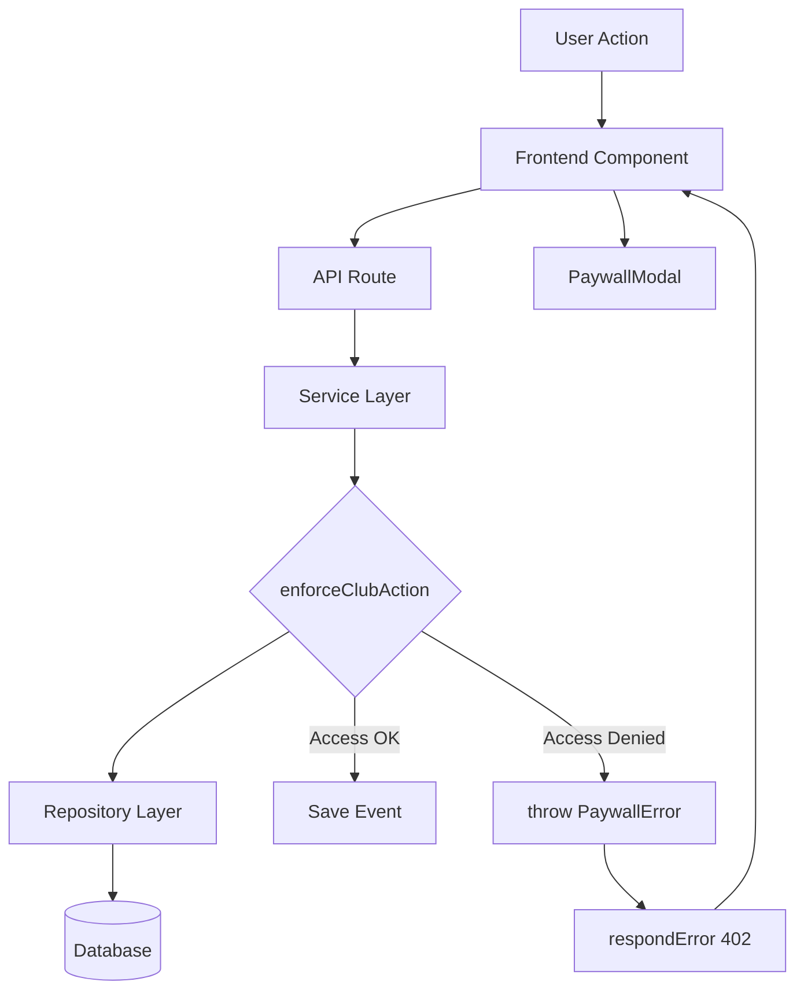

# 💳 Анализ системы биллинга Need4Trip

> **Living Document** — обновляется по мере развития системы  
> **Версия:** 5.8  
> **Дата:** 1 января 2026  
> **Статус:** Production (v5.8 - SSOT-Linter Compliant)

---

## 🆕 Changelog

**v5.8 (1 January 2026) — SSOT-Linter Compliance:**
- ✂️ Removed all framework-specific code blocks (>10 lines) per SSOT_ARCHITECTURE.md § 27
- 📦 Archived implementation examples → `docs/ssot/archive/SSOT_BILLING_IMPLEMENTATION_EXAMPLES.md`
- 🔗 Replaced "Aborted Purchase Attempts" section with cross-reference to SSOT_ARCHITECTURE.md § 26
- ✅ No new behavioral rules introduced
- 📝 Fixed metadata inconsistency (removed outdated footer)

**v5.7 (1 January 2026) — UI Implementation Removed from SSOT:**
- ✂️ Removed React/TypeScript code (PaywallModal, CreditConfirmationModal) from SSOT
- 📦 Moved UI implementation to legacy reference: `docs/billing/legacy/PaywallModal_v4.md`
- ✅ Preserved normative rules: when paywall shows, error contracts, UI behavior principles

**v5.6 (1 January 2026) — SSOT Cleanup:**
- 📦 Archived NON-NORMATIVE history → `docs/ssot/archive/SSOT_BILLING_HISTORY.md`
- ✂️ Compressed "Aborted Purchase Attempts" — billing-specific rules only
- 🔗 Deduplicated — removed v4.x inline history, added cross-references

**v5.5 (1 January 2026):** Aborted actions finalization, explicit/implicit cancellation rules  
**v5.0–v5.4:** Save-time enforcement, credit consumption, UI integration  
**v4.x:** Historical (see archive)

> **Full changelog:** `docs/ssot/archive/SSOT_BILLING_HISTORY.md`

---

## 📜 Historical / Archived

> **NON-NORMATIVE implementation history** (v3.x, v4.x, migration paths) has been archived.  
> See: **`docs/ssot/archive/SSOT_BILLING_HISTORY.md`**  
> 
> **Implementation code examples** have been archived.  
> See: **`docs/ssot/archive/SSOT_BILLING_IMPLEMENTATION_EXAMPLES.md`**
>
> **Current normative behavior:** v5+ (save-time enforcement, no separate publish step).

---

## 📋 Содержание

1. [Обзор системы](#обзор-системы)
2. [База данных](#-база-данных)
3. [Тарифные планы](#-тарифные-планы)
4. [Система enforcement](#-система-enforcement)
5. [One-off Credits](#-one-off-credits)
6. [Unified Purchase Flow](#-unified-purchase-flow)
7. [Event Save Enforcement (v5)](#-event-save-enforcement-v5) — **NORMATIVE**
8. [Aborted / Incomplete Actions](#aborted--incomplete-actions)
9. [API Contracts (v5+)](#-api-contracts-v5-current)
10. [Ключевые файлы](#-ключевые-файлы)

> **Historical sections (v4.x, migrations):** See `docs/ssot/archive/SSOT_BILLING_HISTORY.md`

---

## 🎯 Обзор системы

### Основные принципы

Система биллинга Need4Trip построена на следующих принципах:

1. **Frontend не решает лимиты и доступ** — фронт только показывает UI и реагирует на ошибки backend
2. **Backend — единственный источник истины** — по доступу, лимитам, grace и paywall
3. **Цены и лимиты — в БД** — seed + API `/api/plans`
4. **Поведение при неоплате — в БД** — grace period, доступные действия в `pending`/`grace`/`expired`
5. **Транзакции не участвуют в проверках доступа** — `billing_transactions` — только аудит/история

### Ключевые концепции

| Термин | Описание |
|--------|----------|
| **User** | Пользователь (Telegram) |
| **Club** | Платная сущность (в Free клуб создать нельзя) |
| **Plan** | Тариф клуба (`Club 50` / `Club 500` / `Unlimited`) |
| **Subscription** | Состояние оплаты клуба: `active`/`grace`/`expired`/`pending` |
| **Limits** | Лимиты тарифа (max_members, max_event_participants, paid events, CSV export) |
| **Actions** | Операции, которые могут быть разрешены/запрещены в зависимости от подписки |
| **Billing policy** | Правила grace и разрешённые actions при pending/grace/expired |

---

## 🏗️ Архитектура

### Общая структура

```
┌─────────────────────────────────────────────────────────────────┐
│                        DATABASE (Supabase)                       │
├─────────────────────────────────────────────────────────────────┤
│  club_plans → billing_policy → billing_policy_actions           │
│  club_subscriptions → billing_transactions (audit)              │
│  billing_products → billing_credits                             │
└─────────────────────────────────────────────────────────────────┘
                              ↑ Query + Cache (5 min)
┌─────────────────────────────────────────────────────────────────┐
│                     BACKEND (Repository Layer)                   │
│  planRepo.ts, billingProductsRepo.ts, billingCreditsRepo.ts     │
│  clubSubscriptionRepo.ts, billingPolicyRepo.ts                  │
└─────────────────────────────────────────────────────────────────┘
                              ↑
┌─────────────────────────────────────────────────────────────────┐
│                     BACKEND (Service Layer)                      │
│  accessControl.ts → enforceClubAction(), enforceEventPublish()  │
└─────────────────────────────────────────────────────────────────┘
                              ↑ throws PaywallError (402)
┌─────────────────────────────────────────────────────────────────┐
│                      API ROUTES (Next.js)                        │
│  POST/PUT /api/events → createEvent() / updateEvent()           │
│  GET /api/clubs/[id]/export → enforceClubAction(CSV_EXPORT)     │
└─────────────────────────────────────────────────────────────────┘
                              ↑ HTTP 402 + PaywallError JSON
┌─────────────────────────────────────────────────────────────────┐
│                     FRONTEND (React/Next.js)                     │
│  PaywallModal, CreditConfirmationModal, usePaywall()            │
└─────────────────────────────────────────────────────────────────┘
```

### Поток данных



---

## 💾 База данных

> **Authoritative schema:** See SSOT_DATABASE.md § 5-8 for complete table definitions.

### Схема таблиц (Summary)

| Table | Purpose | Key Fields |
|-------|---------|------------|
| `club_plans` | Тарифные планы | id, price_monthly, currency_code, max_event_participants, allow_paid_events |
| `club_subscriptions` | Подписки клубов | club_id, plan_id, status, current_period_end, grace_until |
| `billing_policy` | Глобальная политика | grace_period_days, pending_ttl_minutes |
| `billing_policy_actions` | Разрешённые действия | policy_id, status, action, is_allowed |
| `billing_transactions` | История платежей (audit) | club_id, user_id, product_code, status |
| `billing_products` | One-off продукты | code, price, currency_code, constraints |
| `billing_credits` | Entitlements | user_id, credit_code, status, consumed_event_id |

**Важно:** Если запись в `club_subscriptions` отсутствует → FREE план (персональные события без клуба).

---

## 💰 Тарифные планы

### Текущие планы

| ID | Название | Цена/мес | Участники/событие | Члены клуба | Платные события | CSV экспорт |
|----|----------|----------|-------------------|-------------|-----------------|-------------|
| `free` | **Free** | 0 ₸ | 15 | - | ❌ | ❌ |
| `club_50` | **Club 50** | 5,000 ₸ | 50 | 50 | ✅ | ✅ |
| `club_500` | **Club 500** | 15,000 ₸ | 500 | 500 | ✅ | ✅ |
| `club_unlimited` | **Unlimited** | 30,000 ₸ | ∞ | ∞ | ✅ | ✅ |

### Особенности FREE плана

**Free — это не клубный тариф:**
- ❌ Нельзя создать клуб
- ✅ Можно создавать личные события (не привязанные к клубу)
- ✅ Только бесплатные события
- ✅ Лимит участников: 15
- ❌ CSV экспорт недоступен

**В БД:** FREE план хранится в `club_plans` (с версии 2.1) для унификации кэширования.

---

## 🔐 Система enforcement

### Центральная функция

**File:** `src/lib/services/accessControl.ts`

**Signature:**
```typescript
enforceClubAction(params: {
  clubId: string;
  action: BillingActionCode;
  context?: { eventParticipantsCount?, clubMembersCount?, isPaidEvent? };
}): Promise<void>  // throws PaywallError on violation
```

### Алгоритм проверки (Decision Tree)

```
1. Load club_subscriptions by club_id
2. If NULL → FREE plan
   - Check FREE limits
   - Throw PaywallError if violated
3. If subscription exists:
   a. Check status (active/grace/pending/expired)
   b. Check billing_policy_actions for status
   c. Check plan limits
   d. Throw PaywallError if any check fails
```

### Коды действий (BillingActionCode)

| Code | Description |
|------|-------------|
| `CLUB_CREATE_EVENT` | Создание события в клубе |
| `CLUB_UPDATE_EVENT` | Обновление события в клубе |
| `CLUB_CREATE_PAID_EVENT` | Создание платного события |
| `CLUB_EXPORT_PARTICIPANTS_CSV` | Экспорт участников в CSV |
| `CLUB_INVITE_MEMBER` | Приглашение участника |
| `CLUB_REMOVE_MEMBER` | Удаление участника |
| `CLUB_UPDATE` | Обновление клуба |

### PaywallError структура

```typescript
PaywallError {
  statusCode: 402;
  code: "PAYWALL";
  reason: PaywallReason;
  currentPlanId?: string;
  requiredPlanId?: string;
  meta?: Record<string, unknown>;
  cta: { type: "OPEN_PRICING"; href: "/pricing" };
}
```

**Причины paywall (reason codes):**

| Reason | When Thrown |
|--------|-------------|
| `CLUB_CREATION_REQUIRES_PLAN` | Free user tries to create club |
| `SUBSCRIPTION_EXPIRED` | Club subscription expired |
| `SUBSCRIPTION_NOT_ACTIVE` | Status not in allowed list |
| `PAID_EVENTS_NOT_ALLOWED` | Plan doesn't allow paid events |
| `CSV_EXPORT_NOT_ALLOWED` | Plan doesn't allow CSV |
| `MAX_EVENT_PARTICIPANTS_EXCEEDED` | Exceeds plan limit |
| `MAX_CLUB_MEMBERS_EXCEEDED` | Exceeds plan limit |

---

## 🚧 Paywall UI Behavior (Normative Rules)

> **Implementation Reference:** `src/components/billing/PaywallModal.tsx`, `src/components/billing/CreditConfirmationModal.tsx`
> **Legacy Reference:** `docs/billing/legacy/PaywallModal_v4.md`

### PaywallModal — When Shown

| Trigger | HTTP Status | UI Action |
|---------|-------------|-----------|
| Limit exceeded (participants, members) | 402 | Show PaywallModal with options |
| Paid feature not allowed on plan | 402 | Show PaywallModal with upgrade CTA |
| Credit confirmation required | 409 | Show CreditConfirmationModal |

### UI Rules (Normative)

1. **UI DOES NOT decide limits** — Frontend only displays modal and reacts to backend errors
2. **Backend is SSOT** — All enforcement via `enforceClubAction()` / `enforceEventPublish()`
3. **PaywallError structure** — See PaywallError section above for contract
4. **No countdown timers** — TTL is backend concern, UI has no authority over time limits
5. **User cancel ≠ error** — Closing paywall silently returns to form (see SSOT_ARCHITECTURE.md § 26)

### CreditConfirmationModal — Purpose

Shown when 409 `CREDIT_CONFIRMATION_REQUIRED` is received. User must explicitly confirm credit consumption before event save completes.

**Behavior:**
- On confirm: Retry save with `?confirm_credit=1`
- On cancel: Return to form, no credit consumed

---

## ⚡ One-off Credits

### Концепция

**One-off credit** = разовая покупка для апгрейда личного события (без клуба).

**Характеристики:**
- **Бессрочный** - не привязан к событию при покупке
- **Расходуется ровно один раз** - при save с `confirm_credit=1`
- **Только для личных событий** - club events используют club billing
- **Не заменяет клуб** - при превышении лимитов (>500) требуется клуб

### Продукт: EVENT_UPGRADE_500

| Field | Value |
|-------|-------|
| `code` | `EVENT_UPGRADE_500` |
| `title` | Event Upgrade (до 500 участников) |
| `price` | 1000 KZT |
| `constraints.scope` | `personal` |
| `constraints.max_participants` | 500 |

**Лимиты:**
- Free plan: ~15 participants
- One-off credit: до 500 participants
- Больше 500: требуется club

### Credit Lifecycle (v5+)

```
1. Purchase → billing_transactions(pending)
2. Payment  → billing_transactions(completed)
3. Issue    → billing_credits(status='available')
4. Save (POST/PUT with confirm_credit=1) → billing_credits(status='consumed', consumed_event_id set)
```

> **v5+ Note:** Credit consumption happens at save-time (POST/PUT), not at a separate publish step.
> See SSOT_CLUBS_EVENTS_ACCESS.md § 10 for canonical timing rules.

### Credit State Machine

> **Authoritative state machine:** SSOT_DATABASE.md § 8.1 "Billing Credits State Machine"

| Status | consumed_event_id | consumed_at | Meaning |
|--------|-------------------|-------------|---------|
| `available` | NULL | NULL | Ready to use |
| `consumed` | NOT NULL | NOT NULL | Bound to event |

**Constraint:** `chk_billing_credits_consumed_state` enforces this invariant at DB level.

---

## 🔄 Unified Purchase Flow

### Endpoint: POST /api/billing/purchase-intent

**Purpose:** Unified API для покупки one-off credits + club subscriptions.

**Input Contract:**
```typescript
{
  product_code: "EVENT_UPGRADE_500" | "CLUB_50" | "CLUB_500" | "CLUB_UNLIMITED";
  quantity?: number;  // default 1
  context?: { eventId?: string; clubId?: string };
}
```

**Output Contract:**
```typescript
{
  transaction_id: string;
  transaction_reference: string;
  payment: {
    provider: "kaspi";
    invoice_url?: string;    // stub for now
    qr_payload?: string;     // stub for now
    instructions: string;
  };
}
```

### Flow Summary

```
1. User clicks "Buy" → POST /api/billing/purchase-intent
2. Create billing_transactions(pending) → Return payment details
3. User pays → Webhook OR DEV: POST /api/dev/billing/settle
4. Mark transaction(completed) → Issue credit OR activate subscription
```

---

## ⚡ Event Save Enforcement (v5)

### Architecture

**Unified enforcement** at save-time via `enforceEventPublish()` in `src/lib/services/accessControl.ts`.

**Integration points:**
- `createEvent()` in `src/lib/services/events.ts`
- `updateEvent()` in `src/lib/services/events.ts`
- `POST /api/events` with `?confirm_credit=1`
- `PUT /api/events/:id` with `?confirm_credit=1`

**Key difference from v4:**
- ❌ NO separate publish step
- ✅ Enforcement happens **BEFORE** save (atomic)
- ✅ Events are live immediately upon creation
- ✅ No `published_at` field (use `created_at`)

### Decision Tree

**Club Events (clubId != null):**
```
1. Check subscription status + policy
   ├─> expired/blocked → 402 PAYWALL
   └─> active → check plan limits

2. Check plan limits (maxParticipants, isPaid)
   ├─> exceeded → 402 PAYWALL
   └─> ok → ALLOW (save event)
```

**Personal Events (clubId == null):**
```
1. Check maxParticipants
   ├─> ≤ free (15) → ALLOW (no credit)
   ├─> > oneoff (500) → 402 PAYWALL (CLUB_ACCESS only)
   └─> 16-500 → check credit

2. Has available credit?
   ├─> NO → 402 PAYWALL (ONE_OFF + CLUB_ACCESS)
   └─> YES → check confirmation

3. confirm_credit=1?
   ├─> NO → 409 CREDIT_CONFIRMATION
   └─> YES → consume credit + ALLOW (save event)
```

### Credit Consumption (v5.1 - SSOT-compliant)

**Pattern:** Compensating Transaction — ensures atomicity between event creation and credit consumption.

**Order (CRITICAL):**
1. Create event FIRST (get eventId)
2. Consume credit with ACTUAL eventId
3. On failure → rollback (delete event)

**Constraint Compliance:** `chk_billing_credits_consumed_state` requires `consumed_event_id IS NOT NULL` when `status='consumed'`. Event MUST exist before credit can be consumed.

> **Implementation Reference:** `src/lib/services/creditTransaction.ts`
> **Code Examples:** `docs/ssot/archive/SSOT_BILLING_IMPLEMENTATION_EXAMPLES.md` § 5

---

## Aborted / Incomplete Actions

> **CANONICAL SOURCE:** SSOT_ARCHITECTURE.md § 26 "Aborted / Incomplete Actions (Canonical System Behavior)"

This section provides billing-specific clarifications. For full behavior rules, invariants, and scenario table, see SSOT_ARCHITECTURE.md § 26.

### Billing-Specific Rules (Non-Duplicative)

| Rule | Description |
|------|-------------|
| **pending/cancelled = no credit** | A `billing_credits` record is created with `status='available'` ONLY after transaction `status='completed'` |
| **pending transaction ≠ entitlement** | `billing_transactions.status='pending'` does NOT grant access |
| **Transaction logs ≠ entitlement** | Access checks read from `billing_credits` and `club_subscriptions`, NOT from transactions |
| **Payment completed but action failed** | Credit remains `status='available'` and user can retry |
| **Completed payment ≠ auto-applied** | Credit is NOT automatically bound to any event. User must save with `confirm_credit=1` |

### Transaction State → Entitlement Mapping

| Transaction Status | Credit Issued | Domain Access |
|-------------------|---------------|---------------|
| `pending` | ❌ NO | ❌ NO |
| `completed` | ✅ YES (`available`) | ✅ After credit bound |
| `failed` | ❌ NO | ❌ NO |
| `refunded` | ❌ Revoked | ❌ NO |

### Cross-References

| Topic | Location |
|-------|----------|
| Full invariants (INV-1 to INV-8) | SSOT_ARCHITECTURE.md § 26.2 |
| Scenario table (S1-S8) | SSOT_ARCHITECTURE.md § 26.3 |
| Explicit vs implicit abort UI | SSOT_ARCHITECTURE.md § 26.4 |
| Credit consumption timing | SSOT_CLUBS_EVENTS_ACCESS.md § 10 |
| UI design for aborted flows | SSOT_DESIGN_SYSTEM.md § Aborted User-Initiated Flows |

---

## ⚡ API Contracts (v5+ Current)

> **Note:** The `/api/events/:id/publish` endpoint was **REMOVED in v5.0**.  
> Enforcement now happens at save-time via POST/PUT `/api/events` with `?confirm_credit=1`.

### Active Endpoints

| Method | Endpoint | Purpose |
|--------|----------|---------|
| GET | `/api/billing/products` | List active products (EVENT_UPGRADE_500) |
| POST | `/api/billing/purchase-intent` | Unified purchase (one-off + clubs) |
| GET | `/api/billing/transactions/status` | Poll transaction status |
| POST | `/api/dev/billing/settle` | DEV: manual settlement (stub) |
| POST | `/api/events` | Create event (enforcement at save-time) |
| PUT | `/api/events/:id` | Update event (enforcement at save-time) |
| GET | `/api/plans` | List public plans |
| GET | `/api/clubs/[id]/current-plan` | Get club's current plan |
| GET | `/api/clubs/[id]/export` | CSV export (billing check) |

### Response Contracts

**402 PAYWALL:**
```json
{
  "success": false,
  "error": {
    "code": "PAYWALL",
    "reason": "PUBLISH_REQUIRES_PAYMENT",
    "meta": { "requestedParticipants": 100, "freeLimit": 15 },
    "options": [
      { "type": "ONE_OFF_CREDIT", "product_code": "EVENT_UPGRADE_500" },
      { "type": "CLUB_ACCESS", "recommended_plan_id": "club_50" }
    ]
  }
}
```

**409 CREDIT_CONFIRMATION_REQUIRED (v5+):**
```json
{
  "success": false,
  "error": {
    "code": "CREDIT_CONFIRMATION_REQUIRED",
    "reason": "EVENT_UPGRADE_WILL_BE_CONSUMED",
    "meta": { "eventId": "...", "creditCode": "EVENT_UPGRADE_500" },
    "cta": { "type": "CONFIRM_CONSUME_CREDIT" }
  }
}
```

> **Full API documentation:** SSOT_API.md

---

## 📁 Ключевые файлы

### Backend

| Layer | Files |
|-------|-------|
| **Repository** | `planRepo.ts`, `billingProductsRepo.ts`, `billingCreditsRepo.ts`, `clubSubscriptionRepo.ts`, `billingPolicyRepo.ts`, `billingTransactionsRepo.ts` |
| **Service** | `accessControl.ts` (enforceClubAction, enforceEventPublish), `creditTransaction.ts` |
| **API Routes** | `billing/`, `plans/`, `clubs/[id]/`, `events/` |
| **Errors** | `errors.ts` (PaywallError, CreditConfirmationRequiredError) |
| **Types** | `types/billing.ts` |

### Frontend

| Category | Files |
|----------|-------|
| **Components** | `billing/PaywallModal.tsx`, `billing/CreditConfirmationModal.tsx`, `billing/credit-badge.tsx` |
| **Hooks** | `use-club-plan.ts`, `usePaywall()` |
| **Pages** | `pricing/page.tsx`, `events/create/`, `events/[id]/edit/` |

### Database

| Category | Migrations |
|----------|------------|
| **Plans** | `20241215_create_club_plans_v2.sql`, `20241215_seed_club_plans.sql`, `20241216_add_free_plan.sql` |
| **Subscriptions** | `20241212_create_club_subscriptions.sql`, `20241215_alter_club_subscriptions_v2_SAFE.sql` |
| **Policy** | `20241215_create_billing_policy.sql`, `20241215_seed_billing_policy.sql` |
| **Products** | See SSOT_DATABASE.md for full list |
| **RLS** | `20241222_enable_rls_*.sql` |

---

## ⚡ Кэширование

### StaticCache для планов

**File:** `src/lib/cache/staticCache.ts`  
**Usage:** `src/lib/db/planRepo.ts`

**Behavior:**
- TTL: 5 minutes
- Key: planId
- Auto-invalidation on TTL expiry
- All plan queries use cache

**Benefits:**
- O(1) access by key
- Single DB query per 5 minutes
- FREE план теперь в кэше

---

## 🔄 Статус-машина подписки

### Диаграмма состояний

```
[*] → pending → active → grace → expired → [*]
         ↓         ↑        ↓
       [*]      grace → active
```

### Описание статусов

| Статус | Когда | Действия | Переход |
|--------|-------|----------|---------|
| **pending** | Payment intent создан | ❌ Ничего | → `active` OR deleted |
| **active** | Оплата подтверждена | ✅ Всё | → `grace` |
| **grace** | Период истёк | ✅ Почти всё | → `active` OR `expired` |
| **expired** | Grace истёк | ❌ Read-only | → `active` OR deleted |

### Параметры из billing_policy

| Parameter | Value |
|-----------|-------|
| `grace_period_days` | 7 |
| `pending_ttl_minutes` | 60 |

---

## 📈 План развития

### Фаза 1: Стабилизация ✅
- ✅ Консолидация PaywallModal
- ✅ Тесты для accessControl.ts
- ⏳ Автоматизация статусов подписки (cron)

### Фаза 2: Платёжная интеграция (Q1 2025)
- [ ] Kaspi QR интеграция
- [ ] club_drafts для создания клубов
- [ ] Webhook обработка

### Фаза 3: Мониторинг (Q1-Q2 2025)
- [ ] MRR/churn dashboard
- [ ] Уведомления о grace

---

## 📚 Связанные документы

| Document | Purpose |
|----------|---------|
| `docs/ssot/SSOT_DATABASE.md` | Schema, constraints, RLS |
| `docs/ssot/SSOT_ARCHITECTURE.md` | Layering, ownership, § 26 aborted flows |
| `docs/ssot/SSOT_CLUBS_EVENTS_ACCESS.md` | § 10 credit consumption timing |
| `docs/ssot/SSOT_API.md` | API contracts |
| `docs/ssot/SSOT_DESIGN_SYSTEM.md` | UI patterns |
| `docs/ssot/archive/SSOT_BILLING_IMPLEMENTATION_EXAMPLES.md` | Code examples (archived) |
| `docs/ssot/archive/SSOT_BILLING_HISTORY.md` | Historical versions |

---

**END OF DOCUMENT**

*For implementation code examples, see `docs/ssot/archive/SSOT_BILLING_IMPLEMENTATION_EXAMPLES.md`*
*For historical implementation details (v3.x, v4.x, migrations), see `docs/ssot/archive/SSOT_BILLING_HISTORY.md`*
